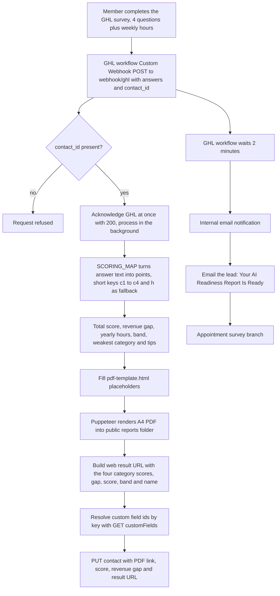

# BNI Network Value Calculator and PDF factory

> A lead-generation calculator for BNI members: a short GHL survey scores how well a member follows up with their network, a Node backend turns the score into a branded personal PDF, and the results are written back to the GHL contact so follow-up emails can use them.

| | |
|---|---|
| **Category** | Excel operations and workflow-automation tools (quiz scoring and PDF) |
| **Status** | On demand, as of 9 Oct 2026. Built; live status not found beyond screenshots that show a published page. |
| **Type** | Web quiz pages plus a Node/Express webhook backend (`bni-pdf-factory` v2.3.0) that renders PDFs with Puppeteer |
| **Runner and schedule** | Event-driven: a GHL survey submission triggers a GHL workflow whose Custom Webhook calls the backend. No schedule. |
| **Client / owner** | Pivot to Thrive branding, BNI member lead-gen (front-end title "How Much Is Your Network Really Worth? \| Pivot to Thrive") |
| **Stack** | Node, Express, Puppeteer (headless Chrome, `--no-sandbox`), axios, form-data, nginx reverse proxy, Let's Encrypt certificates, GHL REST API (Version 2021-07-28) |
| **Source** | Main KB Part 5 section 10 (also sections 8, 13, 14); Part 3 section 10 and Part 6A (cross-references); Portfolio KB sections 9 and 26 |

## 1. Description

### What it does
A BNI member answers four questions about their follow-up habits (Google review recency, social posting frequency, last email to past clients, where contacts live) plus a weekly-hours question. The backend turns the answers into points, an overall score from 0 to 100, a band, a "revenue gap" estimate and tips for the weakest category, then fills an HTML template and renders it to an A4 PDF. It then updates the GHL contact with the PDF link, score, revenue gap and a web result-page URL so a GHL workflow can email the report and notify the team. A published GHL variant of the page, "How Much Referral Revenue Is Slipping Through The Cracks?", appears in the screenshots held in the Pivot GHL Hub folder.

### Inputs and outputs
- **Inputs:** a GHL Custom Webhook POST to `https://<domain>/webhook/ghl` carrying answers as the full question strings or short keys `c1` to `c4` and `h`, plus `contact_id`, `first_name`, `email`.
- **Outputs:** a PDF in `public\reports\premium_report_<contact>_<ts>.pdf` served at `/reports/` by nginx; updated GHL contact fields (PDF link, score, revenue gap, result URL); a result-page URL of the form `<PUBLIC_URL>/expo#/result?p1..p4&gap&score&band&name`.

### Key components
| Component | Role |
|---|---|
| `html\email-backend\server.js` | Webhook handler, scoring, template fill, Puppeteer render, GHL update. |
| `SCORING_MAP` | Converts survey answer text to points: each of 4 questions scores 0, 5-10, 15-18 or 25; hours map to 12, 7.5, 3.5 or 1. |
| Score model | Total = c1+c2+c3+c4 (0 to 100); revenue gap = (100 minus total) x 1200; yearly hours = hours x 50; bands Foundation (30 or less), Building (up to 60), Established (up to 85), Advanced; weakest category and tips chosen by score thresholds. |
| `pdf-template.html` | Placeholders such as `{{first_name}}`, `{{total_score}}`, `{{revenue_gap}}`, `{{c1}}`, tips and diagnosis. |
| `updateGHLContact` | Resolves custom field ids from keys via `GET /locations/{id}/customFields`, then `PUT /contacts/{id}`. |
| Front-end pages | `index.html`, `v2index.html`, `thankyou.html`, `checkout.html` (plus `html\bots_asset.mp4`); `parseGhlParameters` reads GHL redirect parameters and a dark-theme guard handles GHL embeds. |
| nginx config | Two nginx server configs (a clean one and a domain-specific one): `/webhook/` and `/reports/` proxied to `localhost:3002`. |
| `create-url-field.js` | Helper script, purpose inferred from its name (create the result-URL field). |

### Where it lives
- `...\network-value-calculator-main\` (the KB elides the parent path; the Part 5 evidence base is the Workflows & Automation folder): `checkout.html`, `html\{index,v2index,thankyou}.html`, `html\bots_asset.mp4`, and `html\email-backend\{server.js, pdf-template.html, create-url-field.js, two nginx configs, package.json, pnpm-lock.yaml}`.
- Environment variable names: `PORT`, `GHL_API_KEY`, `GHL_LOCATION_ID`, `GHL_CUSTOM_FIELD_ID` (PDF link field key, example `scoredpdf`), `GHL_SCORE_FIELD_ID` (example `bni_score`), `GHL_REVENUE_FIELD_ID` (example `revenue_gap`), `GHL_RESULT_URL_FIELD_ID`, `BASE_URL`, `PUBLIC_URL`.
- `.gitignore` excludes generated PDFs and logs. The nginx config targets the owner's hosting domain.

## 2. Flow chart

**Reading the chart**
1. The member completes the survey inside GHL (or on the published page).
2. The GHL workflow posts the answers to the backend's `/webhook/ghl`.
3. The handler requires `contact_id` and answers GHL with 200 immediately, so GHL is never kept waiting for the PDF.
4. In the background, `SCORING_MAP` converts the answer text to points (question text must match the survey exactly; a short-key fallback exists).
5. Score, revenue gap, yearly hours, band and tips are computed and poured into `pdf-template.html`.
6. Puppeteer renders the PDF to `public\reports`, where nginx serves it at `/reports/`.
7. The web result URL is built and `updateGHLContact` looks up the custom field ids and writes the PDF link, score, revenue gap and URL to the contact.
8. Meanwhile the GHL workflow waits 2 minutes, then notifies the team internally, emails the lead the report, and continues to an appointment survey branch (as seen in the workflow screenshot).

## 3. Case study

### The challenge
The need was a lead-generation asset for BNI members: a short self-assessment of network follow-up that returns a personal, branded report. The system had to take a GHL survey, produce a branded PDF per person, and put the results where GHL emails could use them. GHL is acknowledged at once so it does not wait for PDF rendering.

### The solution
A single Express service behind nginx. GHL calls it through a Custom Webhook; it replies at once and finishes the work in the background: score, render the PDF with Puppeteer from an HTML template, serve it from its own `/reports/` path, and write the PDF link, score, revenue gap and result URL back to the contact through the GHL contacts API. GHL then sends the report email and the internal notification after a 2-minute wait. The front-end pages carry the quiz, a thank-you page and a checkout page.

### Design decisions and rules learned
- **Respond first, work later:** 200 to GHL immediately, then process (the same survey-webhook pattern is noted in Part 3 section 10).
- **Exact question text:** answers are matched by the survey's exact question strings, including a typo in the survey ("More than IO hours") that is mapped explicitly; short keys `c1` to `c4` and `h` are the fallback.
- **Self-hosted PDFs:** `uploadToGHLMedia` is defined but not called; the PDF is served from the backend's own server (inferred: left over from an earlier design).
- **Port:** the code default is 3000 while nginx proxies to 3002, so set `PORT=3002` (inferred from the config mismatch).
- **Front-end fallbacks:** if quiz answers are missing from the URL, the page loads randomised realistic fallbacks.
- **Revenue gap is a marketing assumption:** the multiplier of 1,200 per missing point is not a measured figure.
- **Portfolio KB:** section 9 ("Growth Constraint Quiz Scoring and PDF Generation", user-confirmed completed) describes the same generic pattern: collect answers, map to scores, apply result bands, render a PDF, associate it with the right contact. That section does not name this tool, so the mapping is unconfirmed. Its controls (keep scoring in documented configuration, version the scoring model, test boundary conditions and missing answers, never expose one contact's results to another) are a useful checklist for this backend. The portfolio KB also lists `network-value-calculator` among folders whose function was not confirmed; the main KB resolves it as this tool.

### Outcome
No measured outcome recorded (no lead, score or report counts). Documented: the front-end pages and the backend package exist; the nginx config targets the owner's hosting domain; screenshots in the Pivot GHL Hub folder show the quiz page published and the GHL workflow "BNI Lead Email Notification Workflow"; live status beyond those screenshots is not found.

### Lessons learned
- Acknowledge webhooks immediately and do slow work (PDF rendering) in the background.
- Tie scoring to exact survey text, and keep a short-key fallback.
- Keep tokens in environment variables, never in one-off helper scripts.
- Label estimated money figures as assumptions.

## 4. Operating notes
- **Run / pause / debug:** `cd html\email-backend; npm install; npm start`. POST a sample JSON body containing `contact_id` to `/webhook/ghl`. Watch the console logs ("Public PDF URL", "Updating GHL contact") and check the PDF under `public\reports`. Pause by stopping the process; no other pause procedure is documented.
- **Known issues and open items:** live status not found; port default versus nginx mismatch; `uploadToGHLMedia` unused; field-id resolution depends on the field keys listed in the env names.
- **Risks:**
  - Security and credential-hygiene findings for this project are tracked privately and are not published here.
  - The result page can show randomised sample numbers when parameters are missing.

## 5. Related
- [Pivot GHL Hub](pivot-ghl-hub-editor.md): its folder holds the screenshots of this calculator's live page and its GHL email workflow.
- [POWER PIVOT audit backend and ABCD checkout](power-pivot-audit-backend-and-abcd-checkout.md): sibling quiz-score-PDF-to-GHL backend.
- [BNI Referral Engine email pack](../03-ghl-crm-migrations/bni-referral-engine-email-pack.md): Part 3 section 10 documents the later `EXPOBNI\email-backend` and the earlier `bni2\email-backend` copies of this webhook backend and the email templates.
- Part 6A "BNI / Franchise PDF factory (quiz scoring, PDF and postcode lock)" in the main KB: same package name and version (`bni-pdf-factory` v2.3.0) at `BNI & Expos\EXPOBNI\email-backend` (825 lines), adding the franchise score webhook and postcode locking. How that copy differs from this one is not documented.
- **Sources:** Main KB Part 5 section 10 (lines 3376-3415), section 8 (screenshots), sections 13 and 14; Part 3 section 10 (lines 1955-1978); Part 6A BNI / Franchise PDF factory; Portfolio KB section 9 (lines 289-328) and section 26 (lines 806-814).
