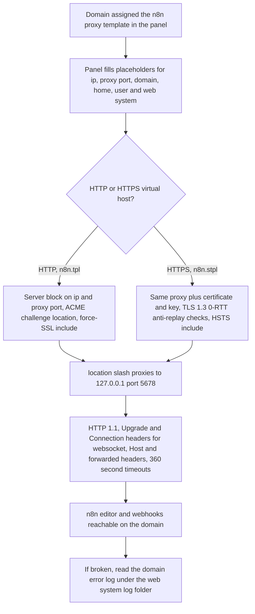

# n8n hosting templates

> Two Nginx reverse-proxy templates that make a self-hosted n8n (port 5678) reachable on a domain through a HestiaCP-style hosting control panel.

| | |
|---|---|
| **Category** | Excel operations and workflow-automation tools (infrastructure) |
| **Status** | Reference, as of 9 Oct 2026. Two template files only; no README and no workflow exports in the folder. |
| **Type** | Nginx proxy templates for a hosting panel (`.tpl` for HTTP, `.stpl` for HTTPS) |
| **Runner and schedule** | Applied by the panel whenever a domain is assigned the "n8n" proxy template. No schedule. |
| **Client / owner** | Internal infrastructure (Client & Agency (Pivot) workspace) |
| **Stack** | Nginx, HestiaCP-style panel placeholders, n8n listening on `127.0.0.1:5678`, ACME challenge location |
| **Source** | Main KB Part 5 section 6 (and the Part 6 hosting map, section 14 gaps); Portfolio KB section 26 and checklist |

## 1. Description

### What it does
The templates tell the control panel how to proxy a domain to an n8n instance running on the same server at `127.0.0.1:5678`. They carry the settings the n8n editor and its webhooks need: websocket upgrade headers, forwarded-address headers and long (360 second) read and send timeouts. The HTTPS template adds the panel's certificate and key and the standard TLS safeguards.

### Inputs and outputs
- **Inputs:** a domain assigned the "n8n" proxy template in the panel; panel placeholders `%ip%`, `%proxy_port%`, `%domain_idn%`, `%home%`, `%user%`, `%web_system%`, `%ssl_pem%`, `%ssl_key%`.
- **Outputs:** a public https endpoint for the n8n editor and for n8n webhooks.

### Key components
| Component | Role |
|---|---|
| `n8n.tpl` (HTTP) | `server` block on `%ip%:%proxy_port%`, ACME challenge location, force-SSL include, and `location /` proxying to `http://127.0.0.1:5678` with HTTP/1.1, Upgrade and Connection headers, Host / X-Real-IP / X-Forwarded-For / X-Forwarded-Proto headers, 360 s read and send timeouts. |
| `n8n.stpl` (HTTPS) | The same proxy plus `ssl_certificate %ssl_pem%`, `%ssl_key%`, TLS 1.3 0-RTT anti-replay checks and an HSTS include. |

### Where it lives
- `D:\Project\Client & Agency (Pivot)\Workflows & Automation\n8n\n8n.tpl` and `n8n.stpl`.
- Target directory on the server: the panel's Nginx template directory (inferred).
- Error log to check: `/var/log/%web_system%/domains/<domain>.error.log`.
- A sibling pair of panel templates, `node3002.tpl` and `node3002.stpl`, exists under `microsaas\backend\deploy\nginx\` for the audit backend on port 3002 (see the related file below).

## 2. Flow chart

**Reading the chart**
1. An operator assigns the "n8n" proxy template to a domain in the panel.
2. The panel substitutes its placeholders when it rebuilds the domain.
3. Plain HTTP requests are served by the `.tpl` block, which keeps the ACME challenge path open and includes the force-SSL redirect; HTTPS requests use the `.stpl` block with the domain's certificate.
4. Both blocks proxy `/` to the local n8n process with websocket upgrade headers and 360 s timeouts.
5. The result is a public URL for the editor and for webhook calls.
6. When something fails, the domain's Nginx error log is the first place to look.

## 3. Case study

### The challenge
A self-hosted n8n needs to be reachable from the internet over https so its editor loads and GHL or other systems can call its webhooks. The editor relies on websockets, and some webhook executions run long, so a default proxy setup is not enough. The server is managed through a HestiaCP-style panel, which expects templates rather than hand-edited Nginx files.

### The solution
Two small panel templates, one per scheme, that proxy to n8n on `127.0.0.1:5678` and add the required headers and timeouts. No workflow exports, README or run notes accompany them.

### Design decisions and rules learned
- The 360 s timeouts and websocket Upgrade/Connection headers are required for the n8n UI and for long-running webhook executions.
- The panel placeholders (`%ip% %domain_idn% %home% %user% %web_system%`) are the reason the KB infers a HestiaCP-managed VPS.
- The same style of panel template is reused for other Node services on the server (`node3002.tpl` / `.stpl` for the audit backend).
- Part 6 of the KB (hosting map) lists n8n among services on the shared 2 GB HestiaCP VPS ("mind memory"), which supports the inference. The template files themselves do not name the instance location.
- Portfolio KB: the `n8n` folder was listed among folders "whose functions were not confirmed" and the source-of-truth checklist asks for n8n workflow exports. The main KB resolves the folder as proxy templates only; no workflow export is in it.

### Outcome
No measured outcome recorded. The two template files exist. Whether the templates were applied to a live n8n domain, and which workflows run on that instance, are not documented in the source. The KB does not evidence the status of the n8n instance (section 14 gaps).

### Lessons learned
- Websocket upgrade headers and long timeouts are not optional for n8n; they are the reason the templates exist.
- The folder holds no note on where the instance runs or which workflows it hosts; that context has to be recovered from other KB sections.

## 4. Operating notes
- **Run / pause / debug:** copy both files into the panel's Nginx proxy template directory, assign the template to the domain, rebuild the domain, then check `/var/log/%web_system%/domains/<domain>.error.log`. Pause procedure: not documented in the source.
- **Known issues and open items:** no README, no workflow exports, instance location undocumented, live status not evidenced.
- **Risks:** security and credential-hygiene findings for this project are tracked privately and are not published here. The shared server has 2 GB of RAM (Part 6 hosting map), so adding services calls for a memory check.

## 5. Related
- [Scope Stainless Works digital timesheet](scope-stainless-works-digital-timesheet.md): variant A was designed to run on n8n (never imported into a real n8n).
- [POWER PIVOT audit backend and ABCD checkout](power-pivot-audit-backend-and-abcd-checkout.md): shares the `node3002.tpl` / `.stpl` template style.
- [Zoho to HighLevel migration (Clixpert)](../03-ghl-crm-migrations/zoho-to-highlevel-migration-clixpert.md) and [n8n GHL changelog to blog and newsletter](../02-content-seo-newsletters/n8n-ghl-changelog-to-blog-and-newsletter.md): other n8n workflows in the KB. The Zoho workflow reads a workbook from a local `.n8n-files` path, so it ran on a local n8n (inferred); neither file establishes that it runs behind these templates.
- **Sources:** Main KB Part 5 section 6 (lines 3225-3253), section 14 (gaps), Part 6 hosting map; Portfolio KB section 26 (lines 806-814) and Part VI checklist.
