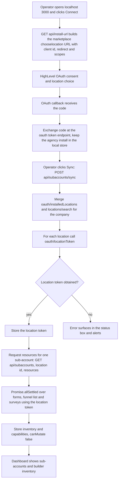

# Pivot GHL Hub (`editor`)

> A local Express "agency hub" starter that connects one HighLevel agency install over OAuth 2.0, discovers its sub-accounts, and lists their forms, funnels and surveys in a small read-only dashboard.

| | |
|---|---|
| **Category** | Excel operations and workflow-automation tools (GHL tooling) |
| **Status** | On demand, as of 9 Oct 2026. Starter, v0.1.0, read-only; whether the OAuth app was ever registered or installed is not found. |
| **Type** | Node.js web app (Express 5) with a static dashboard and a local JSON store |
| **Runner and schedule** | Manual: `npm run dev` or `npm start`, then open `http://localhost:3000`, click Connect, then Sync. No schedule. |
| **Client / owner** | Internal agency tooling (Pivot2Thrive / HL Growth Partner side) |
| **Stack** | Node >= 20, Express 5, dotenv; HighLevel Marketplace OAuth app (Private, target user Sub-account, installable by Agency or Both); API header `Version: 2021-07-28`; `playwright-core` (inferred, for screenshots) |
| **Source** | Main KB Part 5 section 8 (also sections 13 and 14); Part 3 section 15 (related); Portfolio KB section 26 |

## 1. Description

### What it does
The hub signs in to HighLevel as an agency-level Marketplace app, finds every sub-account the app is installed on, exchanges the agency token for a token per sub-account, and then reads builder-related inventory (forms, funnels, surveys) from each one. A small dashboard shows the sub-accounts and what each exposes. It is deliberately read-only: every resource reports `canMutate:false`, because public HighLevel documentation exposes list and read endpoints for forms, surveys and funnels but not full create, update and delete on the visual builders.

### Inputs and outputs
- **Inputs:** environment variable names from `.env.example`: `PORT`, `APP_BASE_URL`, `GHL_CLIENT_ID`, `GHL_CLIENT_SECRET`, `GHL_REDIRECT_URI`, `GHL_SCOPES` (a very long list covering contacts, opportunities, custom fields and values, objects, forms, funnels, surveys, workflows read, payments, blogs, social planner, emails builder, products, voice and conversation AI and more), `GHL_WEBHOOK_SECRET`, `GHL_DEFAULT_COMPANY_ID`. Operator clicks on Connect and Sync.
- **Outputs:** local dashboard JSON and cards; a local store of the agency install and per-location authorisation; per-sub-account inventory and capability flags.

### Key components
| Component | Role |
|---|---|
| Express routes (module roles below are inferred from file names) | `/api/install-url`, `/oauth/callback` (alias `/rest/oauth2-credential/callback`), `/api/subaccounts/sync`, `/api/subaccounts/:locationId/resources`, `/api/status`, `/api/subaccounts`, and a stub `/api/webhooks/ghl`. |
| `src\server.js` | Server and route wiring (inferred). |
| `src\ghl-client.js` | HighLevel API calls such as token exchange, installed locations, location token, resource lists (inferred). |
| `src\subaccount-service.js` | Sync and inventory logic (inferred). |
| `src\store.js` and `src\config.js` | Local persistence and environment loading (inferred). |
| `public\{index.html,app.js,styles.css}` | The dashboard; errors show in a status box and alerts. |
| Screenshots in the folder | `bni-calc-live-published.png`, `live-bni-calc.png`, `live-checkout-check.png`, `live-result-check.png`, `builder-current.png`, `workflow-builder-review.png` and `.data\builder-*.png`. |

### Where it lives
- `D:\Project\Client & Agency (Pivot)\Workflows & Automation\editor\` with `README.md`, `package.json` (package `pivot-ghl-hub`, private), `.env.example`, `.gitignore`, `src\`, `public\` and the screenshots.
- A local data folder is present, which shows the app was run at least once.
- The screenshots show the BNI quiz page live, a GHL workflow "BNI Lead Email Notification Workflow" (Wait 2 minutes after survey submission, internal email notification, send the "AI Readiness Report" email to the lead, appointment survey branch) and builder views. They look like browser-automation checks via `playwright-core` (inferred). They concern the BNI calculator, see the related file below.

## 2. Flow chart

**Reading the chart**
1. The operator starts the app locally and clicks Connect.
2. `/api/install-url` builds the HighLevel `oauth/chooselocation` URL with the client id, redirect URI and scopes.
3. After consent, the callback (`/oauth/callback`, or the alias `/rest/oauth2-credential/callback`) receives the code and exchanges it at `/oauth/token`; the agency install is saved in the local store.
4. Sync merges `/oauth/installedLocations` with `/locations/search?companyId=...`, then calls `/oauth/locationToken` for each location (agency token to location token).
5. The resources call runs `Promise.allSettled` over `/forms/`, `/funnels/funnel/list` and `/surveys/` with the location token, so one failing list does not block the others (inferred from the pattern).
6. Inventory and capabilities, all `canMutate:false`, are stored and shown on the dashboard.
7. `POST /api/webhooks/ghl` is a stub and is not part of the flow above.

## 3. Case study

### The challenge
Keep sight of builder-related assets (forms, funnels, surveys) across many sub-accounts from one place, using an official OAuth route instead of one token per location. The constraint is that public HighLevel documentation provides list and read endpoints for these assets but no full create, update or delete on the visual builders.

### The solution
A minimal Express app that performs the agency OAuth install, exchanges per-location tokens and reads the three inventories with `Promise.allSettled`, storing everything in a local JSON file and showing it on a small dashboard. Resources are explicitly flagged read-only (`canMutate:false`).

### Design decisions and rules learned
- Do not rely on a visual-builder mutation API; it is not public. The hub reports `canMutate:false`.
- Production hardening is still needed before any hosted use (the webhook route is a stub).
- Relation to the page-builder injector: the KB points to a separate effort that does write into the builder by a different route, a Chrome extension called "Apex GHL Injector" that reuses GHL's own autosave request. See Related. The KB does not say that the hub and the injector share code or call each other.

### Outcome
No measured outcome recorded. Documented: a v0.1.0 starter with the OAuth, sync and inventory endpoints; the local data folder shows at least one run; whether the OAuth app was ever registered and installed is not found; no session transcript exists for the folder.

### Lessons learned
- Check what the public API actually exposes before designing a "hub" that edits assets; here the reachable surface is read-only.
- Design OAuth token storage (encryption at rest, rotation) from the start rather than retrofitting it.
- Open question flagged by another part of the KB: Part 6A (Authority Inner Circle, 30 Sep 2026) records that the owner cannot create a GHL Marketplace app, and this hub depends on one. Whether the hub can be installed is therefore unconfirmed.

## 4. Operating notes
- **Run / pause / debug:** `npm install`, then `npm run dev` (or `npm start`); fill `.env` from `.env.example`; open the dashboard; errors surface in the status box and alerts. Stop the process to pause. Not run during the KB audit.
- **Known issues and open items:** OAuth app registration and install not evidenced; webhook route is a stub; no session transcript.
- **Risks:** security and credential-hygiene findings for this project are tracked privately and are not published here. `GHL_SCOPES` requests a very broad permission set that should be trimmed to least privilege before any real install.

## 5. Related
- [GHL builder / Apex GHL Injector](../03-ghl-crm-migrations/ghl-builder-apex-injector.md): complementary, not shared code. The hub reads forms, funnels and surveys through the official OAuth API and is read-only. The injector writes pages into a live GHL funnel by arming a Chrome MV3 extension, intercepting the builder's next autosave request and swapping only `pageData.sections`. Together they cover the read side (inventory) and the write side (page content) of GHL builder work, through different mechanisms. The KB entry for the hub points to the injector's project memory under `C:\Users\<user>\.claude\projects\D--Project-Pivot-ghl-builder\memory\` as the place where that work is documented.
- [BNI Network Value Calculator and PDF factory](bni-network-value-calculator-and-pdf-factory.md): the screenshots in this folder show that calculator's live page and its GHL email workflow.
- [GHL API contracts and quirks](../03-ghl-crm-migrations/ghl-api-contracts-and-quirks.md): GHL API behaviour worth knowing when extending the client.
- Not to be confused with the "P2T/HLGP Automation Hub" (portfolio KB section 16, `Blogs\p2t-hlgp-automation`, blog and sales routines), which is a different thing.
- **Sources:** Main KB Part 5 section 8 (lines 3297-3331), sections 13 and 14; Part 3 section 15 (lines 2154-2178); Part 6A Authority Inner Circle rules (Marketplace app note); Portfolio KB section 26 (lines 806-814) and section 16.
