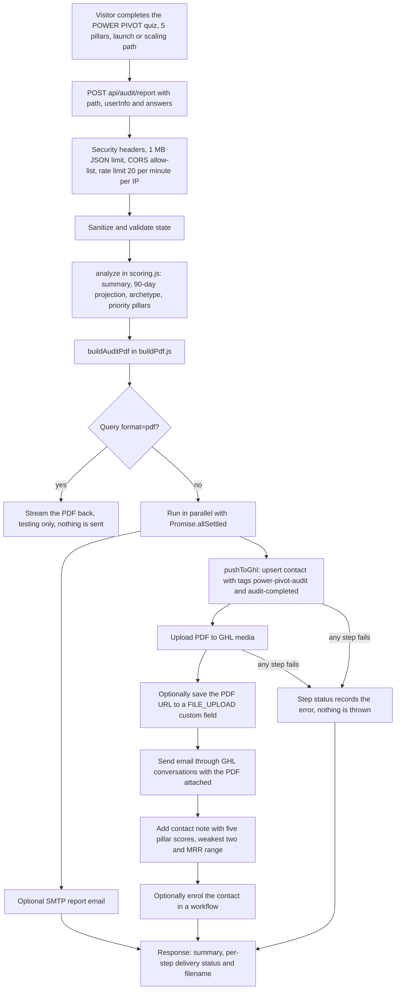
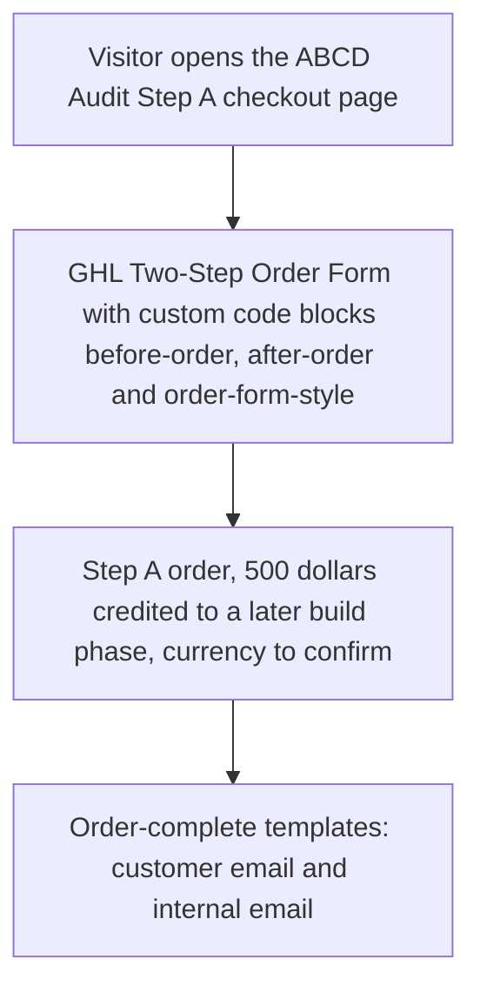

# POWER PIVOT audit backend and ABCD Audit checkout (`microsaas`)

> A lead-magnet and paid-audit micro-SaaS for HL Growth Partner: a free five-pillar agency audit quiz, a Node/Express backend that re-scores it, builds the PDF report, emails it and syncs the lead to GoHighLevel, and a paid "ABCD Audit - Step A" checkout page.

| | |
|---|---|
| **Category** | Excel operations and workflow-automation tools (micro-SaaS, quiz and PDF) |
| **Status** | On demand, as of 9 Oct 2026. Built, with deployment instructions and a VPS setup script. Whether it is live is not found beyond the front-end config pointing at an API host. |
| **Type** | Node/Express backend (PDF builder), static quiz funnel pages, GHL custom-code checkout blocks |
| **Runner and schedule** | Event-driven: the quiz posts to `POST /api/audit/report`; the paid audit starts from the GHL Two-Step Order Form. No schedule. |
| **Client / owner** | HL Growth Partner (HLGP) |
| **Stack** | Node, Express, PDF generation (`src\pdf\buildPdf.js`), GHL REST API with a Private Integration Token (PIT), optional SMTP, Docker, nginx, certbot, HTML/CSS/JS funnel pages |
| **Source** | Main KB Part 5 section 9 (also sections 6, 13, 14); Part 6B POWER PIVOT Agency Audit (cross-reference); Portfolio KB sections 9 and 26 |

## 1. Description

### What it does
Visitors take the free "POWER PIVOT Agency Audit", a quiz that scores an agency on five pillars (P, O, W, E, R) with 20 yes/ok/no questions each, on two paths ("launch" and "scaling"). The backend does not trust the browser: it re-runs the analysis server-side (pillar scores, a 90-day projection, an archetype, priority pillars, an estimated recoverable-revenue figure), builds a PDF report and delivers it by email through GHL, while syncing the lead into GHL with tags and a note. A separate paid product, "ABCD Audit - Step A" ($500, credited to a later build phase), has its own checkout page built from custom-code blocks around the native GHL Two-Step Order Form.

### Inputs and outputs
- **Inputs:** request body `{ path: "launch"|"scaling", userInfo: {firstName, email, phone, agencyName, mrrRange}, answers: {P:[20], O:[20], W:[20], E:[20], R:[20]} }`; optional `?format=pdf` to stream the PDF instead of emailing (testing).
- **Outputs:** the PDF report; a GHL contact (tags `power-pivot-audit`, `audit-completed`, `audit-<band>`, source `power_pivot_audit_backend`), a contact note, an email with the PDF attached; a JSON response with a summary, per-step delivery status and the filename; the funnel and checkout pages.

### Key components
| Component | Role |
|---|---|
| `backend\src\server.js` | Express server: security headers, request log, JSON limit of 1 MB, CORS allow-list from `ALLOWED_ORIGINS`, rate limit of 20 requests per minute per IP on the report endpoint; `sanitize` and `validate`; orchestration. |
| `src\analysis\scoring.js` | `auditSummary`, `analyseResponses`, 90-day projection, archetype, priority pillars. MRR bands map to dollar values. "Honest estimate" rule: figures are labelled illustrative and the $50k assumption is disclosed when no MRR is given. |
| `src\pdf\buildPdf.js` | `buildAuditPdf`, builds the report. |
| `pushToGhl` | Best-effort GHL sync that never throws and returns per-step status (see the chart). |
| Quiz pages | `index.html` and `index-v2.html` (the front-end `CONFIG.apiBaseUrl` points at the audit API host). |
| GHL pages | `ghl\before-order.html`, `after-order.html`, `order-form-style.html` (pasted into GHL Custom Code blocks around the native Two-Step Order Form; styles scoped `.p2t-wrap`); `ghl\audit-body.html`, `audit-script.html`, `audit-style.html` (inferred: the quiz split into blocks to embed in a GHL page; the body header reads "Free Agency Audit"). |
| Email templates | `emails\order-complete-email.html` and `order-complete-internal-email.html`. |
| Scripts | `scripts\ghl-check.js` (read-only connectivity check: location and contacts count), `scripts\ghl-send-test.js` (sends), `apply_palette.py` (for `ghl\*.html`), `update_checkout.py` (for `checkout.html`). |
| Deploy | `backend\Dockerfile`, `deploy\docker-compose.yml` (bound to `127.0.0.1:3002`, healthcheck `/health`, log rotation), `deploy\setup-vps.sh` (Ubuntu: nginx, certbot, docker; variables `DOMAIN`, `EMAIL`, `APP_DIR=/opt/pp-audit`), `deploy\nginx\pp-audit.conf`, and Hestia-style `node3002.tpl` / `.stpl`. |

### Where it lives
- `D:\Project\Client & Agency (Pivot)\Workflows & Automation\microsaas\` (backend under `backend\`, GHL blocks under `ghl\`, emails under `emails\`, deploy files under `deploy\`).
- Environment variable names (`backend\.env.example`): `PORT`, `ALLOWED_ORIGINS`, `BOOK_URL`, `GHL_ENABLED`, `GHL_API_TOKEN`, `GHL_LOCATION_ID`, `GHL_SEND_EMAIL`, `GHL_EMAIL_FROM`, `GHL_WORKFLOW_ID`, `GHL_CUSTOM_FIELD_ID`, `EMAIL_ENABLED`, `SMTP_HOST`, `SMTP_PORT`, `SMTP_SECURE`, `SMTP_USER`, `SMTP_PASS`, `EMAIL_FROM`, `EMAIL_BCC`.
- Required PIT scopes: `contacts.write` / `readonly`, `conversations.write`, `conversations/message.write`, `medias.write` / `readonly`, and `workflows.readonly` only if a workflow is used.
- Local preview: `.claude\launch.json` runs `python -m http.server 8123`.

## 2. Flow chart

Main flow: quiz to PDF to GHL delivery.

**Reading the chart**
1. The front-end quiz posts the whole state to the backend; the browser's own score is not trusted.
2. Middleware applies security headers, a request log, the 1 MB JSON limit, the origin allow-list and a per-IP rate limit.
3. `sanitize` and `validate` clean the state; `analyze` re-computes scores, the 90-day projection, archetype and priority pillars.
4. `buildAuditPdf` creates the PDF. With `?format=pdf` the PDF is streamed back and nothing is sent (the test route).
5. Otherwise the SMTP email (if enabled) and `pushToGhl` run in parallel using `Promise.allSettled`.
6. `pushToGhl` upserts the contact, uploads the PDF to GHL media (the response URL key varies: `url`, `fileUrl`, `link` or `meta.url` are tried), optionally stores the URL in a custom field, sends the email with the PDF attached, writes a contact note, and optionally enrols the contact in a workflow.
7. Failures are recorded as per-step status and never thrown; the response always carries the summary, the per-step delivery status and the filename.

**ABCD Audit - Step A checkout (as far as documented)**

The KB documents the pages and templates but not how the order-complete emails are triggered or how the cart is configured. The chart shows only the documented pieces.

## 3. Case study

### The challenge
HL Growth Partner needed a lead magnet that gives agency owners a credible, scored audit and a PDF, and a paid entry product to follow it. Constraints visible in the KB: the report had to be built and delivered server-side (not by the browser), the lead had to land in GHL with tags, a note and the PDF, and the numbers had to stay honest because revenue figures are estimates.

### The solution
A single-file quiz funnel posts to an Express backend that re-runs scoring, renders a PDF, and fans out to SMTP and GHL in parallel. GHL delivery is best-effort with per-step results, so the visitor still gets a response if one GHL call fails. A separate paid "ABCD Audit - Step A" checkout is built from custom-code blocks and styles scoped to `.p2t-wrap` around the native two-step order form, with two order-complete email templates.

### Design decisions and rules learned
- **Honest estimates:** revenue figures are labelled illustrative and the $50k assumption is disclosed when no MRR is given. (Part 6B's front-end copy also states the figures are illustrative and falls back to a webhook if the backend is down.)
- **Best-effort GHL push:** `pushToGhl` never throws and reports each step.
- **Media upload quirk:** the response URL key varies by API version; check `delivery.ghl.steps.media` on the first real run.
- **Origins and transport:** set `ALLOWED_ORIGINS` to the live funnel domains only; HTTPS is mandatory because the funnel posts contact data.
- **Currency:** checkout copy was flagged "confirm US$500 vs AU$500 and make the GHL cart match this copy".
- **Palette migration scripts** (`apply_palette.py`, `update_checkout.py`) replace the old navy/gold palette with navy/blue and swap fonts to Manrope; both hard-code the old path `d:\Project\Pivot\microsaas\...` and overwrite files in place, so edit the path first.
- **`scripts\ghl-send-test.js` sends real messages:** do not run it casually. `ghl-check.js` is the read-only check.
- **Portfolio KB:** `microsaas` appears only as a folder whose function was not confirmed; its generic quiz-scoring guidance (keep scoring in documented configuration, test boundary conditions and missing answers, version the scoring model, never expose one contact's results to another) is a sensible checklist for this backend but is not mapped to it by name.

### Outcome
No measured outcome recorded. Documented: the backend, funnel pages, checkout blocks, email templates and deployment files exist; a VPS setup script and Docker files are present; live status is not found.

### Lessons learned
- Re-score on the server and keep the browser out of the trust boundary.
- Return per-step delivery status instead of a single success flag, so partial GHL failures are visible.
- Resolve host, port and currency inconsistencies before go-live (see Known issues).

## 4. Operating notes
- **Run / pause / debug:** `cd backend; npm install; copy .env.example .env; npm start` (or `npm run dev`). Test the PDF without sending: `curl -X POST "http://localhost:<PORT>/api/audit/report?format=pdf" -H "Content-Type: application/json" -d '{...}' --output report.pdf`. Health check at `/health`. Pause by stopping the process or the container.
- **Known issues and open items:**
  - Host and port discrepancies to confirm before go-live: the front-end `CONFIG.apiBaseUrl` and the backend README and deploy scripts name different API hostnames; `.env.example` sets `PORT=3002` while the README default is 8080.
  - A second front-end copy (Part 6B: `Compliance & Audits\New audit`) points `apiBaseUrl` at a different API host with a legacy multipart webhook fallback, and Part 6 notes the backend for that API is not in those folders. Whether this `microsaas` backend is the backend for that copy is not stated.
  - The checkout currency (US$500 or AU$500) and the GHL cart match are unresolved.
- **Risks:** security and credential-hygiene findings for this project are tracked privately and are not published here; the funnel posts contact data (name, email, phone, agency name, MRR range) so HTTPS and a strict origin list matter; rate limit is per IP only; the palette scripts overwrite files in place.

## 5. Related
- [n8n hosting templates](n8n-hosting-templates.md): the `node3002.tpl` / `.stpl` panel templates are the same style as the n8n proxy templates.
- [BNI Network Value Calculator and PDF factory](bni-network-value-calculator-and-pdf-factory.md): a sibling quiz-score-PDF-to-GHL backend with the same pattern (survey in, scored PDF out, contact updated).
- [GHL API contracts and quirks](../03-ghl-crm-migrations/ghl-api-contracts-and-quirks.md): GHL API behaviour (media upload response keys, PIT scope, user-agent blocks).
- Part 6B "POWER PIVOT Agency Audit (scored self-assessment)" in the main KB covers the front-end copy (pillar names Product, Offer, Workflow, Engagement, Repeat; yes = 1, ok = 0.5, no = 0; total bands at 40, 60 and 80).
- **Sources:** Main KB Part 5 section 9 (lines 3335-3372), section 6 (port 3002 templates), sections 13 and 14; Part 6B POWER PIVOT Agency Audit and Part 6 gaps; Portfolio KB section 9 (Growth Constraint Quiz, generic) and section 26 (lines 806-814).
