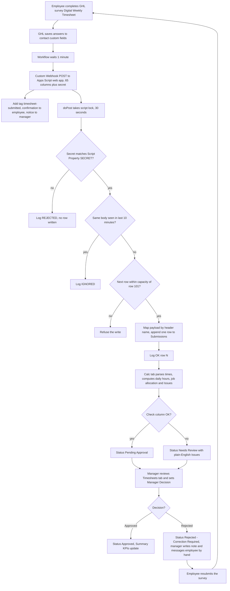
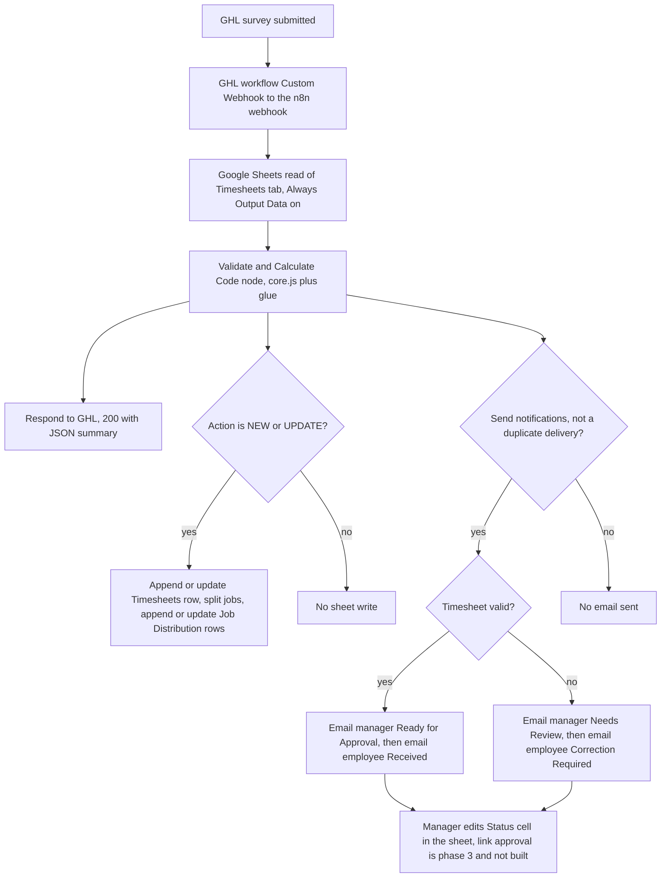

# Scope Stainless Works digital timesheet

> A client demo that replaces a handwritten weekly timesheet with a GoHighLevel survey, a Google Sheet that does all the checking and totals, and a manager approval step, built in two variants (A: HTML demo plus n8n, superseded; B: GHL survey plus Sheet formulas plus Apps Script intake, current).

| | |
|---|---|
| **Category** | Excel operations and workflow-automation tools |
| **Status** | On demand, as of 9 Oct 2026. Demo build only: variant B is the current direction but its Apps Script deploy and GHL workflow are not finished, and variant A is superseded. |
| **Type** | GHL survey and workflow, Google Sheet with formulas, Google Apps Script web app (variant B). HTML page plus n8n workflow (variant A). |
| **Runner and schedule** | Event-driven by a GHL survey submission once built (not built). Locally tested only. No schedule. |
| **Client / owner** | Scope Stainless Works (client demo), built in the Client & Agency (Pivot) workspace |
| **Stack** | GoHighLevel survey, workflow and Custom Webhook; Google Sheets; Google Apps Script (`Code.gs`); Python openpyxl, Node `vm`, PowerShell with desktop Excel COM for build and tests. Variant A also used n8n, a JavaScript `core.js` and the GHL Conversations API. |
| **Source** | Main KB Part 5 sections 1, 2, 12, 13, 14; Portfolio KB section 22 (Spreadsheets and Operations) and section 12 (GHL Forms to Excel / Google Sheets) |

## 1. Description

### What it does
The client's staff write start, unpaid break and finish times for each day of the week, plus a job-hours split, on a paper sheet. This project digitises that capture: an employee completes a four-step mobile survey in GHL, the answers land as one raw row in a Google Sheet, and the Sheet works out daily hours, ordinary hours, overtime at 1.5x, job-hour reconciliation, issues and a status. A manager reviews the `Timesheets` tab and records Approved or Rejected. The pitch is "Paper to digital form to automatic spreadsheet"; invoice automation is deliberately deferred.

Variant A did the calculation in JavaScript inside an n8n workflow. On 6 Oct 2026 the owner said "here no custom build, only ghl and sheet", so variant B moved all logic into Sheet formulas, with a small Apps Script web app as the only code that receives the GHL webhook.

### Inputs and outputs
- **Inputs:** a GHL survey ("Digital Weekly Timesheet") whose answers are stored on 62 contact custom fields, then sent by a GHL Custom Webhook. Variant B payload is 65 columns plus a shared `secret`. Times are free text (for example `7am`, `3:30pm`, `15:30`, `0730`, `7.30`); dates accepted as `28/06/2026`, `28.06.26` or ISO.
- **Outputs:** one `Submissions` row per submit; formula-driven `Timesheets`, `Job Distribution` and `Summary` tabs; `Log` tab entries (OK, REJECTED, IGNORED, ERROR). Variant A also returned a JSON summary to GHL and sent two emails per submission through GHL Conversations.

### Key components
| Component | Role |
|---|---|
| GHL survey and workflow (not built) | Four steps (Employee, Mon-Wed, Thu-Sun, Work distribution). Workflow: Survey Submitted, wait 1 minute, Custom Webhook, add tag `timesheet-submitted`, employee confirmation, manager notice. |
| Apps Script `apps-script\Code.gs` | `doPost` receives the webhook: script lock, secret check, 10-minute duplicate check, header-name row mapping, one row appended. `doGet` returns a health JSON. |
| Workbook `Scope_Stainless_Timesheet_GHL_Sheet.xlsx` (8 tabs) | `Read Me`, `Summary`, `Timesheets` (24 columns, manager view), `Job Distribution` (12 columns), `Submissions` (65 raw columns, GHL writes here), `Employees`, `Invoices (future)`, `Calc` (54 helper columns, visible for audit). |
| Manager columns on `Timesheets` | Manager Decision (Approved or Rejected dropdown), Approved By, Approval Date, Manager Note. All other cells are formulas. |
| Test tooling | `tests\test-in-excel.ps1` with `scenarios.json` (A-K), `tests\test-apps-script.js` with mocked Google services, `tools\build_workbook.py`. |
| Variant A: `demo\` folder | `index.html` demo page, `core.js` logic, `n8n-workflow.json` (15 nodes), workbook, `BLUEPRINT.md` (19 sections), two test scripts. |

Variant comparison:

| Aspect | Variant A (superseded) | Variant B (current) |
|---|---|---|
| Receiver | n8n webhook | Apps Script web app |
| Calculation | `core.js` inside an n8n Code node | Sheet formulas on the `Calc` tab |
| Record | Append-or-Update on Timesheet Key (email plus week-ending) | New `Submissions` row each time; older row becomes `Superseded` |
| Notifications | Four emails via GHL Conversations API | Generic GHL confirmation and manager notice |
| Tests | 17 unit tests, sandbox test of the n8n Code node | 11 Excel scenarios, 6 Apps Script tests |

### Where it lives
All under `D:\Project\Client & Agency (Pivot)\excel operation\`.
- Variant B (current): `ghl-sheet-demo\` with `GHL-BUILD-GUIDE.md`, the workbook, `apps-script\Code.gs`, `tools\build_workbook.py`, `tests\headers.json`, `tests\scenarios.json`, `tests\test-apps-script.js`, `tests\test-in-excel.ps1`.
- Variant A (superseded): `demo\` with `BLUEPRINT.md`, `core.js`, `index.html`, `n8n-workflow.json`, `sample-data.js`, workbook, `tests\`, `tools\`.
- Source photos: five `WhatsApp Image 2026-10-05 ...jpeg` files (paper timesheet and invoice template) in `excel operation\`.
- Config names only: Apps Script Script Property `SECRET`; n8n placeholders `PASTE_GOOGLE_SHEET_ID_HERE` and `REPLACE_WITH_MANAGER_CONTACT_ID`; n8n credential names "Google Sheets account" and "GHL Private Integration Token". No environment variables are used.
- Project memory note: `scope-stainless-ghl-sheet-only.md` (records that `demo\` is superseded and `ghl-sheet-demo\` is live).

## 2. Flow chart

Main flow: variant B (current). Parts of the front end (survey and workflow) are specified but not built; the Apps Script and the Sheet are built.

**Reading the chart**
1. The employee fills the four-step survey; GHL stores the answers on the contact's custom fields, which are a scratch pad only (they are overwritten on each submission).
2. The workflow waits 1 minute so the fields finish saving, then the Custom Webhook posts the mapped answers plus the shared secret to the Apps Script URL. Tag, employee confirmation and manager notice go out for every submission, because GHL cannot see the Sheet result.
3. `doPost` takes a 30-second script lock so simultaneous submissions never share a row.
4. Three gates: wrong or missing secret is logged `REJECTED`; an identical body within 10 minutes (CacheService MD5 of the raw body) is `IGNORED`; a next row above 101 is refused.
5. Otherwise `buildRow_` maps by header name (column order does not matter), stamps `Submitted At` itself, converts job-hour values to numbers (non-numbers stay text so the Sheet can flag them) and leaves times as text. The script logs `OK row N` plus any payload keys with no matching header.
6. Formulas on `Calc` and `Timesheets` recompute: parsed times, daily hours, job allocation per day, Issues, Check, Status, Version.
7. Status order: Superseded, then Approved, then Rejected - Correction Required, then Pending Approval when Check is OK, else Needs Review.
8. The manager filters on `Timesheets` only (never on `Submissions` or `Calc`) and sets the decision. Rejection means a reason in Manager Note and a manual message from GHL conversations, since a Sheet-triggered employee notice is not possible with GHL alone.
9. A resubmission is a new `Submissions` row: the older row becomes `Superseded` unless it was Approved, in which case the new row is flagged "already approved - manager must reopen it".

**Variant A chart (superseded, never imported into a real n8n)**

**Reading the variant A chart**
1. The webhook payload is flat key/value pairs (GHL custom data cannot nest): 4 fixed job rows by 7 days.
2. The Code node derives a `submission_id` by hash when none is supplied, so an identical retry gets the same id and a genuine resubmission differs because `submitted_at` differs.
3. Three things run in parallel after the calculation: the reply to GHL, the sheet write (match columns `Timesheet Key` and `Job Key`, USER_ENTERED) and the notification branch.
4. All four emails are HTTP POSTs to the GHL Conversations API. A duplicate delivery sends no second email.
5. Approval in the demo phase is the manager editing the Status cell; approval links via a second n8n workflow were planned, not built.

## 3. Case study

### The challenge
Scope Stainless Works records weekly hours on a handwritten timesheet: start, unpaid break and finish per day, and a job-hours distribution. The first deliverable was a client demo that shows "Paper to digital form to automatic spreadsheet", with these constraints: no OCR or image processing in the solution (the photos were only read to design it), a mobile-first form that does not recreate the paper grid, and invoice automation into the client's Excel template left for a later phase.

The paper sample itself exposed problems: the break columns hold break lengths rather than clock times; one day computes to 10 hours by clock but 11 hours were written and allocated; a digit is struck through on one job cell; job names are interpretations of handwriting; the sample uses 4 jobs where the brief said 3. The system flags the paper sheet as invalid (scenario B), which became the demo's selling point.

### The solution
Variant A (HTML demo plus n8n) was built first: a browser demo with a manager view, 17 tests on the calculation core, and a 15-node n8n workflow with idempotent writes and four notification emails. After the owner asked for GHL and a Sheet only, variant B kept the same data model and rules but moved every calculation into Sheet formulas. A single Apps Script web app is the only code, and it only appends validated-by-secret rows. Hours, overtime, job reconciliation, Issues, status and the dashboard all live in the workbook, where the manager can read and audit the `Calc` helper tab.

### Design decisions and rules learned
- **Owner rule:** GHL plus Google Sheet only, no n8n, no custom web page. Do not call the owner's GHL accounts (ghl-* MCP) for experiments. Always flag that GHL and Apps Script behaviour is unverified. This matches the KB golden rule to prefer the simple stack for client demos and ask before introducing n8n or custom code (Part 1 golden rule 17).
- **Sync decision history (the owner changed course several times):** (1) HTML plus n8n rejected; (2) "just sync custom-field values to the sheet" with no apps or files running on a server, after which it was clarified that nothing syncs by itself and three options were offered (native GHL Google Sheets action, manual CSV export of survey submissions, Excel Power Query with a token in the file), and the native action was chosen; (3) GHL marketplace apps were explored (SheetSyncers; the official LeadConnector "Google Sheets MCP"), the latter judged a poor fit because an AI step could misplace values in a 65-column deterministic write; (4) a daily API pull of survey submissions (not contacts, which lose history) was considered, needing a scheduled add-on because Sheets IMPORTDATA cannot send headers; (5) finally an Apps Script trigger, which produced `Code.gs`. The native Google Sheets action is kept as Option 2.
- **No "on form submit" trigger:** that trigger fires only for Google Forms. For a GHL survey the web-app deployment is the trigger. Do not run `doPost` from the editor (no secret means REJECTED is expected); run `testWithSample` and delete its row afterwards.
- **Times are text** because GHL has no time-of-day field; mistakes are caught and explained in the Sheet, not blocked on the phone.
- **Contact fields are overwritten on each submission**, so a weekly timesheet, being transactional, must be recorded in the Sheet (production alternatives named: a DB, or a GHL custom object, with only 3-4 summary fields on the contact).
- **Row-number coupling:** row N of `Timesheets` and `Calc` always reads `Submissions` row N; Job Distribution row is 2 + (N-2)*4 + (job-1). Capacity is 100 submissions (rows 2-101, `MAX_ROW = 101`). Never type in, sort, filter, insert or delete on `Submissions` or `Calc`.
- **Locale must be Australia** so `28/06/2026` parses.
- **Stricter job rule than the weekly sum:** each day's job hours must equal that day's calculated hours, and the weekly job total must equal weekly hours (tolerance 0.005 h).
- **Duplicate and resubmission rule:** same email plus week-ending means a new version; if an Approved row exists the manager must reopen it (clear Manager Decision on the old row).
- **Bugs found in testing:** invalid times made the job-mismatch formula subtract text and return `#VALUE!` (scenario D), fixed by comparing numeric days only; a freeze-pane call in variant A's workbook builder created an empty row 2 so data landed in row 3, fixed.
- **Known limitation in variant A:** if an employee drops a job on resubmission, the old Job Distribution row stays because Append-or-Update never deletes (fix: delete rows by Timesheet Key first).
- **Platform choice:** Google Sheets for the demo; Excel/OneDrive or Supabase/Postgres for production because the client's invoice template is Excel. The dashboard is the `Summary` tab (Looker Studio later); GHL dashboards are the wrong tool.
- **Phases planned (variant A blueprint):** 1 form, 2 webhook plus sheet plus notifications, 3 approval links, 4 invoice automation into the client's Excel template plus PDF, 5 reporting. No pricing given.
- **Folded in from the portfolio KB:** section 22 lists the reported assets (n8n workflow JSON, Apps Script / GHL Sheets version, blueprint) and asks for the real field schema, approval process, payroll and time calculations and edit permissions to be documented. The schema, approval flow and edit rules are above. On payroll the main KB is explicit that no payroll, pay-rate or leave calculation exists in either variant, and the Hourly Rate column is blank.
- **Portfolio KB section 12** describes a generic, "user-confirmed completed" GHL form to Sheet sync with recommended controls (stable key, documented column mapping, safe handling of concurrent submissions, restricted access, no silent discarding of invalid values). Variant B follows several of these (email plus week-ending key, header-name mapping, script lock, secret guard, invalid values flagged in Issues rather than dropped). That section is generic and does not name this project; the main KB says the GHL side of this timesheet is not built.

### Outcome
No measured business outcome recorded. Documented facts:
- Variant A: built and tested locally only. 17 unit tests on `core.js` and a sandbox test of the generated n8n Code node. Not imported into a real n8n, not connected to real GHL or Google Sheets. Superseded on 2026-10-06.
- Variant B workbook: formulas tested in real desktop Excel via PowerShell COM across 11 scenarios (A-K) with zero error cells. Not yet tested in Google Sheets.
- Variant B Apps Script: logic tested with mocked Google services (6 tests). In the last session turn (2026-10-07) the script was pasted into a real Apps Script project and a run of `doPost` from the editor correctly logged `REJECTED - missing or wrong secret`, which showed the script and the `Log` tab work. The target spreadsheet was still blank (no `Submissions` tab) at that point.
- GHL custom fields, survey and workflow: specs only, not built. The final state after 2026-10-07 15:07 is not found in the source, and there is no evidence that the client saw the demo.

### Lessons learned
- Treat GHL as an intake form only; it cannot validate times or sum hours, so the checking belongs in the Sheet.
- Build the keying and versioning (Timesheet Key, Version, Superseded) before the dashboard; a transactional record cannot live on contact fields.
- Test spreadsheet formulas in real Excel via COM when LibreOffice is absent, and cover bad inputs (blank name, bad email, Saturday week-ending, finish before start, job hours with no job).
- Always label unverified platform behaviour (native GHL Sheets action, Custom Webhook pricing) as unverified.
- Use the paper sample's own inconsistencies as the demo's proof of value.

## 4. Operating notes
- **Run / pause / debug:**
  - Formula test: `powershell -File ghl-sheet-demo\tests\test-in-excel.ps1 -Workbook <xlsx> -Scenarios ghl-sheet-demo\tests\scenarios.json` (copies the workbook to temp, writes scenario rows from `Submissions` row 3, approves row 2, runs `CalculateFull`, prints results and counts error cells). Scenarios: A valid; B Wednesday finish 18:00 (35 vs 36 hours); C jobs 35.5; D finish before start; E am/pm times; F resubmit of B gives v2 and the old row Superseded; G resubmit after Approved gives Needs Review; H blank name, bad email, Saturday week-ending; I empty week; J job hours without a job; K 42 hours gives 38 ordinary plus 4 overtime.
  - Script test: `node ghl-sheet-demo\tests\test-apps-script.js`.
  - Rebuild the workbook: `python ghl-sheet-demo\tools\build_workbook.py <out.xlsx>` (blue text = typed, yellow = manager editable, black = formula).
  - Runtime check: open the web-app URL in a browser (`doGet` returns `{ok:true, service:"timesheet-intake"}`) and read the `Log` tab. After code edits use Deploy, Manage deployments, New version (the URL stays the same).
  - Variant A only: `node tests\test-core.js`, `node tests\test-n8n-node.js`, regenerate with `node tools\build-n8n.js`. Open `demo\index.html` offline and press "Reset demo" before each run (scenarios A-D).
  - Demo script (5 minutes) and clean-up (clear `Submissions` rows 3 onward and the yellow manager cells before each run) are in `GHL-BUILD-GUIDE.md` sections 10 and 13.
- **Known issues and open items:**
  - The Apps Script web-app deploy and the GHL workflow are not finished (steps handed over: import the xlsx via File, Import, Replace spreadsheet; run `testWithSample`; deploy as Web app; build the GHL workflow).
  - The 38-hour ordinary-hours threshold is a demo placeholder; the award or agreement must be confirmed with the client. Overtime 2x and leave are not calculated.
  - GHL may show the webhook as failed or redirected because Google answers with a 302; judge by whether the row appears and what `Log` says. Numbers that arrive left-aligned arrived as text and will be flagged "Job hours must be numbers".
  - The native GHL Google Sheets action and the Custom Webhook premium-pricing status are unverified.
  - `demo\tools\build_workbook.py` needs a `sample.json` that is not in the folder.
  - Capacity is 100 submissions; the `Invoices (future)` tab and the invoice phase are not built.
  - Portfolio KB mentions a reported "Time tracker template"; the main KB found no session transcript or file for it (session metadata only).
- **Risks:**
  - Security and credential-hygiene findings for this project are tracked privately and are not published here.
  - The invoice template photos contain personal contact and banking details: keep them out of any shared or demo copy.
  - Custom Webhook may be a premium per-execution GHL action.

## 5. Related
- [GHL forms to Sheets sync](../09-integrations-operations/ghl-forms-to-sheets-sync.md): the generic form-to-spreadsheet pattern (portfolio KB section 12).
- [GHL API contracts and quirks](../03-ghl-crm-migrations/ghl-api-contracts-and-quirks.md): GHL platform quirks relevant to custom fields, webhooks and contact overwrites.
- [n8n hosting templates](n8n-hosting-templates.md): reverse-proxy templates for a self-hosted n8n, the runtime variant A was designed for.
- Other timesheet code that belongs to other slices (names only): `D:\Project\Apps & Fullstack\taskmanager\timesheet_export.php`, `D:\Project\<owner>\Stack&code\pm-tool\src\services\timesheetExportService.js` and `timesheetPdfService.js`.
- **Sources:** Main KB Part 5 section 1 (lines 2944-3009), section 2 (lines 3013-3078), section 12 (Time tracker template note), section 13 (cross-cutting rules, gotchas), section 14 (gaps); Part 1 golden rule 17. Portfolio KB section 22 (lines 742-762) and section 12 (lines 399-429).
