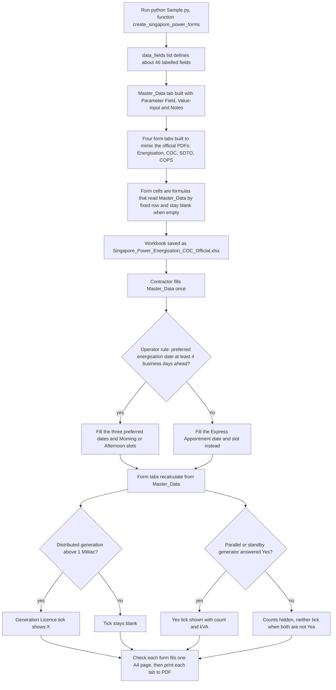

# Singapore Power forms to Excel

> A Python generator that rebuilds Singapore energisation and certification paperwork as one Excel workbook, where a single input tab drives four printable one-page A4 forms for a solar-PV electrical contractor.

| | |
|---|---|
| **Category** | Excel operations and workflow-automation tools (document conversion) |
| **Status** | On demand, as of 9 Oct 2026. Generator script and output workbook exist; data inside is fictitious sample data. |
| **Type** | Python script (openpyxl) that writes an Excel workbook of formula-driven form tabs |
| **Runner and schedule** | Manual: `python Sample.py` (function `create_singapore_power_forms`). Not run during the KB audit. |
| **Client / owner** | Client project (see Where it lives); use case is a solar-PV electrical contractor (Design / Installing LEW) |
| **Stack** | Python 3 and openpyxl only; no environment variables, no APIs |
| **Source** | Main KB Part 5 section 11 (also sections 13 and 14); Portfolio KB section 22 |

## 1. Description

### What it does
The official Singapore Power and EMA forms exist only as flat PDFs. This project recreates their layout in Excel so the contractor types each fact once, on a `Master_Data` tab, and the four form tabs fill themselves through formulas. Each form is laid out to mimic the official PDF and is set to print on one A4 page, ready to be printed to PDF for submission. The folder also holds a flow-chart PDF of the PV submission process, used as process knowledge.

### Inputs and outputs
- **Inputs:** five official blank PDFs in the folder: "Application for Appointment for Energisation of Service Connection", the "Certificate of Compliance", `SOTO.pdf` (Statement of Turn On of Electricity), `COPS.pdf` (Commissioning of Photovoltaic System) and "PV CS1 & PSO submission Flow Chart BY RES - more than 1MWAC". They have no fillable fields (checked), so the approach is manual re-creation of layout, not field extraction. `Form_COC.pdf` and `Form_Energisation.pdf` carry sample values and look like print-to-PDF exports of the generated tabs (inferred, used to compare layout). Operator input is the `Master_Data` tab.
- **Outputs:** the workbook `Singapore_Power_Energisation_COC_Official.xlsx` with five tabs (`Master_Data`, `Form_Energisation`, `Form_COC`, `Form_SOTO`, `Form_COPS`), and printable PDFs of each form tab.

### Key components
| Component | Role |
|---|---|
| `Sample.py` (1,630 lines) | Builds the workbook; configuration is the `data_fields` list. |
| `Master_Data` tab | "Project Central Input Repository", columns Parameter Field / Value-Input / Notes, about 46 labelled fields from row 4: applicant and consumer, design LEW name, licence, company, contact and email, owner email, submission date, SP application no., MSS account no., site address (two lines), approved load kW, supply voltage, distributed generation MWac, electrical installation licence, installing LEW, parallel generators (installed, count, kVA), standby generator (installed, count, kVA), target energisation date, three preferred dates with Morning/Afternoon slots, express appointment date and slot, solar PV kWac and kWp, commissioning test date, turn-on date, time, officer and licence, operation LEW, applicant representative with NRIC or passport and sign date. |
| `Form_Energisation`, `Form_COC` (EMA Certificate of Compliance), `Form_SOTO`, `Form_COPS` | Mimic the official layout: A4 portrait, fit to 1 page, merged cells, thin borders, Arial 7 to 12.5 pt, gridlines off. Cells are formulas such as `=IF(Master_Data!B4<>"", Master_Data!B4, "")`, with concatenated labels and `& " kW"` for approved load. |
| Conditional ticks | Generation Licence tick only when DG capacity exceeds 1 MWac (`=IF(Master_Data!B17>1,"X","")`); parallel and standby generator Yes/No ticks and counts shown only when "Yes"; a "neither" tick when both are not Yes. |

### Where it lives
`D:\Project\<owner>\<client-folder>\Exxcel converstion\` (folder name spelled as on disk): `Sample.py`, `Singapore_Power_Energisation_COC_Official.xlsx`, and the seven PDFs named above (five blank official forms or flow chart, plus `Form_COC.pdf` and `Form_Energisation.pdf`). No environment variables.

## 2. Flow chart

Main flow: generate the workbook, then fill it and print.

**Reading the chart**
1. `python Sample.py` runs `create_singapore_power_forms`, driven by the `data_fields` list.
2. `Master_Data` is created as the single input tab; the four form tabs are laid out to mimic the official PDFs.
3. Every form cell is a formula pointing at a fixed `Master_Data` row, so the form stays empty until data is entered.
4. The contractor fills `Master_Data` once. The date rule appears to be a human check rather than a formula (inferred): a preferred energisation date must be at least 4 business days ahead, otherwise the Express Appointment fields are used.
5. The forms recalculate. The Generation Licence tick appears only above 1 MWac; generator Yes/No ticks and counts appear only when "Yes".
6. Each tab is checked in Page Layout to fit one A4 page and printed to PDF.

**Reference chart: PV submission sequence above 1 MWac (from the flow-chart PDF in the folder, not automated)**

This sequence is documented process knowledge, with an estimated 3 to 4 months from CS1 to turn-on. Turn-on needs the PSO letter, a wholesaler generation licence, PV1, PV2, the EMA EI and a meter declaration. A mock-up test is suggested for more than 10 tie-in points.

## 3. Case study

### The challenge
A solar-PV electrical contractor has to complete several official forms for each project (energisation appointment, certificate of compliance, statement of turn-on, commissioning of the PV system), and much of the same information repeats across them. The official versions are flat PDFs with no fillable fields, so retyping each one by hand would mean repeating the same data entry.

### The solution
One workbook where a single input tab is the only place data is typed. A Python script (`Sample.py`) generates the workbook: it writes the labelled input fields, then lays out each form tab to match the official PDF, with cell formulas reading from `Master_Data`. Conditional formulas show ticks and counts only when the underlying answers call for them. Because the PDFs could not be field-extracted, the layout was recreated by hand in code and compared against print-to-PDF exports of the generated tabs.

### Design decisions and rules learned
- **Fixed row references:** formulas address `Master_Data` by hard-wired row numbers (for example B14 site address, B15 load, B17 DG capacity). Do not insert or delete rows in `Master_Data`; add new fields at the end.
- **Dates are text** in `YYYY-MM-DD` form.
- **Business rules baked in:** a generation licence is required above 1 MWac; a preferred energisation date must be at least 4 business days ahead, otherwise use the Express Appointment fields.
- **Layout approach:** merged cells, thin borders, Arial 7 to 12.5 pt, A4 portrait fit to one page, gridlines off.
- **Revision risk:** the source forms carry a Dec 2019 revision tag and SP contact details; re-check against current official forms before real submissions.
- **Portfolio KB:** section 22 describes this as "Excel conversion of energisation and certificate-of-compliance forms" and advises treating it as document or data conversion unless the workflow shows more automation. The main KB confirms that: it is a one-shot generator plus formulas, with no API, trigger or schedule. The main KB covers four forms (adding SOTO and COPS), where the portfolio KB names two.

### Outcome
No measured outcome recorded. Documented: the generator (`Sample.py`, 1,630 lines) and the output workbook exist; the data inside is fictitious sample data (placeholder company, LEW, addresses and dates); no real submission, form count or time saving is recorded, and no session transcript exists for this folder.

### Lessons learned
- When the source forms are flat PDFs, recreating the layout and driving it from one input tab removes repeated data entry.
- Keep a single central input repository and never move its rows once formulas depend on them.
- Check recreated forms against the current official revision before any real submission (the sources carry a Dec 2019 tag).

## 4. Operating notes
- **Run / pause / debug:** `python Sample.py` in the folder; open the workbook in Excel; check that each form tab prints on one A4 page (Page Layout). Not run during the KB audit.
- **Known issues and open items:** source forms are Dec 2019 versions and need checking against current forms; sample data only; no transcript or run history; the KB does not say whether a real project has used the workbook.
- **Risks:** the workbook has fields for NRIC or passport numbers and licence numbers, so a filled copy holds personal data and should be handled accordingly; row-coupled formulas break if `Master_Data` rows are inserted or deleted; the KB documents formulas only for field links and ticks, so the 4-business-day date rule appears to be a manual check (inferred).

## 5. Related
- [Scope Stainless Works digital timesheet](scope-stainless-works-digital-timesheet.md): another spreadsheet-driven project in this folder, built on the same generator-plus-formulas approach (Python openpyxl, formula-driven output tabs). The KB documents no direct link between the two.
- **Sources:** Main KB Part 5 section 11 (lines 3419-3455), sections 13 and 14; Portfolio KB section 22 "Singapore Power form conversion" (lines 757-761).
