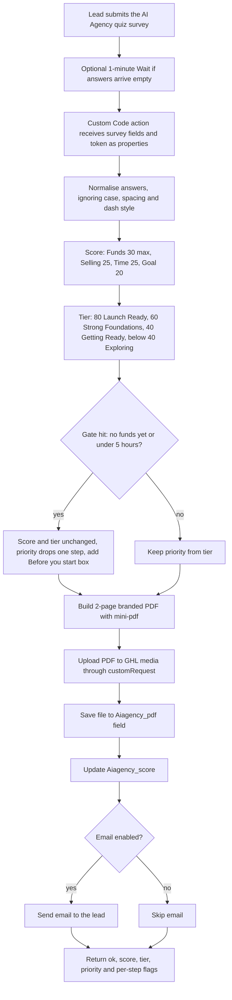

# AI Agency readiness quiz: scoring and PDF inside one GHL Custom Code action

> A dependency-free JavaScript program, pasted into a single GoHighLevel Custom Code workflow action, that scores the "AI Agency in a Box" quiz out of 100, builds a 2-page branded PDF, stores it on the contact and optionally emails the lead.

| | |
|---|---|
| **Category** | Apps, calculators, websites and funnels (quizzes and scoring) |
| **Status** | On demand, as of 9 Oct 2026 (live test succeeded on 9 Oct, but the saved workflow action still needed a manual Save) |
| **Type** | GHL Custom Code workflow action (premium action, charged per execution) |
| **Runner and schedule** | Runs once per workflow execution after "Survey Submitted"; no schedule |
| **Client / owner** | P2T (AI Agency in a Box / Unfranchise offer) |
| **Stack** | Pure JavaScript, no packages (the Custom Code sandbox has no `require` or `fetch`); hand-written PDF writer `src/mini-pdf.js` with Helvetica metrics in `helvetica-widths.js` and an embedded logo JPEG; build script `dev/build-ghl.js`; tests with `node --test` (38 tests), `pdf-lib` as a dev check only |
| **Source** | Main KB Part 6 section 6A (AI Agency readiness quiz); Portfolio KB section 9 (Growth Constraint Quiz scoring and PDF generation, mapping inferred) |

## 1. Description

### What it does
After a lead completes the quiz survey, the workflow runs one Custom Code action. The script scores four answers (funds, B2B selling experience, weekly time, goal) out of 100, assigns a tier and a priority, builds a 2-page branded PDF, uploads it to GHL media, saves it to the contact's `Aiagency_pdf` file field, saves the score to `Aiagency_score`, and optionally emails the lead.

### Inputs and outputs
- **Inputs (action properties):** the contact's survey fields `funds`, `sales`, `time`, `outcome`, `postcode`, `name`, `firstName`, `contactId`, `locationId`, plus `ghlToken`.
- **Outputs:** `ok` (true / partial / false), `score`, `tier`, `priority`, breakdown points, `pdfStored`, `fieldsStored`, `emailSent`, error strings. Steps fail independently (media upload, field upload, score update, email). Outputs are capped at 2 MB.

### Key components
| Component | Role |
|---|---|
| `src/` | Scoring, tiers, gates, PDF composition |
| `src/mini-pdf.js`, `helvetica-widths.js` | Hand-written PDF writer and font metrics (the sandbox cannot load libraries) |
| `dist/ghl-custom-code.js` | Single file pasted into the action (`--no-logo` makes a 73 KB version; `--target=save-test` builds the small `dist/ghl-save-test.js` that only checks saving) |
| `customRequest` | Global HTTP client in the sandbox, found via the editor's Snippets menu; earlier guesses such as `axiosWrapperFunction` were dead ends. The script tries `customRequest` first and keeps fallbacks |
| `test/` | 38 `node --test` tests |

### Where it lives
- Source: `D:\Project\Client & Agency (Pivot)\Pivot2Thrive & Content\franchise` (`src/`, `dist/ghl-custom-code.js`, `test/`, `README.md`). Session "Quiz scoring system and PDF generation" (finished 9 Oct 2026).
- Needs a Private Integration Token with media write, forms write and contacts write, and optionally conversations write for email.

## 2. Flow chart

**Reading the chart**
1. The survey submission starts the workflow. If answers can arrive empty, add a 1-minute Wait before the action.
2. The action receives the survey fields and the token as properties and normalises answers so case, spacing and dash style do not matter.
3. Points: Funds 30/22/12/0, Selling 25/21/13/6, Time 25/20/12/3, Goal 20/18/14/5. Tiers: 80-100 Launch Ready (hot), 60-79 Strong Foundations (warm), 40-59 Getting Ready (nurture), 0-39 Exploring (explore).
4. Gates (no funds yet, under 5 hours) leave score and tier unchanged but move priority down one step and add a "Before you start" box.
5. The PDF is built with the in-house writer, uploaded to media, stored on the contact, the score is saved, and an email is optionally sent. Each step reports its own success so a failure in one does not hide the others.

## 3. Case study

### The challenge
The "AI Agency in a Box" quiz needed a personalised scored PDF for each lead, saved to the contact, with the logic running inside GHL's Custom Code action, which has no `require` and no `fetch`, a 2 MB output cap and a per-execution charge. The source does not say whether this replaced the server-based PDF factory; section 6B says the scored-quiz backend for the franchise funnels is the PDF factory and this Custom Code script.

### The solution
Write the whole thing as plain JavaScript with no dependencies, including a small PDF writer with embedded font metrics and logo, and compile it into one file that is pasted into the action. The HTTP client is the sandbox's own `customRequest`. Scoring is deterministic and unit-tested.

### Design decisions and rules learned
- **Tests and builds:** `npm test` (38 tests), `npm run build` creates the single deployable file. A small `save-test` target checks only saving, with no PDF.
- **Partial success is a result:** `ok` can be `partial`, so a missing email does not lose the stored PDF.
- Custom values are not passed in tests: paste the token in Test Setup.
- Treat `ghlToken` like a password and pass it only as an action property.
- The saved action held the old script, so the owner still had to click Save action after the code was pasted.

### Outcome
Documented facts only: the live test on 9 Oct 2026 succeeded - score 74 saved, a 39,721-byte PDF stored, uploads returned 201 and the update returned 200. The action still needed a manual Save to take the new script. No volume of leads scored is recorded.

### Lessons learned
- In GHL's Custom Code sandbox, use the Snippets menu to discover the real HTTP helper rather than guessing names.
- Keep outputs small (2 MB cap) and make every step independent.
- The design uses one Custom Code action because it is a premium action charged per execution.

## 4. Operating notes
- **Run / pause / debug:** `npm test`, `npm run build`, paste `dist/ghl-custom-code.js` into the action, set properties, test with real survey data. Add a 1-minute Wait before the action if answers arrive empty.
- **Known issues and open items (portfolio KB list of information still needed):**

| Item still needed (portfolio KB section 9) | Where the main KB now answers it |
|---|---|
| Exact question/answer scoring matrix | Answered above for this quiz (four questions, point tables) |
| Category names and weights | Funds 30, Selling 25, Time 25, Goal 20 |
| Thresholds and result-band definitions | Four tiers and the gate rules above |
| PDF template and branding rules | Only "2-page branded PDF with an embedded logo" is documented; layout and brand rules are not documented in the source |
| Where the PDF is stored or delivered | GHL media plus the `Aiagency_pdf` file field; optional email |
| How the result is connected to GHL contacts | By `contactId` and `locationId` using the token |

- **Risks:** premium action cost per run. The portfolio KB asks that scoring rules be kept in configuration, boundary cases be tested, versioning be considered and one contact's results never be exposed to another; 38 tests exist (their coverage of boundary cases is not detailed in the source), and a versioned scoring configuration is not documented.

## 5. Related
- Portfolio KB section 9 (general process, generic): collect answers, validate, map to scores, calculate category and overall results, apply bands, generate a personalised report, render a PDF, store it against the contact, log errors and validate sample outputs. It does not name the quiz; the match to this file is inferred from the session title "Quiz scoring system and PDF generation" and the status "user-confirmed completed".
- Server-based alternative for the BNI and franchise quizzes: [bni-franchise-pdf-factory-and-postcode-lock.md](bni-franchise-pdf-factory-and-postcode-lock.md).
- Funnel pages that lead to this quiz: [ai-agency-unfranchise-funnels-and-link-pages.md](ai-agency-unfranchise-funnels-and-link-pages.md).
- **Sources:** Main KB Part 6 section 6A "AI Agency readiness quiz"; Portfolio KB section 9.
