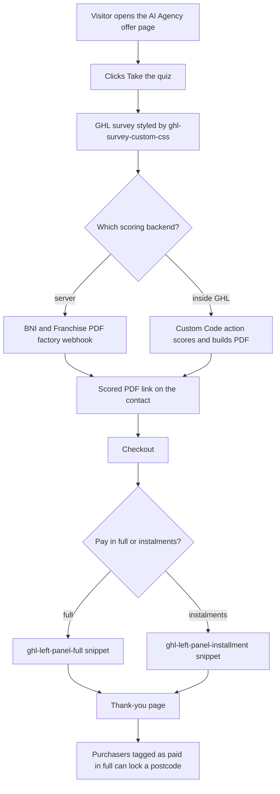

# "Start Your Own AI Agency" / Unfranchise funnels and link pages

> Pivot2Thrive's AI-agency franchise offer pages: an offer page with a quiz survey, checkout panels for full-pay or instalment, a thank-you page, GHL custom CSS, and a link-in-bio page.

| | |
|---|---|
| **Category** | Apps, calculators, websites and funnels (funnels) |
| **Status** | On demand, as of 9 Oct 2026 |
| **Type** | Static HTML pages and CSS snippets pasted into GHL elements and custom CSS fields |
| **Runner and schedule** | Manual. Pages are pasted into GHL; CSS pasted into GHL Custom CSS fields |
| **Client / owner** | P2T |
| **Stack** | Static HTML/CSS; GHL surveys, checkout and funnel steps; GHL Ask AI Build prompts |
| **Source** | Main KB Part 6 section 6B ("Start Your Own AI Agency" / Unfranchise funnels and link pages) |

## 1. Description

### What it does
The pages present Pivot2Thrive's AI-agency franchise offer (no royalties). A quiz survey qualifies the visitor, a checkout supports full payment or instalments through separate left-panel snippets, and a thank-you page closes the flow. GHL-specific CSS files style the survey and checkout inside GHL. The scored-quiz backend for these funnels is the PDF factory and the Custom Code script (see Related). A link-in-bio page for the principal also lives in the same family of folders.

### Inputs and outputs
- **Inputs:** visitor quiz answers; checkout choices.
- **Outputs:** GHL survey submissions, orders, and (via the scoring backends) a scored PDF on the contact.

### Key components
| Component | Role |
|---|---|
| `Nich\ai-agency-funnel.html`, `niche-unfranchise.html` | Offer pages |
| `Nich\ghl-page-custom-css.css`, `ghl-survey-custom-css.css` | GHL custom CSS for pages and surveys |
| `Niche\index.html`, `survey.css`, `thank-you.html` | Alternate set: page, survey styling, thank-you |
| `Linktree\drpriya.html` | Link-in-bio page |
| `Linktree\ai agency\ghl-left-panel-full.html`, `ghl-left-panel-installment.html` | Checkout left-panel snippets for full pay and instalments |
| `Linktree\niche-rewrite\` | GHL build prompts |
| `Linktree\franchsie\` | `NICHE.html`, `calculator.html`, `GHL-BUILD-PROMPTS.md` |

### Where it lives
- `D:\Project\Client & Agency (Pivot)\Websites & Funnels\Nich`, `...\Niche` and `...\Linktree`.

## 2. Flow chart

The source does not give an exact page order; the chart shows how the documented parts fit together.

**Reading the chart**
1. The offer page invites the visitor to take a quiz, which is a GHL survey.
2. Scoring happens either in the server-side PDF factory or in the GHL Custom Code action; the source names both as the backend.
3. The checkout shows one of two left-panel snippets depending on full payment or instalments.
4. Postcode locking applies to contacts tagged as having paid in full (see the BNI and Franchise PDF factory file).

## 3. Case study

### The challenge
As described in the source: Pivot2Thrive's AI-agency franchise offer pages (no royalties) with a quiz survey, a checkout with full-pay or instalment left-panel snippets, and a thank-you page, all styled with GHL-specific CSS.

### The solution
Static pages and CSS snippets that match the brand and are pasted into GHL elements, with dedicated checkout left-panel snippets for each payment option and separate GHL build prompts for rebuilding pages with GHL's Ask AI Build mode.

### Design decisions and rules learned
- GHL-specific CSS files are required because the survey and checkout live in GHL (and form content is inside an iframe that page CSS cannot reach).
- Keep full-pay and instalment checkout panels as separate snippets.
- Use the Standard Page type for funnel steps that carry custom code (see the PoolSafe file for the checkout-widget gotcha).

### Outcome
No measured outcome recorded.

### Lessons learned
- The same funnel family can use more than one scoring backend; document which is live (the source does not).

## 4. Operating notes
- **Run / pause / debug:** paste HTML into GHL elements and CSS into custom CSS fields. Test the survey and checkout in GHL.
- **Known issues and open items:** which backend is current for each page is not stated.
- **Risks:** none recorded.

## 5. Related
- [bni-franchise-pdf-factory-and-postcode-lock.md](bni-franchise-pdf-factory-and-postcode-lock.md) and [ai-agency-readiness-quiz-ghl-custom-code.md](ai-agency-readiness-quiz-ghl-custom-code.md) are the scoring backends.
- [dr-priya-personal-brand-site.md](dr-priya-personal-brand-site.md) includes the same link-in-bio page.
- [../03-ghl-crm-migrations/ghl-ai-prompt-builder-and-search-for-ghl.md](../03-ghl-crm-migrations/ghl-ai-prompt-builder-and-search-for-ghl.md) covers the prompt-building method.
- **Sources:** Main KB Part 6 section 6B and the embed patterns in section 6D.
