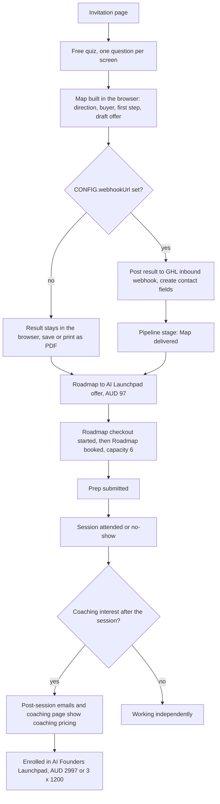

# AI Launchpad funnel (quiz, Roadmap session and Founders Launchpad coaching)

> A funnel for Dr Priya's AI offer: invitation, a free quiz that produces a Personal AI Launchpad Map, a paid Roadmap session, and an optional six-month group coaching programme, with a GHL build specification.

| | |
|---|---|
| **Category** | Apps, calculators, websites and funnels (quizzes and funnels) |
| **Status** | On demand, as of 9 Oct 2026 (pages and build spec written; GHL build status not stated) |
| **Type** | Self-contained HTML pages pasted into GHL, plus an automation build spec |
| **Runner and schedule** | Manual. The quiz webhook (`CONFIG.webhookUrl`) is blank until set |
| **Client / owner** | P2T (Dr Priya's offer) |
| **Stack** | Inline HTML, CSS and JS (no extra files): `index.html`, `quiz.html` (87 KB), `ghl-quiz-embed.html`, `roadmap-to-ai-launchpad.html`, `roadmap-confirmed.html`, `coaching-decision.html`, `ai-founders-launchpad.html`, `welcome.html`, `team-playbook.html`; `launchpad1` adds checkout pieces and GHL custom CSS |
| **Source** | Main KB Part 6 section 6B (AI Launchpad funnel) |

## 1. Description

### What it does
A visitor takes a one-question-per-screen quiz (with branches and "doesn't feel like me" edits) that builds a Personal AI Launchpad Map in the browser: service direction, potential buyer, first step and a draft one-sentence offer, with save or print as PDF. The funnel then leads to the paid Roadmap to AI Launchpad session (AUD $97, credited towards coaching) and the six-month AI Founders Launchpad group coaching (AUD $2,997, or 3 x $1,200).

### Inputs and outputs
- **Inputs:** quiz answers (state kept in localStorage); optional webhook to a GHL inbound webhook.
- **Outputs:** the Map (on-screen, printable); optional contact fields (`result_type`, `service_direction`, `starter_deliverable`, `potential_buyer`, `main_barrier`, `time_available`, `first_action`, `marketing_consent`, and so on).

### Key components
| Component | Role |
|---|---|
| `quiz.html` | The quiz and Map builder; `CONFIG.webhookUrl` posts the result to a GHL inbound webhook when set |
| Funnel pages | Landing, Roadmap sales and confirmation, coaching decision, coaching sales, welcome, team playbook |
| `AI-Launchpad-Emails-and-Automations.md` | Build spec: custom values (session date, links), contact fields, 15 `lp-*` tags, an "AI Launchpad" pipeline, products and checkouts, credit rules, workflows, email formats, a testing checklist |
| `launchpad1` | Checkout pieces and GHL custom CSS |

### Where it lives
- `D:\Project\Client & Agency (Pivot)\Pivot2Thrive & Content\lanchpad` (typo in the folder name) and `...\launchpad1`. Sessions "AI Launchpad funnel copy".

## 2. Flow chart

**Reading the chart**
1. The invitation leads to the free quiz; the Map is built in the browser and can be saved or printed.
2. If `CONFIG.webhookUrl` is set, the result is posted to GHL and creates contact fields; otherwise it stays local.
3. The paid Roadmap session is AUD $97 with capacity of 6, credited towards coaching.
4. The pipeline in the spec runs Map delivered, Roadmap checkout started, Roadmap booked, Prep submitted, Attended or No-show, Coaching considering, then Enrolled or Working independently.
5. Coaching pricing appears only at the end of the paid session, in post-session emails and on the coaching page.

## 3. Case study

### The challenge
The offer is a staged path from a free quiz to a $97 paid session and then to coaching. The build rules require that coaching pricing is not shown before the paid session and that the quiz result lands in GHL as structured fields and tags.

### The solution
Self-contained HTML pages that can be pasted into GHL, a browser-side quiz that produces something useful on the spot (the Map), an optional webhook for capturing results, and a detailed build specification for the tags, pipeline, products, workflows and testing.

### Design decisions and rules learned
- **Coaching pricing only at the end of the paid session**, in post-session emails and on the coaching page; never in quiz-to-$97 emails.
- **The $97 credit is applied once per person** (verify tag `lp-roadmap-paid` and no `lp-credit-applied`).
- Update `agreed_focus`, `agreed_next_action`, `coaching_support_needed` and `actual_obstacle` before sending coaching follow-ups; tag `lp-session-record-updated` unlocks them.
- Roadmap session capacity is 6.
- A second editor changed `theme.css` (Poppins) while pages were being rewritten, so styles may need re-syncing.

### Outcome
No measured outcome recorded. The pages and the build spec exist; the source does not record enrolments, bookings or GHL build completion.

### Lessons learned
- Keep a clear gate (a tag) between the quiz funnel and coaching communications.
- Re-sync styles when two editors touch shared CSS.

## 4. Operating notes
- **Run / pause / debug:** paste pages into GHL; set `CONFIG.webhookUrl` in `quiz.html` to capture results; follow the testing checklist in the build spec.
- **Known issues and open items:** webhook blank until set; styles may need re-syncing.
- **Risks:** the quiz captures marketing consent and personal answers; the spec assumes consent handling is wired in GHL.

## 5. Related
- [dr-priya-personal-brand-site.md](dr-priya-personal-brand-site.md) is the personal brand site for the same principal, and [ai-agency-unfranchise-funnels-and-link-pages.md](ai-agency-unfranchise-funnels-and-link-pages.md) covers other P2T funnels.
- **Sources:** Main KB Part 6 section 6B "AI Launchpad funnel".
