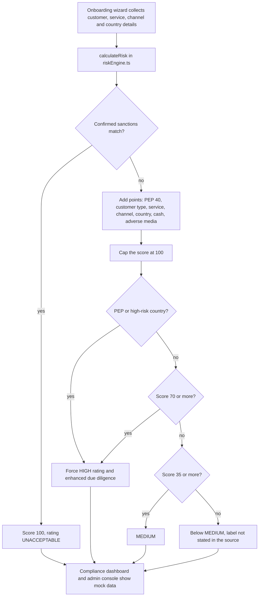

# AUSTRAC AML/CTF platform concept and Tranche 2 Readiness Scorecard

> Pivot2Thrive's explored product for professional-services firms facing AUSTRAC Tranche 2: a scope-of-work and research base, a mock-data prototype app with an additive customer risk engine, and a free 12-minute readiness scorecard funnel.

| | |
|---|---|
| **Category** | Apps, calculators, websites and funnels (calculators and funnels) |
| **Status** | Designed, not built, as of 9 Oct 2026 (prototype with mock data only; no backend; deployment not found) |
| **Type** | Next.js prototype plus static funnel pages |
| **Runner and schedule** | `npm run dev` (Next). Not deployed anywhere the source could find |
| **Client / owner** | P2T |
| **Stack** | Next 16, React 19, Tailwind 4 (prototype); static HTML for the funnel pages |
| **Source** | Main KB Part 6 section 6B (AUSTRAC / AML-CTF platform concept and Tranche 2 Readiness Scorecard) |

## 1. Description

### What it does
The folder explores a productised AML/CTF offer for Tranche 2 (professional-services firms, from 1 Jul 2026). It holds a scope-of-work document (8 Jun 2026) that front-loads a strategic risk register arguing against building a full proprietary platform, a research report, a prototype app, and sales and funnel pages including a free 12-minute readiness scorecard.

### Inputs and outputs
- **Inputs:** (prototype) onboarding wizard answers about a customer, service, channel, country and cash expectations; (scorecard) readiness answers.
- **Outputs:** (prototype) a customer risk score and rating with mock data; (scorecard) a readiness check. The source does not describe the scorecard's scoring or delivery.

### Key components
| Component | Role |
|---|---|
| `AUSTRAC-AML-CTF-Platform-Scope-of-Work.docx` | Scope of work; strategic risk register |
| Prototype components | OnboardingWizard, ComplianceDashboard, AdminConsole, with `mockData.ts` (mock data only, no backend) |
| `src/lib/riskEngine.ts` `calculateRisk()` | Additive customer risk score |
| `scripts/scan-modules.js` | Run as `predev` / `prebuild`: scans `src/modules/*/config.json` and writes `src/lib/modulesManifest.ts`, so dropping in a module folder auto-registers it |
| `public/{index,product,scorecard,waitlist,dwy}.html`, `sales-page.html`, `sales-page-ghl.html` | Sales and funnel pages; `scorecard.html` is the free readiness check |

### Where it lives
- `D:\Project\Client & Agency (Pivot)\Compliance & Audits\Austrac` (Next.js app) and `...\Websites & Funnels\landing` (a copy of the landing page).

## 2. Flow chart

Designed flow of the prototype risk engine, run on mock data only; the full platform was not built.

**Reading the chart**
1. The onboarding wizard gathers customer type, service, channel, country and cash expectations.
2. A confirmed sanctions match gives 100 and UNACCEPTABLE straight away.
3. Otherwise points are added: PEP +40; customer type foreign +30, trust/SMSF +20, company/partnership +15, association +10, individual +5; service +25 (trust/company formation), +20 (asset management), +15 (legal/conveyancing), +10 (accounting/tax); channel third-party +20, non-face-to-face +15, digital ID +5; high-risk country +30; expected cash at or above A$10,000 +25 (any cash +10); adverse media +20. The score is capped at 100.
4. 70 or more is HIGH and needs EDD; 35 or more is MEDIUM; PEP or a high-risk country forces HIGH plus EDD.
5. The dashboards display mock data only.

## 3. Case study

### The challenge
Tranche 2 brings professional-services firms under AUSTRAC AML/CTF obligations from 1 Jul 2026. The folder weighs whether to build a proprietary compliance platform at all (the scope-of-work risk register argues against it) and also holds sales and funnel pages, including a waitlist and the readiness scorecard.

### The solution
A staged exploration: a scope-of-work document with a risk register that argues against a full proprietary platform, a prototype to show the shape of the product (wizard, dashboard, admin console, risk engine), and a set of funnel pages including a 12-minute free readiness scorecard to test demand. The implemented related product is Centinl.

### Design decisions and rules learned
- The scope-of-work document front-loads a strategic risk register that argues against building a full proprietary platform.
- The risk score is additive and rule-based, with hard overrides for sanctions, PEP and high-risk country.
- Modules self-register via a manifest script, so new modules need no wiring.

### Outcome
No measured outcome recorded. The prototype has not been deployed anywhere the source could find. Related implemented product: [centinl-aml-ctf-audit-portal.md](centinl-aml-ctf-audit-portal.md).

### Lessons learned
- No lessons are recorded in the source for this item. The prototype stayed on mock data; the related implemented product is Centinl.

## 4. Operating notes
- **Run / pause / debug:** `npm run dev` in the Next.js app.
- **Known issues and open items:** deployment status not found; scorecard scoring and delivery not documented in the source.
- **Risks:** none recorded in the source.

## 5. Related
- [centinl-aml-ctf-audit-portal.md](centinl-aml-ctf-audit-portal.md) is the implemented AML/CTF product.
- **Sources:** Main KB Part 6 section 6B "AUSTRAC / AML-CTF platform concept"; Part 6 section 6C for the `implementation_plan.md`.
