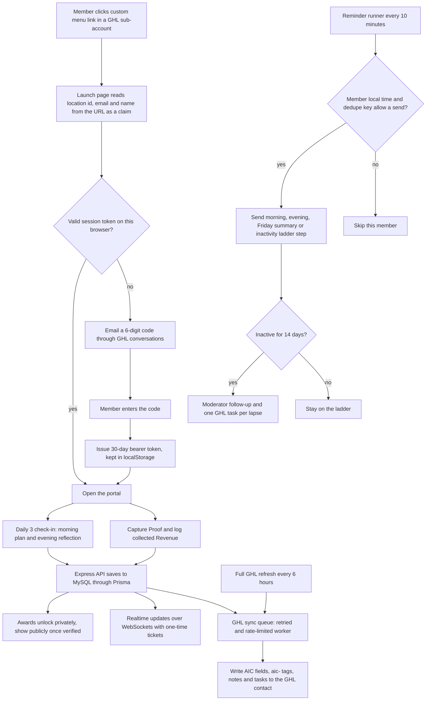

# Authority Inner Circle member portal

> A member portal for the "Authority Daily 3" programme (Show, Sell, Serve) that runs as an iframe inside GoHighLevel sub-accounts, with daily check-ins, proof and revenue capture, awards, reminders and a two-way mirror of members into GHL contacts.

| | |
|---|---|
| **Category** | Apps, calculators, websites and funnels (apps) |
| **Status** | Live, as of 9 Oct 2026 |
| **Type** | Web app (React client, Node/Express API, MySQL, WebSockets), embedded in GHL as a custom menu link |
| **Runner and schedule** | One Docker container on the shared 2 GB HestiaCP VPS. In-process reminder runner every 10 minutes, full GHL refresh every 6 hours, nightly database dump at 03:17 |
| **Client / owner** | HLGP (served from a subdomain of the HLGP domain; client not otherwise named in the source) |
| **Stack** | React 19, TypeScript, Vite, React Router, TanStack Query; Node 22, Express 5; MySQL 8 via Prisma 6 (live DB is the server's HestiaCP MariaDB); `ws` WebSockets; GHL REST API v2 with a Private Integration Token; Docker |
| **Source** | Main KB Part 6 section 6A (Authority Inner Circle); Portfolio KB section 25 (names only) |

## 1. Description

### What it does
Members complete a guided Daily 3 check-in (morning plan, evening reflection), capture Proof, log collected Revenue and unlock monthly Money awards. Admins and moderators get a console to manage members, run announcements, approve new sub-accounts and watch the GHL sync. The portal opens from a custom menu link inside a GHL sub-account, and every member is mirrored into the main GHL sub-account as a contact with `AIC` custom fields and `aic-` tags.

### Inputs and outputs
- **Inputs:** the launch URL claim (location id, email, name), a 6-digit emailed code, member check-ins, proof and revenue entries, admin actions, GHL API responses.
- **Outputs:** member records in MySQL (source of truth), reminder emails, in-app notifications, award achievements, and GHL contact data (16 custom fields prefixed `AIC`, tags starting `aic-`, notes for awards and nudges, tasks for moderator follow-up).

### Key components
| Component | Role |
|---|---|
| `src/` (React client) | Member and admin screens, dark navy theme (SHOW blue, SELL green, SERVE gold) |
| `server/` (Express) | API, auth, RBAC, WebSocket hub |
| `server/jobs.js` | Reminder runner every 10 minutes, per-member timezone, de-duplicated with keys |
| `server/ghl/` | Queued, retried, rate-limited sync worker plus 6-hourly full refresh |
| `prisma/schema.prisma` | Role, Permission, RolePermission, AuditLog, Account, User, AuthCode, Daily3, Proof, Revenue, AwardDefinition, AwardAchievement, Notification, WeeklyReflection, ActivityLog, Setting, GhlSyncJob, MemberNote, Announcement and others |
| Admin console | Dashboard, Members (segments, bulk nudge), Activity, Announce, Accounts, Awards, Roles, Settings, GoHighLevel (connection test, field setup, sync queue) |
| `deploy/` and `docker/` | `deploy.sh`, `remote-build.sh`, `backup.sh`, `init-env.sh`, Hestia nginx templates, `entrypoint.sh` |

### Where it lives
- Source: `D:\Project\Client & Agency (Pivot)\Saas app` (spec `Authority_Inner_Circle_SaaS_Dev_Spec.md`; folders `docs/`, `deploy/`, `docker/`, `prisma/`, `server/`, `src/`).
- Live: on a subdomain of the HLGP domain, with the container bound to localhost behind the Hestia nginx proxy template on the shared VPS.
- Environment variable names: `DATABASE_URL`, `JWT_SECRET`, `APP_URL`, `TRUST_PROXY`, `GHL_PIT`, `GHL_LOCATION_ID`, `GHL_ADMIN_EMAILS`, `GHL_AGENCY_PIT`, `GHL_COMPANY_ID`, `GHL_FRAME_ANCESTORS`, `UPLOAD_DIR`, `NO_DEMO`.

## 2. Flow chart

**Reading the chart**
1. A member opens the custom menu link. The URL values are only a claim, so the first open on a browser needs proof of the email address.
2. A 6-digit code is emailed through GHL conversations and, once entered, a 30-day bearer token is stored in localStorage (the iframe is cross-site, so cookies are not used).
3. Inside the portal the member does the Daily 3 check-in and captures Proof and Revenue. Everything is saved to MySQL, which stays the source of truth.
4. Awards unlock privately and become public once verified. WebSocket connections use one-time tickets.
5. Each change is queued to the GHL sync worker, and a full refresh every 6 hours repairs drift. Demo data is never sent to GHL.
6. Independently, the reminder runner wakes every 10 minutes and works in each member's timezone with dedupe keys. After 14 days of inactivity the ladder reaches moderator follow-up, which also creates one GHL task per lapse.

## 3. Case study

### The challenge
The Authority Daily 3 programme needed a place where members could build a daily habit (Show, Sell, Serve), prove results and see awards, while the team kept the member list, tags and follow-up tasks inside GoHighLevel. The portal had to live inside GHL sub-accounts, and the owner cannot create a GHL Marketplace app, so single sign-on through the platform was not an option.

### The solution
A single custom web app launched from an agency-level custom menu link. Login is a plain emailed code asked once per browser, then a 30-day token. Permissions rather than role names drive every access check, and roles (Member, Moderator, Admin) are editable bundles of permissions. A queued GHL sync mirrors members as contacts so GHL workflows and reports can act on them. The whole stack ships as one Docker container behind the Hestia nginx proxy.

### Design decisions and rules learned
- **No Marketplace or SSO.** The user cannot create a GHL Marketplace app. Login stays a custom menu link plus an emailed code asked once. The signed-SSO code was deleted on 30 Sep. Do not suggest Marketplace or SSO again.
- **Iframe rules.** Custom menu links can only be created at agency level, the page must be https, and the agency's white-label GHL domain must be in `GHL_FRAME_ANCESTORS` or the iframe is blocked.
- **Permissions, not roles, in code.** Safety rails: nobody can change their own role, at least one active role-manager must remain, a role in use cannot be deleted, and an audit log records changes.
- **Rules from the spec.** A streak is a completed evening check-in on a working day. Revenue is money received only, with no future dates. Dates are stored as `YYYY-MM-DD` text in the member's timezone. Currency is locked once revenue exists. Awards unlock privately and show publicly once verified.
- **Shared 2 GB server.** A rebuild once pushed RAM to 90% and the user stopped it. Always check `free -m` first; `deploy.sh` runs the build detached and aborts if free RAM is under about 300 MB.
- **MariaDB specifics.** `wait_timeout` is 10 seconds, so `DATABASE_URL` carries `?connection_limit=5&max_idle_connection_lifetime=5`. Table names are case-sensitive on Linux.
- **Source of truth.** MySQL is authoritative; GHL is a mirror. Staff (admins and moderators) are left out of member stats, reminders and directories.
- The Community feature was removed (server code deleted 30 Sep).

### Outcome
Documented facts only: the portal is deployed on the HLGP domain. It was built across three sessions on 29-30 Sep 2026 ("MD file setup with UI and realtime"). The latest recorded work (8 Oct) reworded the Daily 3 questions and was deployed to the live server. The test suite (`npm test`) runs API integration tests against a mock GHL and refuses any database not named `*_test`. No usage, member count or time-saving figure is recorded.

### Lessons learned
- Treat URL parameters from a GHL menu link as a claim, not an identity; prove the email once.
- In a cross-site iframe, use bearer tokens in localStorage rather than cookies.
- On a shared small server, guard builds with a RAM check and run them detached.
- Candidate extras not built yet: "Not today" reasons, rest day, "same as yesterday", and a paid amount inside Sell.

## 4. Operating notes
- **Run / pause / debug:** Local: copy `.env.example` to `.env`, set `DATABASE_URL`, then `npm install`, `npm run db:deploy`, `npm run dev` (http://localhost:5173). `npm run seed` loads demo data (development only), `npm run simulate` fires live events, `npm run create-admin -- email "Name"` creates the first admin, `npm run mock:ghl` starts the mock GHL. Update live with `deploy/deploy.sh`; `docker/entrypoint.sh` runs `prisma migrate deploy` on start, which never drops data. `deploy/backup.sh` keeps 7 days of nightly dumps; `deploy/init-env.sh` generates secrets on the server.
- **Known issues and open items:** the unbuilt candidate extras listed above. No other open defects are recorded.
- **Risks:** shared 2 GB VPS (memory pressure during builds); the GHL token (`GHL_PIT`) and agency token (`GHL_AGENCY_PIT`) must stay in the server environment only.

## 5. Related
- Hosting context: see Part 6 section 6D (hosting map) of the main KB. The same Hestia VPS also hosts the P2T preview site and the BNI Oasis directory: [pivot2thrive-new-website.md](pivot2thrive-new-website.md), [bni-oasis-connect-member-directory.md](bni-oasis-connect-member-directory.md).
- **Sources:** Main KB Part 6 section 6A, "Authority Inner Circle"; hosting map in section 6D. Portfolio KB section 25 lists a "SaaS application with real-time updates" by name only; matching it to this app is inferred from the session names ("UI and realtime").
