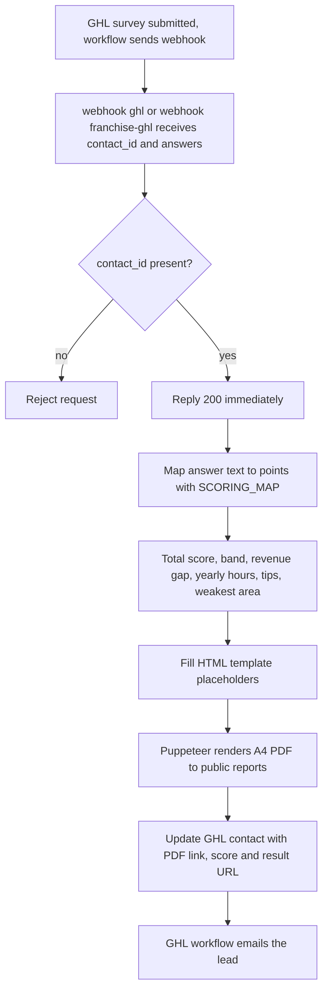
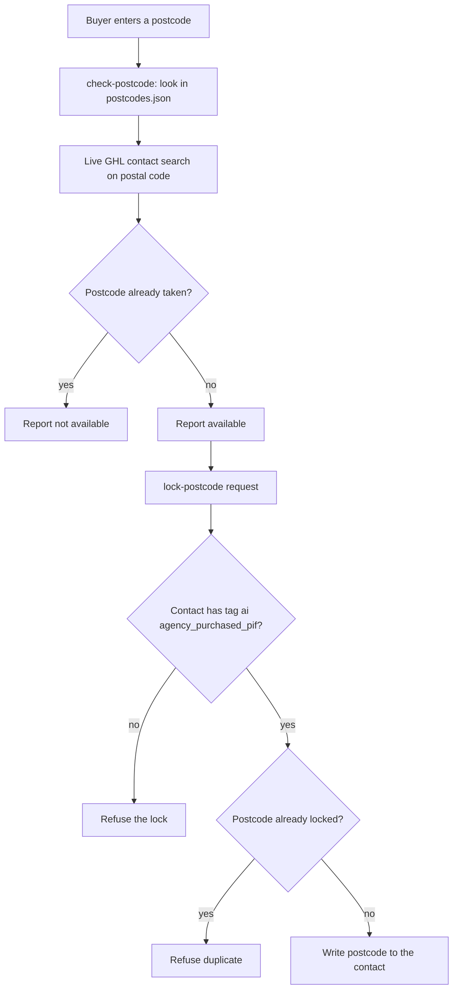

# BNI and Franchise PDF factory with postcode lock (EXPOBNI backend)

> A Node/Puppeteer webhook backend that turns a GHL survey submission into a scored, branded PDF linked on the contact, and also locks a territory postcode for the "AI Agency / Unfranchise" offer.

| | |
|---|---|
| **Category** | Apps, calculators, websites and funnels (apps) |
| **Status** | On demand, as of 9 Oct 2026 (built; live status not stated in the source) |
| **Type** | Node/Express webhook service with headless-Chrome PDF rendering |
| **Runner and schedule** | `npm start` behind nginx on the VPS (`/webhook/` and `/reports/` proxied to localhost:3002); triggered by GHL workflow webhooks |
| **Client / owner** | P2T (BNI AI readiness quiz and the AI Agency / Unfranchise franchise funnel) |
| **Stack** | Node + Express (package `bni-pdf-factory` v2.3.0), Puppeteer (`--no-sandbox`), axios to GHL v2, HTML templates `pdf-template.html` and `franchise-pdf-template.html` |
| **Source** | Main KB Part 6 section 6A (BNI / Franchise PDF factory); Part 3 section 10 (same EXPOBNI backend) |

## 1. Description

### What it does
GHL sends a survey submission (`contact_id` plus the answers) to `POST /webhook/ghl` (BNI) or `POST /webhook/franchise-ghl` (franchise). The service replies 200 immediately, converts the answers to points, builds a personalised A4 PDF in the background and writes its link to the GHL contact. For the franchise offer, two more endpoints check whether a postcode is available and lock it once the buyer has paid in full.

### Inputs and outputs
- **Inputs:** GHL webhook JSON (`contact_id`, long question strings or short keys `c1..c4`, `h`); for the postcode endpoints, a postcode and the contact's tags or id.
- **Outputs:** a PDF in `public/reports/` served at `<BASE_URL>/reports/<file>.pdf`; GHL contact updates (PDF link; EXPOBNI also saves the score and a web result URL `/expo#/result?...`); postcode availability and lock results.

### Key components
| Component | Role |
|---|---|
| `SCORING_MAP` | Converts answer text to points: each of the four categories (Google reviews, social posting, email nurture, contact storage) is scored 25/18/10/0-style; hours mapped to 12 / 7.5 / 3.5 / 1 |
| Scoring and bands | Total = c1+c2+c3+c4 (0-100). Foundation (30 or less), Building (up to 60), Established (up to 85), Advanced (above 85). Revenue gap = (100 minus score) x 1200. Yearly hours = hours x 50 |
| Templates | `{{placeholders}}` filled with category tips and a "weakest area" diagnosis |
| `POST /webhook/check-postcode` | Available or not: local `postcodes.json` plus a live GHL contact search on postal code |
| `POST /webhook/lock-postcode` | Locks only if the contact has the purchase tag `ai agency_purchased_pif`; refuses duplicates |
| HTML email templates | customer-welcome, hesitation-followup, internal-alert, onboarding-start, order-notification, client-report-email |

### Where it lives
- Current: `D:\Project\Client & Agency (Pivot)\BNI & Expos\EXPOBNI\email-backend` (825 lines). Earlier BNI-only copy: `...\BNI & Expos\bni2\email-backend`. Older franchise copy: `...\Other Projects\franchise\backend` (with `create-score-field.js`).
- Front ends: `EXPOBNI/{bni,checkout,thankyou}.html`, `bni2/{home,checkout}.html`, `Other Projects/franchise/{index,v2index}.html`.
- Environment variable names: `PORT`, `GHL_API_KEY`, `GHL_LOCATION_ID`, `GHL_CUSTOM_FIELD_ID`, `BASE_URL`, `PUBLIC_URL`. Part 3 section 10 adds `GHL_SCORE_FIELD_ID`, `GHL_REVENUE_FIELD_ID`, `GHL_PDF_CUSTOM_FIELD_ID`, `GHL_FRANCHISE_SCORE_FIELD_ID`. Default port is 3000 in `bni2`, 3002 in EXPOBNI.

## 2. Flow chart

A second chart shows the franchise postcode lock.

**Reading the chart**
1. A GHL workflow sends the survey answers and the contact id. The service answers 200 immediately and works in the background so GHL does not time out.
2. Answers are converted to points; the total gives a band and a revenue-gap figure. The 1200 per missing point multiplier is a marketing assumption (Part 5 section 10), not a measured number.
3. The template is filled, Puppeteer renders the PDF, and the contact is updated with the public link. A GHL workflow then emails the lead (Part 5 section 10).
4. The second chart: the postcode is checked against the local list and a live GHL search; locking requires the purchase tag (read from the payload or looked up in GHL) and refuses duplicates. Part 3 section 10 adds that a lock writes the native postal code, a custom field `postcodeaiagency` and a tag `locked_postcode_<code>`.

## 3. Case study

### The challenge
As described in the source, a GHL survey submission for the "BNI AI readiness" quiz (four categories plus hours) and the "AI Agency / Unfranchise" franchise funnel had to become a scored, branded PDF report linked on the contact. The franchise side also had to lock a territory by postcode.

### The solution
A small Node service behind nginx: survey answers become points, points become a personalised PDF rendered by headless Chrome, and the contact record carries the link. The postcode endpoints sit in the same service and use a flat `postcodes.json` plus a live GHL contact search as the check, with a purchase tag as the gate for locking.

### Design decisions and rules learned
- The GHL select option reads "More than IO hours" (letter I and O); the map matches that typo on purpose.
- The postcode list is a flat JSON file, so the service must be a single instance, and it is the only lock outside GHL.
- Tag spelling is exact-match and lower-cased.
- Respond 200 immediately and build the PDF afterwards (survey-driven webhooks).
- The service needs Chrome dependencies on the server (`--no-sandbox`).

### Outcome
No measured outcome recorded. The main KB documents the code, templates and deployment shape; it does not record how many PDFs were produced or whether the endpoints are in current use.

### Lessons learned
- Treat answer text as a contract with the GHL survey; one changed word breaks the map.
- A flat file is a fragile lock: keep a single instance or move the check into GHL.

## 4. Operating notes
- **Run / pause / debug:** `npm install`, `npm start`. POST a sample JSON body with `contact_id` to `/webhook/ghl` and check the PDF under `public/reports/`. nginx proxies `/webhook/` and `/reports/` to port 3002.
- **Known issues and open items:** several copies exist (EXPOBNI is current; `bni2` and `Other Projects\franchise` are earlier). The portfolio KB's "Growth Constraint Quiz" description is generic and does not name a tool; it may refer to this quiz, to the BNI Network Value Calculator, or to the AI Agency readiness quiz (see [ai-agency-readiness-quiz-ghl-custom-code.md](ai-agency-readiness-quiz-ghl-custom-code.md), which carries the portfolio text and its list of information still needed).
- **Risks:** security and credential-hygiene findings for this project are tracked privately and are not published here. Each generated PDF is a lead's personal report.

## 5. Related
- The BNI scoring and PDF core is also documented from the network-value-calculator folder: [../05-excel-workflow-tools/bni-network-value-calculator-and-pdf-factory.md](../05-excel-workflow-tools/bni-network-value-calculator-and-pdf-factory.md). That file owns the BNI-only scoring walkthrough; this file focuses on the EXPOBNI/franchise copies and the postcode lock.
- Email specification for the same BNI offer: [../03-ghl-crm-migrations/bni-referral-engine-email-pack.md](../03-ghl-crm-migrations/bni-referral-engine-email-pack.md).
- Franchise funnel pages that call it: [ai-agency-unfranchise-funnels-and-link-pages.md](ai-agency-unfranchise-funnels-and-link-pages.md).
- **Sources:** Main KB Part 6 section 6A "BNI / Franchise PDF factory"; Part 3 section 10; Part 5 section 10 (for the shared scoring behaviour).
