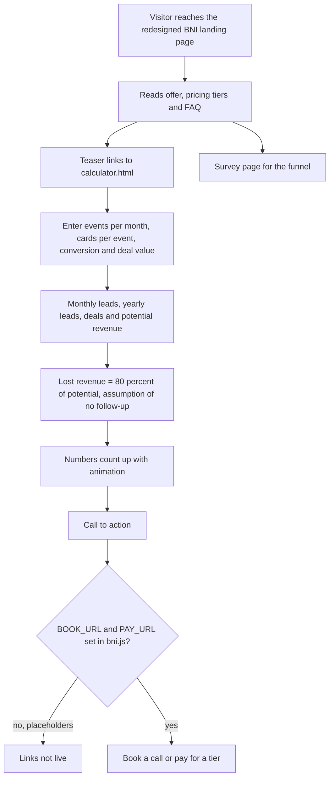

# BNI landing page, revenue-leak calculator and expo collateral

> A funnel for BNI chapter members and expo visitors: a redesigned landing page, a separate follow-up revenue-leak calculator and survey, and printed expo collateral.

| | |
|---|---|
| **Category** | Apps, calculators, websites and funnels (calculators and funnels) |
| **Status** | On demand, as of 9 Oct 2026 (built; booking and payment links were still placeholders at the last transcript) |
| **Type** | Static HTML/CSS/JS pages, plus documents |
| **Runner and schedule** | Manual. Open `index.html`, host it, or paste into GHL |
| **Client / owner** | P2T (BNI and Expos workspace) |
| **Stack** | Static HTML, CSS and JS: `index.html`, `bni.css`, `bni.js`, `calculator.html`/`calculator.js`, `survey.html`, `survey-ghl.html`, `ghl-slide-script.html`, `ghl-submit-message.html`, `tools.html` |
| **Source** | Main KB Part 6 section 6B (BNI landing page, revenue-leak calculator and expo collateral) |

## 1. Description

### What it does
The landing page sells a BNI offer with a pricing section and FAQ. Visitors can run a revenue-leak calculator on its own page: events per month times business cards per event gives monthly leads, and an assumption that most leads are never followed up gives the lost revenue. A survey page and GHL slide and submit-message snippets support the funnel, and printed expo materials sit in `docs/files`.

### Inputs and outputs
- **Inputs:** events per month, business cards per event, conversion percent, deal value.
- **Outputs:** monthly and yearly leads, deals, potential revenue and lost revenue, with numbers counting up with animation; a page that links to booking and payment.

### Key components
| Component | Role |
|---|---|
| Calculator | Monthly leads = events x cards; yearly leads = x 12; deals = x conversion percent; potential revenue = x deal value; lost revenue = 0.8 x potential (fixed assumption that 80% of leads are lost with no follow-up) |
| Redesigned landing | Inline calculator removed; teaser linking to `calculator.html`; 3-tier pricing (Starter $297; Done-For-You $997 + $97/mo, "Most Popular"; 1:1 Concierge $2,497 + $297/mo); FAQ accordion; sticky mobile CTA bar; hamburger menu (breakpoints 1080/980/620/380) |
| `docs/files` | A4 flyers (Hormozi-style offer), pull-up banners, goodie-bag flyer, booth strategy and offer rewrite markdown, expo task and scope spreadsheets, strategic offer analysis |
| `plugins/` | A Codex plugin scaffold for the PHP task manager (see the HLGPods file) |

### Where it lives
- `D:\Project\Client & Agency (Pivot)\BNI & Expos\bni` (`webpage/bni`, `webpage/expo`, `webpage/franchise`, `docs/files`). Session "Redesign BNI landing page ..." (Pivot-bni worktree).
- Replace `BOOK_URL` and `PAY_URL` at the top of `bni.js` (still placeholders at the last transcript).

## 2. Flow chart

**Reading the chart**
1. The landing page was redesigned: the inline calculator was removed and replaced by a teaser to a separate page.
2. The calculator multiplies events by cards, then yearly leads, deals, and potential revenue. The 80% lost-to-no-follow-up factor is a fixed assumption, not a measurement.
3. Calls to action depend on `BOOK_URL` and `PAY_URL`, which were still placeholders at the last transcript.
4. `survey.html` and `survey-ghl.html` support the funnel; the source does not describe their wiring.

## 3. Case study

### The challenge
As described in the source, the work was a funnel for BNI chapter members and expo visitors: a landing page, a separate calculator page and survey, and printed expo collateral to match.

### The solution
A landing page with three pricing tiers, a standalone revenue-leak calculator and a survey, and a pack of flyers, banners and strategy documents for the booth.

### Design decisions and rules learned
- The redesign removed the inline calculator from the landing page and added a teaser linking to `calculator.html`.
- The 80% lost-lead assumption is fixed in the calculator.
- **Three BNI trees exist: `BNI & Expos\bni` (this landing/expo tree), `bni2` and `EXPOBNI` (PDF-factory era), and `Servigo\bni` (visitor funnel). Do not confuse them.**

### Outcome
No measured outcome recorded. The page and collateral exist; booking and payment links were placeholders at the last transcript.

### Lessons learned
- Check placeholder links before publishing.
- Keep the assumption behind a revenue-lost figure visible.

## 4. Operating notes
- **Run / pause / debug:** open `index.html`; replace `BOOK_URL` and `PAY_URL` in `bni.js`; host or paste into GHL.
- **Known issues and open items:** placeholder links; survey wiring undocumented.
- **Risks:** pricing and the lost-revenue assumption are marketing claims; the source gives no evidence for them.

## 5. Related
- [bni-franchise-pdf-factory-and-postcode-lock.md](bni-franchise-pdf-factory-and-postcode-lock.md) (EXPOBNI backend), [../05-excel-workflow-tools/bni-network-value-calculator-and-pdf-factory.md](../05-excel-workflow-tools/bni-network-value-calculator-and-pdf-factory.md) (the BNI Network Value Calculator and PDF factory), [../03-ghl-crm-migrations/bni-referral-engine-email-pack.md](../03-ghl-crm-migrations/bni-referral-engine-email-pack.md) (BNI Referral Engine; its product pages `index.html`, `demo.html`, `checkout.html`, `thankyou.html` are described in Part 6 section 6B and are covered there), [servigo-bni-visitor-funnel.md](servigo-bni-visitor-funnel.md), [bni-oasis-connect-member-directory.md](bni-oasis-connect-member-directory.md).
- **Sources:** Main KB Part 6 section 6B "BNI landing page, revenue-leak calculator and expo collateral" and the BNI Referral Engine entry in the same part.
