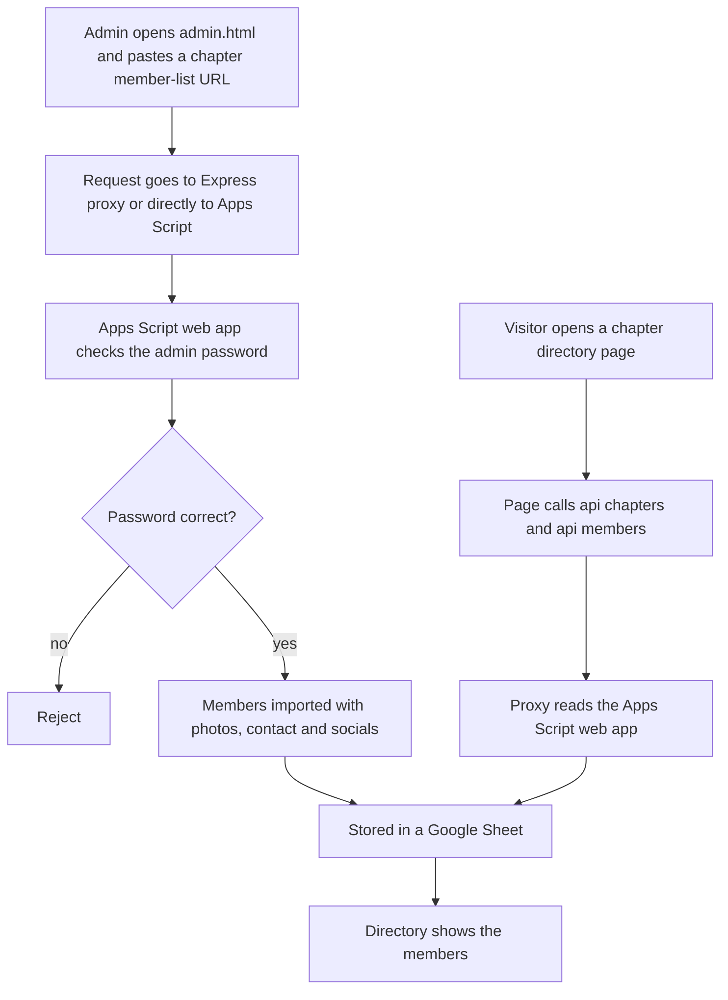

# BNI Oasis Connect member directory

> A public member-directory page for a BNI chapter plus an admin portal where an admin pastes a chapter member-list URL and the members (photos, contact details, socials) are imported automatically.

| | |
|---|---|
| **Category** | Apps, calculators, websites and funnels (apps) |
| **Status** | On demand, as of 9 Oct 2026 (deploy script exists; live status not stated) |
| **Type** | Web app (static HTML front ends, Express proxy, Google Apps Script back end) |
| **Runner and schedule** | `npm start` in `backend` (port 3003); deployed with `deploy.ps1` to the shared Hestia VPS. A "no backend" mode talks to the Apps Script URL directly |
| **Client / owner** | A BNI chapter client (Pivot client work, BNI and Expos workspace) |
| **Stack** | Static HTML (`BNI-Oasis-Connect.html`, `BNI-Client2-Connect.html`, `admin.html`), Express proxy (`backend/server.js`), Google Apps Script web app (`apps_script.js`) storing data in a Google Sheet, Node scrapers (`scrape_all_details.js`, `merge_data.js`) |
| **Source** | Main KB Part 6 section 6A (BNI Oasis Connect) |

## 1. Description

### What it does
Each chapter gets a public directory page showing members. An admin portal lets an admin paste a chapter member-list URL, after which members with their photos, contact details and socials are imported automatically. Data is held in a Google Sheet behind a Google Apps Script web app, and an Express proxy exposes `/api/chapters` and `/api/members` to the front ends.

### Inputs and outputs
- **Inputs:** a chapter member-list URL from an admin, the admin password.
- **Outputs:** member and chapter records in a Google Sheet, public directory pages for each chapter.

### Key components
| Component | Role |
|---|---|
| `BNI-Oasis-Connect.html`, `BNI-Client2-Connect.html` | Public directory pages |
| `admin.html` | Admin portal |
| `backend/server.js` | Express proxy with `/api/chapters` and `/api/members` to the Apps Script app |
| `apps_script.js` | Google Apps Script web app storing data in a Google Sheet |
| `scrape_all_details.js`, `merge_data.js` | Node scrapers and merge helper |
| `deploy.ps1`, `Dockerfile` | Packaging and upload to the shared VPS |
| `SOP_BNI_Admin_Guide.md`, `SOP_ADMIN_APPSCRIPT_NO_BACKEND.md` | Admin SOPs |

### Where it lives
- Source: `D:\Project\Client & Agency (Pivot)\BNI & Expos\Bni_Oasis` (`backend/`, `frontend/`).
- Environment variable names: `APPS_SCRIPT_URL`, `ADMIN_PASSWORD`, `PORT`.

## 2. Flow chart

**Reading the chart**
1. An admin pastes the chapter member-list URL into the admin portal.
2. The request reaches the Apps Script web app through the Express proxy, or directly in "no backend" mode.
3. An admin password checked server-side protects the admin side (how exactly it gates the import is not described; the check shown is inferred).
4. Imported members are stored in a Google Sheet. The source does not say which component fetches the member-list page; Node scrapers also exist in the folder.
5. Public pages read chapters and members through the proxy and render the directory.

## 3. Case study

### The challenge
As stated in the source, the need was a public member-directory page per BNI chapter, plus an admin portal where pasting a member-list URL imports the members (photos, contact, socials) automatically instead of typing each profile.

### The solution
A static front end per chapter, a Google Sheet as the database behind Apps Script, and an optional Express proxy so the front end does not call Apps Script directly. The "no backend" mode removes the proxy entirely for simple hosting.

### Design decisions and rules learned
- Keep the data store in a Google Sheet behind Apps Script, so no database server is needed.
- Offer both a proxy mode and a direct "no backend" mode (SOP files exist for each).
- Admin credentials are checked server-side, never in the front end.

### Outcome
No measured outcome recorded. The source documents the components and SOPs, not usage.

### Lessons learned
- Scraped member exports (CSV and JSON) contain personal data and must not be copied or published.

## 4. Operating notes
- **Run / pause / debug:** `npm start` in `backend` (port 3003). Deploy with `deploy.ps1` (tar and upload).
- **Known issues and open items:** which component performs the member-page import is not detailed in the source.
- **Risks:** the folder contains scraped member data (CSV and JSON exports) with personal details; do not copy or publish. Security and credential-hygiene findings for this project are tracked privately and are not published here.

## 5. Related
- BNI landing and calculator funnel, a different BNI tree: [bni-landing-page-and-revenue-leak-calculator.md](bni-landing-page-and-revenue-leak-calculator.md).
- **Sources:** Main KB Part 6 section 6A "BNI Oasis Connect"; Part 3 section 10 describes it as a web build rather than GHL automation (no GHL calls found in `server.js`).
