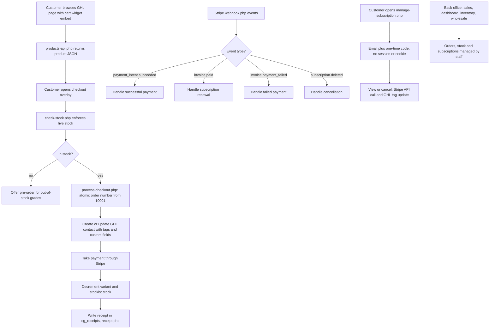

# Cafe Grato shop, subscriptions and wholesale app

> A custom coffee e-commerce and back-office system for a coffee roaster, embedded into a GoHighLevel site, with Stripe checkout, subscriptions, wholesale and pre-order pages, stock and shipping rules.

| | |
|---|---|
| **Category** | Apps, calculators, websites and funnels (apps) |
| **Status** | Live, as of 9 Oct 2026 (on the client's own app subdomain) |
| **Type** | Web app (plain PHP + MySQL, single-file pages with inline JS) |
| **Runner and schedule** | PHP files served from the web root; Stripe webhook; manual redeploy by cPanel/FTP. The read-only order monitor is a separate scheduled task |
| **Client / owner** | Cafe Grato (coffee roaster client) |
| **Stack** | PHP with PDO/MySQL, Stripe REST, GHL REST (contacts, tags, custom fields), SMTP email, Australia Post MyPost Business rates; settings in a `cg_config` table |
| **Source** | Main KB Part 6 section 6A (Cafe Grato) |

## 1. Description

### What it does
A product browser and cart widget that GHL pages embed, a checkout with Stripe, a subscription builder with automatic volume discounts, a customer self-service portal for subscriptions, wholesale and pre-order pages, a stockist finder, inventory and a sales dashboard. Orders create or update a GHL contact with tags and custom fields, take payment, decrement stock and issue a receipt.

### Inputs and outputs
- **Inputs:** customer orders and subscriptions, Stripe webhook events, shipping rate table, stock levels, coupon codes, settings in a `cg_config` table (integration, receipt and free-shipping postcode settings).
- **Outputs:** orders and receipts in MySQL (`cg_receipts`), GHL contact updates, Stripe charges and subscriptions, receipt pages, inventory changes.

### Key components
| Component | Role |
|---|---|
| `embed.php`, `cart-widget.html`, `products-api.php` | GHL iframe embeds; `products-api.php` returns open-CORS JSON |
| `stockists-api.php` | "Find a stockist" |
| `check-stock.php` | Enforces live stock when the checkout overlay opens |
| `process-checkout.php` | Creates the order (atomic counter starting at 10001), GHL contact update, payment, stock decrement (product to grade to size, plus per-stockist stock), receipt |
| `subscriptions.php`, `manage-subscription.php` | Subscription builder with volume discount tiers; customer portal using email plus a one-time code (no PHP sessions or cookies) to view or cancel |
| `webhook.php` | Stripe events: `payment_intent.succeeded`, `invoice.paid` (renewals), `invoice.payment_failed`, `customer.subscription.deleted` |
| `shipping.php`, `shipping-chart.php` | Australia Post rate matrix in an editable `cg_shipping_rates` table; free-shipping postcode list |
| `sales.php`, `dashboard.php`, `inventory.php`, `wholesale.php` | Back office |
| An order-import page and `translate-proxy.php` | One-click migration of orders from the previous order system; AI translation proxy for a multilingual GHL page (hosted on a separate cPanel account) |

### Where it lives
- Source: `D:\Project\Client & Agency (Pivot)\cafe_grato` (the empty `...\cafe` folder is a placeholder).
- Live on the client's own app subdomain. The Stripe webhook endpoint is configured in the Stripe dashboard.
- Deploy: upload PHP files by cPanel or FTP. Build markers: open `checkout.php?ver=1`, `subscriptions.php?ver=1` or `process-checkout.php` for a JSON marker (current marker `2026-08-04-01`).

## 2. Flow chart

**Reading the chart**
1. A GHL page embeds the cart widget, which loads products from `products-api.php`.
2. Opening the checkout overlay triggers a live stock check; out-of-stock grades go to the pre-order page.
3. `process-checkout.php` takes an atomic order number, writes the contact and tags to GHL, takes payment, decrements stock and writes a receipt.
4. Stripe webhooks handle renewals, failed payments and cancellations. The exact record changes made for each event are not described in the source beyond the event names.
5. Customers manage subscriptions with email plus a one-time code, deliberately without PHP sessions or cookies.
6. The back-office pages let staff review sales, manage inventory and handle wholesale orders.

## 3. Case study

### The challenge
A coffee roaster needed shop, subscription and wholesale ordering embedded into a GHL site, with stock control by product, grade and size, Australian shipping rules, Stripe payments, and a path off an older order system.

### The solution
A set of single-file PHP pages (heavy inline JavaScript) and JSON endpoints that GHL embeds as iframes, with settings stored in the database so they can be changed without redeploying. Shipping rates come from an Australia Post MyPost Business matrix held in a table. A one-click migration page imports orders from the old system. A separate read-only monitor watches the live order list.

### Design decisions and rules learned
- **Order-number prefixes** R- (retail), S- (subscription), W- (wholesale) are relied on by the order monitor's regex (inferred).
- Customer subscription management deliberately avoids PHP sessions and cookies; it uses email plus a one-time code.
- Settings live in a `cg_config` table, so they can change without a redeploy.
- Everything is single-file PHP with heavy inline JS, so changes need a manual redeploy; the JSON build markers show which build is deployed.

### Outcome
Documented facts only: the app is live with build marker `2026-08-04-01`. The order monitor recorded a baseline snapshot of the live order list with no change events at its first run (see the monitor file). The order-migration page and migration SQL exist. No revenue or order-volume metrics are recorded.

### Lessons learned
- Keep a visible build marker on single-file PHP deployments.

## 4. Operating notes
- **Run / pause / debug:** deploy by uploading files; confirm the deployed build with the `?ver=1` markers. Monitor: see the order monitor file.
- **Known issues and open items:** a one-off migration helper was never uploaded to the live host (its fix is in the migration SQL).
- **Risks:** security and credential-hygiene findings for this project are tracked privately and are not published here.

## 5. Related
- [../01-scheduled-tasks-reporting/cafe-grato-order-monitor.md](../01-scheduled-tasks-reporting/cafe-grato-order-monitor.md) is the read-only scheduled monitor for this app (not duplicated here).
- **Sources:** Main KB Part 6 section 6A "Cafe Grato". The monitor section of the main KB (Part 1) records the baseline snapshot.
