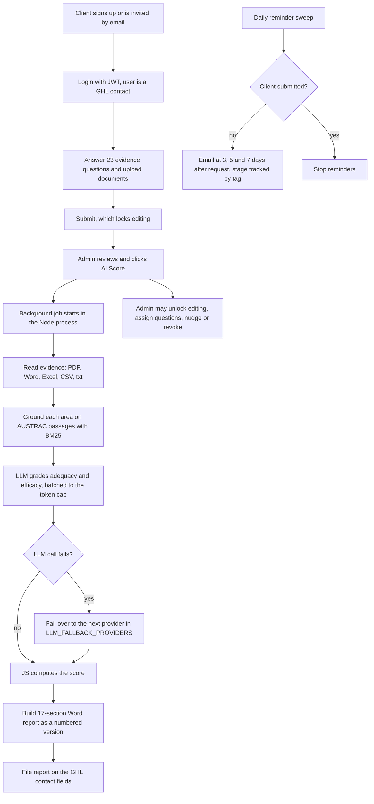

# Centinl AML/CTF audit portal with AI scoring

> A portal where reporting entities answer 23 AML/CTF evidence questions and upload documents, and admins run an AI score that produces a 0-100 rating and a formal Word review report, with GoHighLevel as the only datastore.

| | |
|---|---|
| **Category** | Apps, calculators, websites and funnels (apps) |
| **Status** | Live, as of 9 Oct 2026 (production on the client's own domain) |
| **Type** | Web app (Node/Express API, React SPA) with a background AI scoring job |
| **Runner and schedule** | VentraIP cPanel Node.js Selector (CloudLinux/Passenger). Daily reminder sweep, first run 60 seconds after boot. AI score runs as a one-click background job taking 2-10 minutes |
| **Client / owner** | An external AML auditor client (not named in the source) |
| **Stack** | Backend Node + Express 5 (CommonJS), JWT bearer auth; frontend React 19, Vite 7, react-router 7, Playwright e2e; AI engine `backend/modules/rag-audit/` using Groq `openai/gpt-oss-120b` with BM25 retrieval over AUSTRAC guidance and an `llm.js` adapter with failover; `docx`, `mammoth`, `pdf-parse`, `xlsx`, `multer` |
| **Source** | Main KB Part 6 section 6A (Centinl); Portfolio KB section 25 (project folder name only) |

## 1. Description

### What it does
"Centinl" is an AML/CTF independent evaluation portal for the 2024 Amendment Act reforms (effective 31 Mar 2026). Reporting entities sign up or are invited, answer the 23 evidence questions, upload evidence and submit, which locks editing. Admins onboard clients, assign question subsets, unlock editing, send "request client" emails and nudges, and run the AI score. The score produces a rating band and a 17-section Word "Independent External Review Report".

### Inputs and outputs
- **Inputs:** client answers and evidence files (PDF, Word, Excel, CSV, txt), admin actions, AUSTRAC guidance pages fetched into a local index.
- **Outputs:** a 0-100 score, rating band, a numbered report version saved under `backend/reports/<contactId>/` and filed on the GHL contact (fields "Centinl RRS - AI Score" and "AI Score Reports"), reminder emails, and a server-disk copy of each evidence upload (`localFileBackup.js`, filed as client/year/question).

### Key components
| Component | Role |
|---|---|
| GoHighLevel | The datastore: users are GHL contacts, answers and uploads are custom fields, roles are tags (`audit user` / `audit admin`). No local database |
| `server.js` | Express API, mounted at both `/api/...` and `/hlgp/api/...` |
| `modules/rag-audit/` | Evidence reading, AUSTRAC grounding, LLM grading, scoring maths, report build |
| `llm.js` | Provider adapter: `LLM_PROVIDER` = groq, openai, anthropic or local; backups in `LLM_FALLBACK_PROVIDERS` |
| `runReminderSweep` | Daily reminders at 3, 5 and 7 days after a request, tracked with tags |
| `frontend/` | React SPA, basename `/audit`, Playwright e2e tests |
| `SOP.md`, `backend/README.md`, `backend/DEPLOY.md` | Documentation |

### Where it lives
- Current source: `D:\Project\Apps & Fullstack\<client-folder>` (`backend/`, `frontend/`). Earlier snapshots: `D:\Project\Client & Agency (Pivot)\Compliance & Audits\<client-folder>` (a test deployment proxied to port 5001). Architecture plan: `...\Pivot2Thrive & Content\p2t\implementation_plan.md`.
- Production: the backend folder on VentraIP cPanel, Node 18 in the nodevenv (pdf-parse downgraded for Node 18); frontend built with Node 22 and `VITE_BASE_PATH=/audit`.
- Environment variable names: `PORT`, `JWT_SECRET`, `GHL_API_KEY`, `GHL_LOCATION_ID`, `BACKEND_URL`, `FRONTEND_URL`, `GHL_ADMIN_TAG`, `GHL_USER_TAG`, `GHL_*_FIELD_ID`, `GHL_INVITE_WEBHOOK_URL`, `GROQ_API_KEY`, `GROQ_MODEL`, `GROQ_MAX_TOKENS`, `RAG_DOC_CHAR_BUDGET`, `RAG_GROUND_CHARS`, `LLM_PROVIDER`, `LLM_FALLBACK_PROVIDERS`, `ANTHROPIC_API_KEY`, `OPENAI_API_KEY`, `REPORT_AUDITOR_NAME`, `REPORT_AUDITOR_CREDENTIALS`, `REPORT_FIRM_NAME`, `REPORT_BRAND_NAME`, `VITE_BASE_PATH`.

## 2. Flow chart

**Reading the chart**
1. Clients arrive by sign-up or invite. Reset and invite links are emailed through GHL.
2. They answer the 23 questions, upload evidence and submit, after which editing is locked until an admin unlocks it.
3. One click starts the AI score as a background job. Evidence is read, each area is grounded on AUSTRAC passages, and the LLM grades adequacy and efficacy. Large submissions are batched to fit the model key's per-minute token cap.
4. The maths is plain JavaScript: 23 areas Q01-Q23 weighted to 100; mark blends adequacy 0.4 and efficacy 0.6; each critical gap deducts 3 marks, capped at 15.
5. Rating bands and a 17-section report (areas A-Q) are produced; the "Requirement" wording is fixed in code and the model writes only observations. The Word file is saved as a numbered version and filed on the GHL contact.
6. The reminder sweep emails request reminders at 3, 5 and 7 days until the client submits; sent stages are tracked as tags so reruns never double-send. The bulk "nudge" tags `nudge requested` for a GHL workflow to act on (inferred).

## 3. Case study

### The challenge
An external AML auditor needed a way to collect evidence from reporting entities against the 2024 Amendment Act AML/CTF reforms (effective 31 Mar 2026) and produce a consistently formatted independent review. The source does not state why GoHighLevel was chosen as the datastore; the architecture plan describes the Node-portal-with-GHL design as the starting point (inferred reason: client records already lived in GHL).

### The solution
A Node and React portal that uses GHL as its datastore (contacts, custom fields and tags) so the CRM and portal never disagree. The AI engine grounds each question area on AUSTRAC guidance using BM25 retrieval, lets the LLM grade only adequacy and efficacy, and keeps the score arithmetic and the "Requirement" wording in code so the auditor controls the formal parts of the report. An `llm.js` adapter lets the engine fail over between Groq, OpenAI, Anthropic or a local model.

### Design decisions and rules learned
- **`FRONTEND_URL` must be the site origin only** (scheme and host, no path). The forgot-password email once linked to a page URL, producing a blank page because React Router `basename="/audit"` could not match. The same variable builds invite links. A code hardening to strip any path off `FRONTEND_URL` was offered, not confirmed.
- **CloudLinux layout:** the backend's `node_modules` must be a symlink into the nodevenv (it was moved aside and then restored). Do not run frontend `npm install` while the backend venv is active; it caused a core dump.
- `frontend/dist` is gitignored, so it is never pulled; build it with Node 22 and `VITE_BASE_PATH=/audit` or copy it. Keep the app alive (`passenger_min_instances 1`) so AI runs finish.
- **Git:** real work lives on branch `feat/llm-adapter-ui-upgrades`; `main` was 19 commits behind, so `git pull origin main` on the server did nothing.
- A Groq error "model `llama-3.3-70b-versatile` does not exist" is fixed by using the configured `GROQ_MODEL` default and the failover chain.
- The README page-route table (`audit.html`, `admin.html`, `entity.html`) describes the earlier static frontend; the app is now the React SPA (inferred from sessions and `frontend/`).
- Knowledge training: `npm run rag:fetch` downloads AUSTRAC pages then indexes; `npm run rag:ingest` ingests. The index and fetched docs are local and gitignored.

### Outcome
Documented facts only: the portal is deployed on VentraIP on the client's domain; the forgot-password fault was diagnosed from the production `FRONTEND_URL` value; reports are saved as numbered versions per contact. Sessions ran Aug-Sep 2026 (the build sessions and a forgot-password access issue). No client counts, scores issued or time savings are recorded.

### Lessons learned
- When GHL is the datastore, tags double as state (roles, reminder stages, nudge flags), which makes reruns safe.
- Keep scoring arithmetic and formal wording in code; let the model write only observations.
- Environment variables that build links must hold origins, not page URLs.

## 4. Operating notes
- **Run / pause / debug:** local backend: `cd backend; npm install; npm start` (port 5001). Frontend: `cd frontend; npm run dev` or `npm run build`. Production runs under Passenger with the Node.js Selector; a killed AI run is reported as interrupted in the console, which polls job status.
- **Known issues and open items:** confirm whether the `FRONTEND_URL` path-stripping hardening is wanted; merge `feat/llm-adapter-ui-upgrades` to `main`; README route table is out of date.
- **Risks:** security and credential-hygiene findings for this project are tracked privately and are not published here. Evidence uploads contain client compliance documents, so server-disk copies and generated reports are sensitive.

## 5. Related
- [austrac-tranche-2-scorecard-and-platform-prototype.md](austrac-tranche-2-scorecard-and-platform-prototype.md) is the earlier concept and scorecard for the same regulatory space.
- The architecture plan `implementation_plan.md` (Part 6 section 6C, "Other P2T support files") describes a transition from the Node portal with GHL as datastore towards Postgres/Prisma, S3 and an LLM engine, recommended as an incremental path; this is what the rag-audit module later implemented (inferred).
- **Sources:** Main KB Part 6 section 6A "Centinl". Portfolio KB section 25 names the AML compliance application (by its project folder name) without detail.
