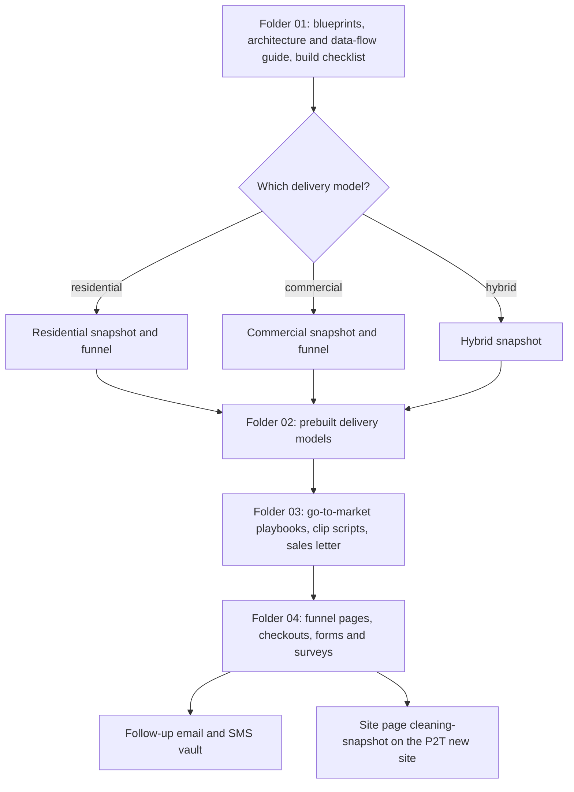

# Cleaning-industry GHL snapshot and funnels

> A productised "Cleaning Industry GHL snapshot" (residential, commercial and hybrid delivery models) with documentation, follow-up message vault, scripts and funnel pages.

| | |
|---|---|
| **Category** | Apps, calculators, websites and funnels (funnels and products) |
| **Status** | On demand, as of 9 Oct 2026 |
| **Type** | Productised GHL snapshot pack: documents, scripts, funnel pages and CSS |
| **Runner and schedule** | Manual |
| **Client / owner** | P2T (inferred from the related page on the P2T new site) |
| **Stack** | GHL snapshot design, static HTML funnel pages, GHL custom CSS, markdown documents |
| **Source** | Main KB Part 6 section 6B (Cleaning-industry GHL snapshot and funnels) |

## 1. Description

### What it does
The pack describes a cleaning-industry GHL snapshot sold in residential, commercial and hybrid models. It includes an architecture and data-flow guide, a build checklist, a follow-up email and SMS vault, three 10-second video-clip scripts, a sales-letter script, and funnel pages: residential, commercial, `cleaning-growth-saas.html`, three checkouts, plus forms and surveys with GHL custom CSS.

### Inputs and outputs
- **Inputs:** the snapshot design and playbooks written by the team.
- **Outputs:** documents, scripts and funnel pages used to sell and onboard cleaning businesses; a site page `P2T_new site\cleaning-snapshot.html`.

### Key components
| Component | Role |
|---|---|
| Numbered folders 01-04 | 01 blueprints and docs, 02 prebuilt delivery models, 03 go-to-market playbooks, 04 funnels and pages |
| Follow-up vault | Email and SMS templates |
| Scripts | Three 10-second video-clip scripts and a sales-letter script |
| Funnel pages | Residential, commercial, `cleaning-growth-saas.html`, three checkouts, forms and surveys |

### Where it lives
- `D:\Project\Client & Agency (Pivot)\Websites & Funnels\cleaning webpage` (folders 01-04). Related site page: `...\Pivot2Thrive & Content\P2T_new site\cleaning-snapshot.html`.
## 2. Flow chart

The source describes the pack's contents, not a runtime sequence. The chart shows how the pack is organised and the choice of delivery model.

**Reading the chart**
1. The blueprint folder sets the architecture and the build checklist.
2. A delivery model is chosen: residential, commercial or hybrid.
3. Playbooks and scripts support sales; funnel pages and checkouts take sign-ups.
4. The follow-up vault and the `cleaning-snapshot` site page support the offer.
5. Which parts are built inside a live GHL account is not stated in the source.

## 3. Case study

### The challenge
Package the team's GHL know-how as a sellable snapshot for a specific industry, with everything needed to market and onboard it.

### The solution
A folder-by-folder pack: architecture, three prebuilt delivery models, go-to-market playbooks, scripts, a message vault and funnel pages with custom CSS.

### Design decisions and rules learned
- Three delivery models (residential, commercial, hybrid) rather than one generic snapshot.
- Funnel pages carry GHL-specific custom CSS (the GHL embed notes in section 6D apply).

### Outcome
No measured outcome recorded.

### Lessons learned
- Not documented in the source.

## 4. Operating notes
- **Run / pause / debug:** manual pack; use the build checklist in folder 01.
- **Known issues and open items:** the GHL build status of the snapshot is not stated.
- **Risks:** none recorded.

## 5. Related
- [pivot2thrive-new-website.md](pivot2thrive-new-website.md) hosts the `cleaning-snapshot` page.
- **Sources:** Main KB Part 6 section 6B "Cleaning-industry GHL snapshot and funnels".
