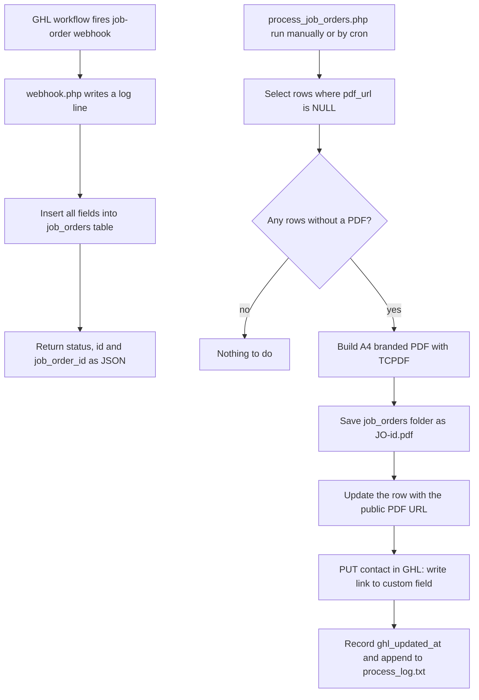

# Clixpert job orders: GHL webhook to MySQL to branded PDF

> A PHP webhook and PDF generator for Clixpert: a GHL workflow posts a job order, every field is stored in MySQL, and a processor later builds a branded PDF and writes its link back to the GHL contact.

| | |
|---|---|
| **Category** | Apps, calculators, websites and funnels (apps) |
| **Status** | On demand, as of 9 Oct 2026 (9 PDFs exist; how the processor is scheduled is not stated) |
| **Type** | PHP webhook and CLI/cron-style processor |
| **Runner and schedule** | cPanel PHP host. `webhook.php` runs per GHL call; `process_job_orders.php` is run manually or by cron (inferred; the log shows runs minutes apart on 16 Sep 2026) |
| **Client / owner** | Clixpert |
| **Stack** | PHP, MySQL, TCPDF (Composer), GHL REST API (`PUT /contacts/<id>`), HTML email template |
| **Source** | Main KB Part 6 section 6A (Clixpert job orders) |

## 1. Description

### What it does
When a GHL workflow fires a job-order webhook, `webhook.php` writes a log line and inserts all fields (job and quote core, financials, dates, location, user and workflow objects, attribution) into a `job_orders` table, returning a JSON status with the new id. Later `process_job_orders.php` finds rows without a PDF, renders an A4 branded PDF, publishes it, and writes the link into a GHL custom field on the contact.

### Inputs and outputs
- **Inputs:** GHL webhook JSON for a job order.
- **Outputs:** `job_orders` rows, PDF files `job_orders/JO-<id>.pdf`, a public PDF URL (a folder on the cPanel host), the GHL contact custom field with that link, `process_log.txt`.

### Key components
| Component | Role |
|---|---|
| `webhook.php` | Receives GHL JSON, logs, inserts every field, returns `{status, id, job_order_id}` |
| `process_job_orders.php` | Finds rows where `pdf_url IS NULL`, builds the PDF with TCPDF, saves it, updates the row and the GHL contact (records `ghl_updated_at`) |
| `mailformat` | Responsive HTML email body used by GHL |
| `job_orders/` | Generated PDFs (9 present) |
| `composer.json` | TCPDF dependency |

### Where it lives
- Source: `D:\Project\Client & Agency (Pivot)\Clixpert`.
- Generated PDFs are served from a folder on the cPanel host.

## 2. Flow chart

**Reading the chart**
1. A GHL workflow posts the job-order payload to `webhook.php`, which logs it and stores every field. The webhook does not itself start the processor.
2. A separate processor selects rows with no PDF yet. How and when it runs is not stated in the source; the log shows runs minutes apart on 16 Sep 2026, so it was manual or cron (inferred).
3. For each row it builds an A4 PDF with TCPDF, saves `JO-<id>.pdf`, updates the row, and writes the link to the GHL contact.
4. `process_log.txt` records the work.

## 3. Case study

### The challenge
When a GHL workflow fires a job-order webhook for Clixpert, every field needed to be stored, and a branded PDF job order generated later with its link attached to the GHL contact. The source does not record why GHL's own document features were not used.

### The solution
Split into two parts so ingestion is fast and robust: the webhook only stores data, and a processor generates PDFs later. The PDF link is written back to the GHL contact so it is available from the CRM. A responsive HTML email template (`mailformat`) is used by GHL.

### Design decisions and rules learned
- Storing all fields first, and rendering later, decouples receiving from PDF generation.
- Selecting rows with `pdf_url IS NULL` makes the processor safe to rerun (inferred from the query).

### Outcome
Documented facts only: 9 PDFs exist in `job_orders/`; the log shows runs minutes apart on 16 Sep 2026. No volume, timing or cost figures are recorded.

### Lessons learned
- Decide and document how the processor is scheduled (the schedule is not recorded).

## 4. Operating notes
- **Run / pause / debug:** cPanel PHP host, `composer install`. Run `process_job_orders.php` (CLI) to generate pending PDFs; read `process_log.txt`.
- **Known issues and open items:** how the processor is scheduled (not found).
- **Risks:** security and credential-hygiene findings for this project are tracked privately and are not published here.

## 5. Related
- Zoho to HighLevel data migration for the same client: see Part 3 section 5 and Part 5 section 5 of the main KB (an n8n workflow), and [../03-ghl-crm-migrations/zoho-to-highlevel-migration-clixpert.md](../03-ghl-crm-migrations/zoho-to-highlevel-migration-clixpert.md).
- **Sources:** Main KB Part 6 section 6A "Clixpert job orders".
