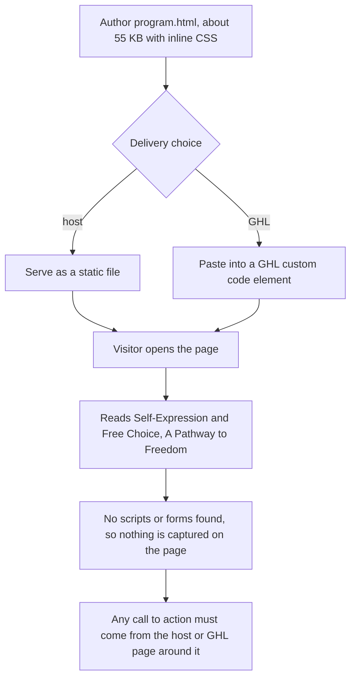

# Doloras / Aspirations United programme page

> A single static landing page, "Self-Expression and Free Choice: A Pathway to Freedom", with inline CSS and no scripts or forms.

| | |
|---|---|
| **Category** | Apps, calculators, websites and funnels (websites) |
| **Status** | On demand, as of 9 Oct 2026 |
| **Type** | Single static HTML page (about 55 KB) |
| **Runner and schedule** | Manual. Host it or paste it into GHL |
| **Client / owner** | Doloras (Aspirations United programme) |
| **Stack** | HTML with inline CSS; no scripts or forms found |
| **Source** | Main KB Part 6 section 6C (Doloras / Aspirations United programme page) |

## 1. Description

### What it does
Presents a programme page titled "Self-Expression & Free Choice: A Pathway to Freedom". It is a single self-contained page of about 55 KB with inline CSS. No scripts or forms were found, so it captures no data and tracks nothing on its own.

### Inputs and outputs
- **Inputs:** none (static content).
- **Outputs:** a rendered landing page.

### Key components
| Component | Role |
|---|---|
| `program.html` | The only page; inline CSS |

### Where it lives
- `D:\Project\Client & Agency (Pivot)\<client-folder>\program.html`.

## 2. Flow chart

The page is static, so the chart shows only how it is delivered and read.

**Reading the chart**
1. The page is delivered either as a hosted static file or pasted into GHL.
2. The visitor reads the page; with no scripts or forms found, there is no capture or tracking inside the file.
3. Any enquiry route would have to be added around it (inferred).

## 3. Case study

### The challenge
The source records only the page and its content title; no business problem is stated.

### The solution
A single self-contained page with inline CSS that can be hosted or pasted into GHL.

### Design decisions and rules learned
- (inferred) Keeping the page self-contained, with inline CSS and no external scripts, is what lets it move between a static host and a GHL custom code element. The source does not state this as a decision.

### Outcome
No measured outcome recorded.

### Lessons learned
- Not documented in the source.

## 4. Operating notes
- **Run / pause / debug:** open `program.html` in a browser; host or paste into GHL.
- **Known issues and open items:** no form or call to action found in the file.
- **Risks:** none recorded.

## 5. Related
- [keystone-strategic-advisory-site.md](keystone-strategic-advisory-site.md) is another client page converted to static HTML for GHL.
- **Sources:** Main KB Part 6 section 6C "Doloras / Aspirations United programme page".
