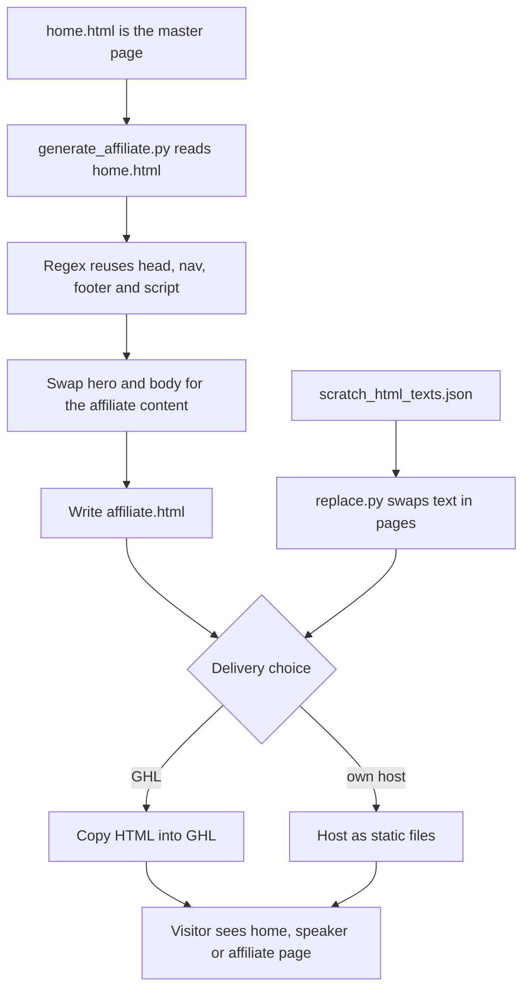

# Dr Priya personal brand site

> A set of static pages for the Pivot2Thrive principal's personal brand: home, keynote speaker and a HighLevel Partner Program affiliate page, with a script that rebuilds the affiliate page from the home page.

| | |
|---|---|
| **Category** | Apps, calculators, websites and funnels (websites) |
| **Status** | On demand, as of 9 Oct 2026 |
| **Type** | Static HTML pages with Python helper scripts |
| **Runner and schedule** | Manual. Copy to GHL or host |
| **Client / owner** | P2T principal (personal brand) |
| **Stack** | Static HTML; `generate_affiliate.py` (regex reuse of head, nav, footer and script), `replace.py`, `scratch_html_texts.json` |
| **Source** | Main KB Part 6 section 6C (Dr Priya personal brand site) |

## 1. Description

### What it does
The pages present the principal as an AI and automation strategist and TEDx speaker: `home.html`, `speaker.html` / `sp.html` (keynote) and `affiliate.html` (HighLevel Partner Program, "Build infrastructure, not chaos"). `generate_affiliate.py` rebuilds `affiliate.html` from `home.html` by reusing its head, navigation, footer and script via regex and swapping the hero and body. `replace.py` and `scratch_html_texts.json` are text-swap helpers.

### Inputs and outputs
- **Inputs:** `home.html` as the template, replacement hero and body copy, text-swap data.
- **Outputs:** `affiliate.html` and other static pages.

### Key components
| Component | Role |
|---|---|
| `home.html`, `speaker.html`, `sp.html`, `affiliate.html` | Pages |
| `generate_affiliate.py` | Rebuilds the affiliate page from the home page |
| `replace.py`, `scratch_html_texts.json` | Text-swap helpers |
| Link-in-bio page `...\Websites & Funnels\Linktree\drpriya.html` | Companion page |

### Where it lives
- `D:\Project\Client & Agency (Pivot)\Compliance & Audits\<client-folder>` (git repo; the pages live in a `.vscode` folder, which is odd) and `...\Websites & Funnels\Linktree\drpriya.html`. History: v1 to v8 commits from March to May 2026.

## 2. Flow chart

**Reading the chart**
1. `home.html` is the master for look and feel.
2. `generate_affiliate.py` copies head, navigation, footer and script from it by regex and swaps in the affiliate hero and body.
3. `replace.py` and `scratch_html_texts.json` help with text changes across pages.
4. The pages are copied to GHL or hosted statically.

## 3. Case study

### The challenge
The source describes the pages and the generator but no business problem. The generator's design implies the need to keep the home, speaker and affiliate pages visually consistent without hand-editing the shared head, navigation and footer (inferred).

### The solution
A generator that clones the home page's chrome into the affiliate page and a replace helper for text changes. The repository history runs v1 to v8 from March to May 2026.

### Design decisions and rules learned
- Reuse the home page's shared sections programmatically so pages stay in step.
- The pages sit in a `.vscode` folder, which is an unusual location (noted in the source).

### Outcome
No measured outcome recorded. The repository history (v1 to v8, March to May 2026) is the only dated fact.

### Lessons learned
- Not documented in the source.

## 4. Operating notes
- **Run / pause / debug:** `python generate_affiliate.py` regenerates `affiliate.html`; check the output before publishing.
- **Known issues and open items:** unusual `.vscode` location for the pages.
- **Risks:** a regex rebuild can break if `home.html` markup changes.

## 5. Related
- [ai-launchpad-funnel.md](ai-launchpad-funnel.md) (the same principal's AI Launchpad offer), [ai-agency-unfranchise-funnels-and-link-pages.md](ai-agency-unfranchise-funnels-and-link-pages.md) (the link-in-bio page).
- **Sources:** Main KB Part 6 section 6C "Dr Priya Jaganathan personal brand site" (surname omitted here).
