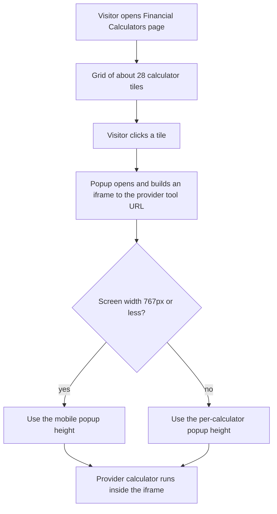

# EMAAR Finance calculators hub

> A static "Financial Calculators" page for a finance broker, listing about 28 calculators that open in a popup iframe to a third-party provider's tools.

| | |
|---|---|
| **Category** | Apps, calculators, websites and funnels (calculators) |
| **Status** | On demand, as of 9 Oct 2026 |
| **Type** | Static HTML page with a popup iframe loader |
| **Runner and schedule** | Manual. Paste into GHL custom code or host as static |
| **Client / owner** | EMAAR Finance (finance broker) |
| **Stack** | `index.html` with `calculators.css`; third-party calculators hosted at visionabacus.net (path pattern `/Tools/B3/Suite` + A or G + a number, then the calculator name, then `/EmaarFinance`) |
| **Source** | Main KB Part 6 section 6B (EMAAR Finance calculators hub) |

## 1. Description

### What it does
Presents about 28 calculators (borrowing power, stamp duty, extra repayment, offset, rent vs buy, tax, budget planner and others) in a grid. Clicking a calculator opens a popup that builds an iframe to the provider's tool URL. Popup height adapts per calculator and for mobile (767px or less). The maths belongs to the provider, not to the team.

### Inputs and outputs
- **Inputs:** the visitor's choice of calculator and inputs entered inside the provider's tool.
- **Outputs:** results shown by the provider's embedded calculator; the page itself computes nothing.

### Key components
| Component | Role |
|---|---|
| Calculator grid | About 28 tiles |
| Popup loader | Builds an `<iframe>` per calculator pointing to the provider URL, with per-calculator height and a mobile rule |
| `calculators.css` | Page styling |

### Where it lives
- `D:\Project\Client & Agency (Pivot)\Websites & Funnels\preth\index.html` (plus `calculators.css`).

## 2. Flow chart

**Reading the chart**
1. The page lists calculators in a grid.
2. Clicking a tile opens a popup that builds an iframe to the provider's URL for that calculator.
3. The popup height adapts per calculator and switches to a mobile height at 767px or less.
4. The provider's tool performs all calculations.

## 3. Case study

### The challenge
A finance-broker "Financial Calculators" page for EMAAR Finance with about 28 calculators. The source states the maths is the provider's, not the team's.

### The solution
A thin page that wraps the provider's hosted calculators in popup iframes, with sizing rules per calculator and for phones. The provider URLs carry an `EmaarFinance` suffix, which indicates a brand-specific configuration at the provider (inferred).

### Design decisions and rules learned
- Use the provider's maths instead of building new calculators, so no formulas need maintenance on the team's side.
- Adapt popup height per calculator and for mobile so the embedded tools remain readable.

### Outcome
No measured outcome recorded.

### Lessons learned
- Embedding a third-party tool shifts calculation accuracy and uptime to the provider.

## 4. Operating notes
- **Run / pause / debug:** static page; paste into GHL custom code or host.
- **Known issues and open items:** none recorded.
- **Risks:** the page depends on the provider's URLs; if the provider changes paths the popups break. Results are the provider's, not the team's.

## 5. Related
- Other calculators: [pool-heat-pump-sizing-calculator.md](pool-heat-pump-sizing-calculator.md), [bni-landing-page-and-revenue-leak-calculator.md](bni-landing-page-and-revenue-leak-calculator.md).
- **Sources:** Main KB Part 6 section 6B "EMAAR Finance calculators hub".
