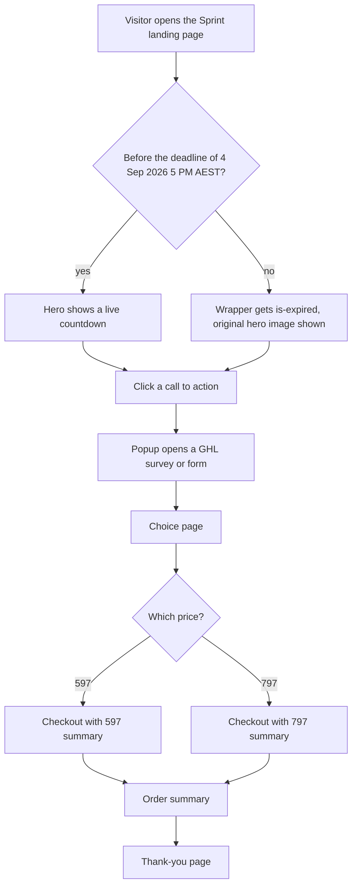

# HLGP 20-Hour Sprint funnel

> A static-HTML funnel for HL Growth Partner's "20-Hour Sprint" offer, pasted into a GoHighLevel funnel, with GHL survey popups, checkout customisations and an enrolment-deadline countdown.

| | |
|---|---|
| **Category** | Apps, calculators, websites and funnels (funnels) |
| **Status** | Live, as of 9 Oct 2026 (the source refers to "the live page" in the GHL funnel) |
| **Type** | Static HTML pages in GHL Custom HTML elements |
| **Runner and schedule** | Manual edits. The countdown ends Thu 4 Sep 2026, 5:00 PM AEST, so the live page should now show the hero image |
| **Client / owner** | HLGP (HL Growth Partner) |
| **Stack** | HTML/CSS/JS; GHL surveys/forms (widget embeds); GHL checkout snippets; converted from an Emergent-agent preview site |
| **Source** | Main KB Part 6 section 6B (HLGP 20-Hour Sprint funnel) |

## 1. Description

### What it does
The Sprint is a senior GHL implementation team working 20 hours inside the client's account for a flat $597 (a $797 variant exists as `*-797.html`). The funnel has a landing page, a choice page, checkout, order summary and two thank-you pages (proceed and purchase). Every call to action opens a popup containing a GHL survey or form.

### Inputs and outputs
- **Inputs:** visitor survey or form entries; order form payment in GHL.
- **Outputs:** GHL contacts, orders and thank-you routing.

### Key components
| Component | Role |
|---|---|
| Static pages | Landing, choice, checkout, order summary, thank-you proceed, thank-you purchase |
| 597 and 797 variants | Separate files for each price |
| `checkout-header/footer/global.css`, `ghl-survey-style.css` | GHL checkout and survey styling |
| Countdown | Replaces the hero image until the deadline: `Date.UTC(2026, 8, 4, 7, 0, 0)` = Thu 4 Sep 2026, 5:00 PM AEST (UTC+10); at zero the wrapper gets `is-expired` and the original hero image reappears (verified with a 3-second test copy) |
| `checkout-summary.html` and `checkout-preview.html` | GHL paste block and local preview; keep them in sync |
| `.bak.html` | Backups beside the edited pages |

### Where it lives
- `D:\Project\Client & Agency (Pivot)\Websites & Funnels\sprint` (git repo). Sessions "hlgp-20hour-sprint preview as HTML" x4 and "Hero image removal and AEST SEP 4 5 PM countdown".

## 2. Flow chart

**Reading the chart**
1. The hero image was replaced by a countdown to the enrolment deadline; after zero the original image reappears.
2. Every call to action opens a popup with a GHL survey or form.
3. The funnel passes through a choice page, checkout, order summary and thank-you pages. Separate files exist for $597 and $797.

## 3. Case study

### The challenge
The offer page needed an urgency element tied to a precise AEST deadline, responsive layouts for common screen widths, and a GHL checkout that matched the page design.

### The solution
Preview pages from an Emergent-agent site were converted into static HTML, then pasted into the GHL funnel as Custom HTML. A small countdown script handles the deadline and falls back to the original hero image. A responsive CSS pass targeted 360 / 390 / 430 / 768 / 1366 / 1920 px, and video testimonials were compressed and uploaded to GHL.

### Design decisions and rules learned
- Countdown deadline is encoded in UTC (`Date.UTC(2026, 8, 4, 7, 0, 0)`) to avoid timezone ambiguity.
- At expiry the page shows the original hero image rather than a blank space (verified with a 3-second test copy).
- The preview showed $600 while the live summary block says $597 (a pre-existing mismatch noted in the session).
- The checkout-summary testimonial was removed from both `checkout-summary.html` and `checkout-preview.html`; keep the two in sync when editing.

### Outcome
Documented facts only: the countdown logic was verified with a 3-second test copy. The deadline has passed (today is 9 Oct 2026), so the live page should show the hero image. No sales, enrolments or traffic figures are recorded.

### Lessons learned
- Keep the GHL paste block and the local preview identical.
- Test time-based behaviour with a short-fuse copy.

## 4. Operating notes
- **Run / pause / debug:** edit the static HTML, paste into the GHL funnel Custom HTML elements; test countdown behaviour with a short deadline copy.
- **Known issues and open items:** $600 versus $597 mismatch between preview and live summary block.
- **Risks:** price and deadline claims are marketing copy; keep them current.

## 5. Related
- [high-ticket-sales-accelerator-funnel-pages.md](../03-ghl-crm-migrations/high-ticket-sales-accelerator-funnel-pages.md) is another HLGP funnel.
- **Sources:** Main KB Part 6 section 6B "HLGP 20-Hour Sprint funnel".
