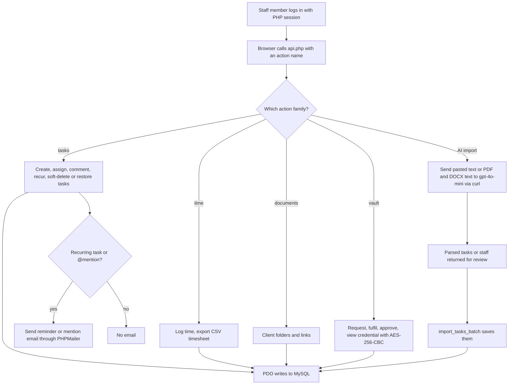

# HLGPods Task Manager (PHP original)

> The original internal project and task manager for the agency's client work: clients, tasks, time logs, staff pods, documents and an encrypted credentials vault, with AI import of tasks from pasted text or documents.

| | |
|---|---|
| **Category** | Apps, calculators, websites and funnels (apps) |
| **Status** | Legacy or retired, as of 9 Oct 2026 (superseded by the Node rewrite; a live copy was reported on the owner's own hosting) |
| **Type** | Web app (plain PHP, MySQL, session auth) |
| **Runner and schedule** | PHP shared hosting (cPanel), no build step. Recurring-task reminder emails are built into `api.php`; no cron script was found |
| **Client / owner** | HLGP agency (internal tool) |
| **Stack** | PHP with PDO/MySQL, PHPMailer (Composer), OpenAI `gpt-4o-mini` over curl |
| **Source** | Main KB Part 6 section 6A (HLGPods Task Manager); Portfolio KB section 25 ("Task manager", name only) |

## 1. Description

### What it does
An internal tool for managing client work. Tasks can have several assignees, @mention comments that send emails, soft-delete and restore, recurring schedules with reminder emails, attachments and bulk assignment. Staff log time and export CSV timesheets, and the app tracks who is online, login history, staff, pods and departments. A client document library holds folders and links, and a credential vault runs a request, fulfil, approve and view workflow with AES-256-CBC encryption.

### Inputs and outputs
- **Inputs:** staff logins, task and time entries, pasted task text or an uploaded PDF/DOCX for AI import, SMTP and site settings.
- **Outputs:** task and time records in MySQL, notification and reminder emails, CSV timesheets, tasks or staff created from AI-parsed documents.

### Key components
| Component | Role |
|---|---|
| `api.php` | One JSON dispatcher with about 55 actions |
| AI import actions | `parse_task_text`, `parse_task_doc`, `import_tasks_batch`, `parse_staff_doc` call OpenAI `gpt-4o-mini` via curl |
| `send_recurrence_reminder` | Builds recurring-task reminder emails inside `api.php` |
| Credential vault | Encrypted request/fulfil/approve/view workflow |
| `site_settings` table | SMTP, timezone, reminder time, app URL |
| Configuration file | Constants for the database, mail, the vault encryption key (`CRED_ENCRYPT_KEY`) and the AI provider |
| `vendor/` | Composer-installed PHPMailer |

### Where it lives
- Source: `D:\Project\Apps & Fullstack\taskmanager` (PHP files at root, `login/`, `vendor/`).
- A live copy was reported on the owner's own hosting (per the README of a Codex plugin scaffold in the BNI and Expos workspace).
- Tables are self-created with `CREATE TABLE IF NOT EXISTS`.

## 2. Flow chart

**Reading the chart**
1. Staff sign in with PHP session authentication, then every screen talks to the single `api.php` dispatcher.
2. The action name selects tasks, time, documents, vault or AI import behaviour.
3. AI import sends pasted text or text extracted from a PDF or DOCX to OpenAI `gpt-4o-mini`, returns parsed tasks or staff, and `import_tasks_batch` saves them.
4. All paths persist through PDO to MySQL.
5. Recurring tasks and @mentions send emails through PHPMailer. How reminders are triggered is not confirmed (see operating notes).

## 3. Case study

### The challenge
The agency needed one place to track client tasks, hours, staff pods, client documents and shared credentials, with notifications. The deployment target was PHP shared hosting (cPanel) with no build step.

### The solution
A plain PHP application behind a single JSON dispatcher, using self-creating tables so a fresh database sets itself up, PHPMailer for email, and an AES-encrypted credential vault. OpenAI `gpt-4o-mini` was added so tasks or staff lists could be imported from pasted text or uploaded documents instead of being typed in.

### Design decisions and rules learned
- Tables use `CREATE TABLE IF NOT EXISTS`, so deployment is "upload and run".
- Settings (SMTP, timezone, reminder time, app URL) sit in a `site_settings` table, not in code.
- A Codex plugin scaffold (under the BNI and Expos workspace) was started to drive this app (list clients and tasks, create and complete tasks). It is a scaffold only; because the app needs a login, a plugin would have to authenticate.
- The app was superseded by the Node multi-tenant rewrite: [pmai-task-manager-multi-tenant.md](pmai-task-manager-multi-tenant.md).

### Outcome
No measured outcome recorded. The source documents the feature set and the existence of a live copy, nothing about usage.

### Lessons learned
- Reminder emails that depend on being triggered "on use" are fragile; a real scheduler is the fix (the Node rewrite documents one but does not wire it either, see the PMAI file).

## 4. Operating notes
- **Run / pause / debug:** upload to cPanel hosting, run `composer install` for PHPMailer, set the application settings. No build step.
- **Known issues and open items:** no cron script found for recurring-task emails (not found); reminders are built in `api.php` (`send_recurrence_reminder`) and may be triggered on use (inferred).
- **Risks:** security and credential-hygiene findings for this project are tracked privately and are not published here. The vault depends on `CRED_ENCRYPT_KEY`; changing it in place would make stored items unreadable.

## 5. Related
- [pmai-task-manager-multi-tenant.md](pmai-task-manager-multi-tenant.md) is the Node/SaaS successor.
- **Sources:** Main KB Part 6 section 6A "HLGPods Task Manager (PHP original)". Portfolio KB section 25 names a "Task manager" without detail; matching it to this app is inferred.
