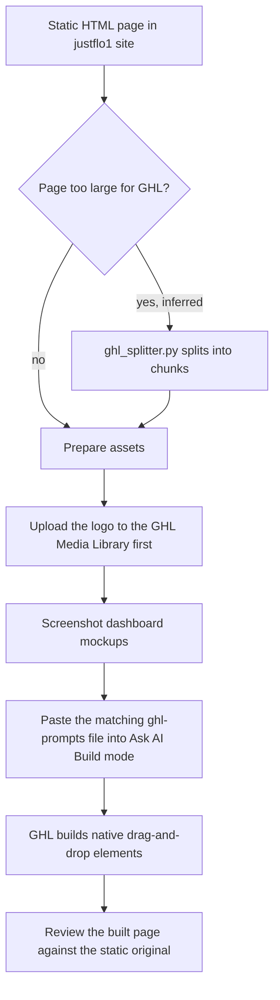

# JustFlo website and GHL build prompts

> A marketing site for "JustFlo, the AI-powered business operating system" built as 12 static HTML pages, with per-page prompts for rebuilding it as native drag-and-drop pages in GoHighLevel's Ask AI Build mode.

| | |
|---|---|
| **Category** | Apps, calculators, websites and funnels (websites) |
| **Status** | On demand, as of 9 Oct 2026 |
| **Type** | Static site plus GHL build prompts |
| **Runner and schedule** | Manual |
| **Client / owner** | Not stated (JustFlo is the product being marketed) |
| **Stack** | Static HTML in `justflo1/site/`, prompt files in `justflo1/ghl-prompts/`, `justflo/pages` custom.css/js, `ghl_splitter.py` (purpose inferred) |
| **Source** | Main KB Part 6 section 6B (JustFlo website and GHL prompts) |

## 1. Description

### What it does
The site has 12 HTML pages: home, why, AI suite, pricing, five industry pages (startups, home services, aesthetics, coaching, professional), four checkout pages (launch, grow, scale, ai-suite), a demo page and a popup-modal example. The `ghl-prompts/` folder holds per-page prompts (files 01-08) that tell GHL's Ask AI Build mode to match the page exactly and produce native drag-and-drop editable elements, not custom code. `ghl_splitter.py` splits large HTML into GHL-sized chunks (inferred).

### Inputs and outputs
- **Inputs:** the static HTML pages, the logo, screenshots of dashboard mockups.
- **Outputs:** per-page build prompts and, once run in GHL, native funnel or website pages.

### Key components
| Component | Role |
|---|---|
| `justflo1/site/` | 12 HTML pages |
| `justflo1/ghl-prompts/01-08*.md` | Per-page "exact match, native drag-and-drop editable (not custom code)" prompts for Ask AI Build |
| `justflo/pages` (`custom.css`, `custom.js`) | Shared page assets |
| `ghl_splitter.py` | Splits large HTML into GHL-sized chunks (inferred) |

### Where it lives
- `D:\Project\Client & Agency (Pivot)\Websites & Funnels\justflo`.

## 2. Flow chart

**Reading the chart**
1. Each static page is the visual reference.
2. Large pages may be split into chunks with `ghl_splitter.py` (inferred).
3. Gotcha from the source: the prompts require the logo to be uploaded to the GHL Media Library first and dashboard mockups to be screenshotted.
4. The matching prompt is pasted into Ask AI Build mode, which should produce native editable elements.
5. The review step is the natural last check; the source does not describe one for JustFlo.

## 3. Case study

### The challenge
The site for JustFlo ("the AI-powered business operating system") exists as static HTML, and the prompts are written so GHL's Ask AI Build mode reproduces each page as native drag-and-drop editable elements rather than custom code.

### The solution
Static pages first, then one prompt per page instructing GHL's Ask AI Build mode to match each page exactly as native drag-and-drop elements (the "exact match" instruction is in the prompt files).

### Design decisions and rules learned
- Prompts explicitly require native editable elements, not custom code.
- Prepare the logo (Media Library) and mockup screenshots before running the prompts.

### Outcome
No measured outcome recorded. The source does not record whether the pages were built in GHL.

### Lessons learned
- Not documented in the source for JustFlo. The PoolSafe file records how AI-built headers and footers can break when the same method is used.

## 4. Operating notes
- **Run / pause / debug:** run prompts one at a time in GHL; verify header, footer and links after each page.
- **Known issues and open items:** results in GHL are not recorded.
- **Risks:** none recorded.

## 5. Related
- [../03-ghl-crm-migrations/ghl-ai-prompt-builder-and-search-for-ghl.md](../03-ghl-crm-migrations/ghl-ai-prompt-builder-and-search-for-ghl.md) covers the prompt-building approach.
- [poolsafe-au-website-and-ghl-rebuild.md](poolsafe-au-website-and-ghl-rebuild.md) shares the same method with documented gotchas.
- **Sources:** Main KB Part 6 section 6B "JustFlo website and GHL prompts"; embed patterns in section 6D.
