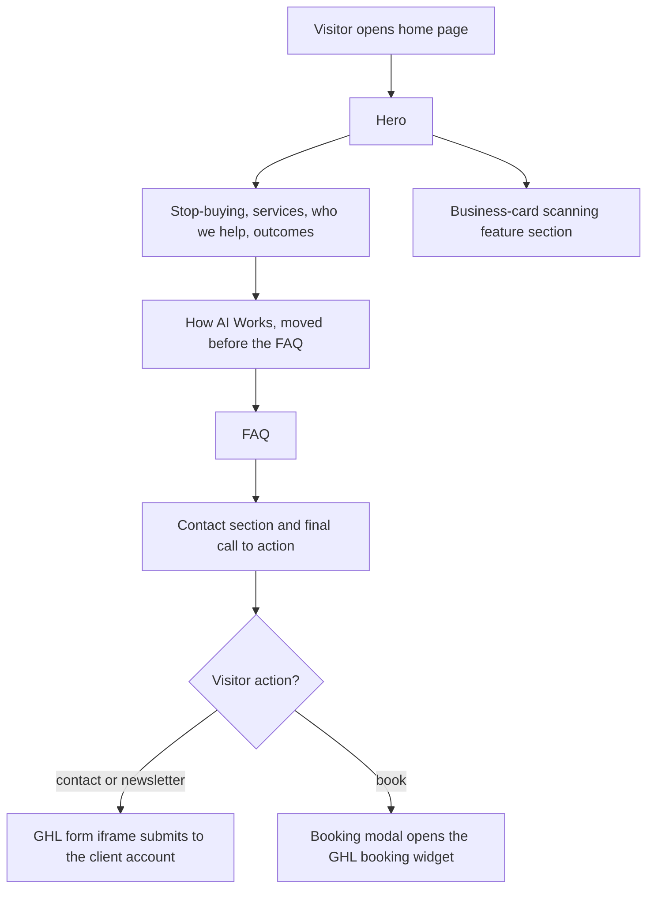

# Keystone Strategic Advisory website (HTML conversion for GHL)

> A client website "Put AI to Work in Your Business", converted to static HTML for placement on the client's GoHighLevel site, with GHL form iframes and a booking modal.

| | |
|---|---|
| **Category** | Apps, calculators, websites and funnels (websites) |
| **Status** | On demand, as of 9 Oct 2026 |
| **Type** | Static HTML pages |
| **Runner and schedule** | Manual. Paste into GHL custom code |
| **Client / owner** | Keystone Strategic Advisory (client) |
| **Stack** | Static HTML (`home.html`, `how-ai-works.html`, `how-ai-works-embed.html`); GHL form iframes; GHL booking widget |
| **Source** | Main KB Part 6 section 6C (Keystone Strategic Advisory) |

## 1. Description

### What it does
A marketing page whose section order is: hero, stop-buying, services, who-we-help, outcomes, How AI Works (moved before the FAQ), FAQ, contact and final CTA. The contact form and newsletter are GHL form iframes (`data-layout-iframe-id`), and a booking modal embeds a GHL widget. The conversion session also added a business-card scanning (mobile app) feature section.

### Inputs and outputs
- **Inputs:** visitor form entries and bookings.
- **Outputs:** GHL form submissions and bookings on the client's GHL account.

### Key components
| Component | Role |
|---|---|
| `home.html` | Main page |
| `how-ai-works.html` | How AI Works section as a page |
| `how-ai-works-embed.html` | The same section without page chrome |
| GHL form iframes | Contact form and newsletter |
| Booking modal | Embeds a GHL booking widget |

### Where it lives
- A `Website` folder (git repo) inside a client folder under `D:\Project\Client & Agency (Pivot)\`. The client folder is named after an individual and the name is omitted here. Session "HTML conversion".

## 2. Flow chart

**Reading the chart**
1. The page reads top to bottom in the documented section order.
2. How AI Works was moved ahead of the FAQ during the conversion session.
3. The contact form and newsletter are GHL form iframes; a booking modal embeds a GHL widget.
4. A business-card scanning (mobile app) feature section was added in the same session. Its position in the page is not stated.

## 3. Case study

### The challenge
A client's website needed to be placed on the client's GHL site as static HTML while keeping GHL-powered forms and booking.

### The solution
Convert the design to static HTML pages, with forms and bookings handled by GHL iframes and widgets, and provide a version of the How AI Works section without page chrome for embedding.

### Design decisions and rules learned
- Section order matters for conversion; How AI Works sits before the FAQ.
- Forms and booking stay in GHL iframes so submissions land in the client's account.
- Provide an embed-ready version (`how-ai-works-embed.html`) without page chrome.

### Outcome
No measured outcome recorded.

### Lessons learned
- Form styling inside GHL iframes needs custom CSS pasted into the form builder (see the embed notes in section 6D).

## 4. Operating notes
- **Run / pause / debug:** paste into GHL custom code; use the embed version where the page chrome is not wanted.
- **Known issues and open items:** none recorded.
- **Risks:** none recorded.

## 5. Related
- [poolsafe-au-website-and-ghl-rebuild.md](poolsafe-au-website-and-ghl-rebuild.md) for a larger example of the same HTML-to-GHL pattern.
- **Sources:** Main KB Part 6 section 6C "Keystone Strategic Advisory"; embed patterns in 6D.
