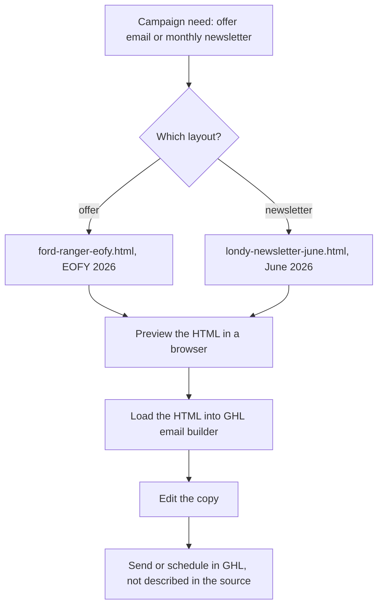

# Landy / Londy email templates

> Two static HTML email layouts for GoHighLevel's email builder: an end-of-financial-year Ford Ranger offer and a monthly newsletter.

| | |
|---|---|
| **Category** | Apps, calculators, websites and funnels (websites and email) |
| **Status** | On demand, as of 9 Oct 2026 |
| **Type** | Static HTML email templates |
| **Runner and schedule** | Manual |
| **Client / owner** | A client whose name is spelled Landy in some files and Londy in others |
| **Stack** | Static HTML email layouts for GHL's email builder |
| **Source** | Main KB Part 6 section 6C (Email templates, Landy / Londy) |

## 1. Description

### What it does
Provides two ready layouts: `ford-ranger-eofy.html` ("$7,000 off selected Ford Ranger models, EOFY 2026") and `londy-newsletter-june.html` ("The Londy Ledger, June 2026"). They are intended for GHL's email builder.

### Inputs and outputs
- **Inputs:** campaign copy and offer details.
- **Outputs:** HTML email bodies for GHL.

### Key components
| Component | Role |
|---|---|
| `ford-ranger-eofy.html` | Offer email, EOFY 2026 |
| `londy-newsletter-june.html` | Newsletter, June 2026 |

### Where it lives
- `D:\Project\Client & Agency (Pivot)\Websites & Funnels\email <client-folder>` (git repo).

## 2. Flow chart

The source documents the two files only; sending and scheduling are not described. The chart shows the documented use.

**Reading the chart**
1. A campaign picks one of two layouts.
2. The layout is loaded into GHL's email builder.
3. Copy is edited and the email is sent from GHL. The source does not describe the sending step.

## 3. Case study

### The challenge
The source gives no business problem beyond providing HTML layouts for a client's offer email and newsletter.

### The solution
Two static HTML layouts kept in a small git repository for use in GHL's email builder.

### Design decisions and rules learned
- The client's name is spelled Landy and Londy in different files; confirm the correct spelling before sending.

### Outcome
No measured outcome recorded.

### Lessons learned
- Normalise the client name across files.

## 4. Operating notes
- **Run / pause / debug:** open the HTML to preview, then load it into GHL.
- **Known issues and open items:** inconsistent client name spelling.
- **Risks:** none recorded.

## 5. Related
- [../02-content-seo-newsletters/hl-growth-brief-email-builder.md](../02-content-seo-newsletters/hl-growth-brief-email-builder.md) covers another email-building asset in the content folder.
- **Sources:** Main KB Part 6 section 6C "Email templates (Landy / Londy)".
