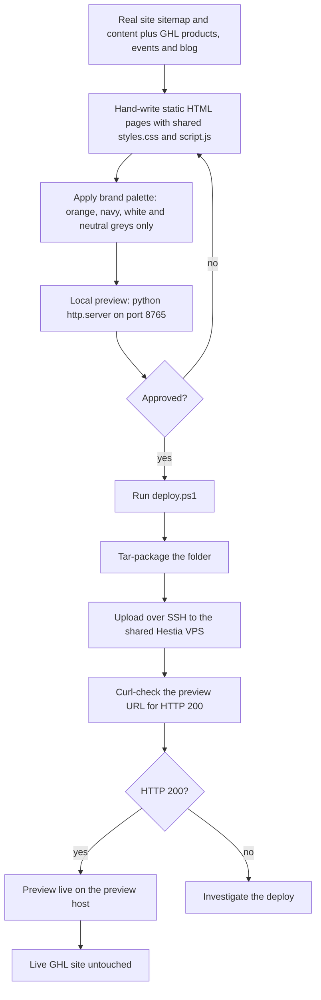

# Pivot 2 Thrive new website (proposed replacement)

> A static replacement for pivot2thrive.com.au, about 39 pages, built from the real site's sitemap and content plus GHL account data, deployed to a preview host without touching the live GHL site.

| | |
|---|---|
| **Category** | Apps, calculators, websites and funnels (websites) |
| **Status** | On demand, as of 9 Oct 2026 (a proposed replacement deployed to a preview host; the live site is unchanged) |
| **Type** | Static website (hand-written HTML, one stylesheet, one script) |
| **Runner and schedule** | Manual deploy with `.\deploy.ps1`; local preview via `python -m http.server 8765` |
| **Client / owner** | P2T |
| **Stack** | HTML, `styles.css`, `script.js`, `.htaccess` clean-URL rewrite (`/page` serves `page.html`), sitemap and robots; PowerShell deploy script (tar, scp/ssh, curl check) |
| **Source** | Main KB Part 6 section 6C (Pivot 2 Thrive new site; Other P2T support files) |

## 1. Description

### What it does
A static site built from the real site's sitemap and content plus GHL account data (products, events, blog). It has about 39 pages: services (AI automation, consulting, coaching, workshops, receptionist agent), speed-to-lead, BNI, glossary, GHL audit, restaurant growth engine, powerpivot toolkit, cleaning snapshot, privacy and terms. Hero images on 23 inner pages come from the client's live assets.

### Inputs and outputs
- **Inputs:** the live site's sitemap and content, GHL products, events and blog data, brand palette.
- **Outputs:** a deployable static folder, previewed locally and on a private preview host.

### Key components
| Component | Role |
|---|---|
| Hand-written HTML pages | About 39 pages |
| `styles.css`, `script.js` | One shared stylesheet and script |
| `.htaccess` | Clean URL rewrite: `/page` serves `page.html` |
| `deploy.ps1` | Tar-packages the folder, uploads it to the shared Hestia VPS over SSH, then curl-checks the preview URL for HTTP 200 |
| `.claude/launch.json` | Local preview with `python -m http.server 8765` |
| Other P2T support files (same workspace) | `pivot 2 trive\custom.html` is a GHL support-widget custom-code snippet limited to the agency's GHL app domains (hooks a GHL header button by selector); `sign.html` is the official email signature; `p2t\add_alt.html`, `custom.css` and `implementation_plan.md` (the AML/CTF platform transition plan) |

### Where it lives
- Source: `D:\Project\Client & Agency (Pivot)\Pivot2Thrive & Content\P2T_new site` (git repo; sessions 21-22 Sep 2026).
- Preview host: a site folder on the shared Hestia VPS.
- The same workspace holds `jcode`, a clone of a third-party open-source project (a Rust coding-agent harness, MIT licence); it is not part of this site and not a project of the team.

## 2. Flow chart

**Reading the chart**
1. Pages are written by hand from the real site's sitemap and content, enriched with GHL products, events and blog data.
2. The palette is orange #F44A12, navy #081028, white and neutral greys only, with white backgrounds; extra colours and dark blocks were rejected.
3. A local preview runs on port 8765.
4. `deploy.ps1` packages the folder, uploads it to the shared VPS over SSH and checks the preview URL for HTTP 200. It does not touch the live GHL site.
5. The approval loop is a natural review step; the source records design feedback rather than a formal approval gate.

## 3. Case study

### The challenge
Provide a static replacement for pivot2thrive.com.au built from the real site's sitemap and content plus GHL account data. The latest concern (second session) was that inner pages were written for people who already know AI and automation.

### The solution
Rebuild the site as plain static pages from the real sitemap, keep a single brand palette, and add a plain-English layer: a persona picker, proof and a "try us" ladder. Preview on the shared VPS so the live GHL site is not touched.

### Design decisions and rules learned
- **Brand palette is orange #F44A12, navy #081028, white and neutral greys only**, with white backgrounds. Extra colours and dark blocks were rejected.
- Clean URLs via `.htaccess` rewrite.
- Deploy to a preview host rather than the live GHL site.

### Outcome
Documented facts only: about 39 pages built, a deploy script that uploads to the preview host, hero images on 23 inner pages from live assets, and a plain-English layer added in the second session (21-22 Sep 2026). Visitor or conversion figures are not recorded; replacement of the live site is not recorded.

### Lessons learned
- Write inner pages for readers who do not yet know AI and automation.
- Keep to the rejected-colours rule: orange, navy, white and neutral greys only.

## 4. Operating notes
- **Run / pause / debug:** local preview: `python -m http.server 8765` (via `.claude/launch.json`). Deploy: `.\deploy.ps1` from the project folder.
- **Known issues and open items:** the cutover to replace the live GHL site is not described.
- **Risks:** the preview shares the 2 GB Hestia VPS with other apps; check memory before heavy work (see the hosting map in Part 6 section 6D).

## 5. Related
- [cleaning-industry-ghl-snapshot-and-funnels.md](cleaning-industry-ghl-snapshot-and-funnels.md) (the `cleaning-snapshot` page), [authority-inner-circle-member-portal.md](authority-inner-circle-member-portal.md) (same VPS), [../02-content-seo-newsletters/landing-page-blueprint-31-pages.md](../02-content-seo-newsletters/landing-page-blueprint-31-pages.md) (the 31 AI and industry pages, owned by the content folder; the 6B "31 AI solution/industry pages" entry is not duplicated here), [centinl-aml-ctf-audit-portal.md](centinl-aml-ctf-audit-portal.md) (consumer of the implementation plan).
- **Sources:** Main KB Part 6 section 6C "Pivot 2 Thrive new site" and "Other P2T support files"; hosting map in 6D.
