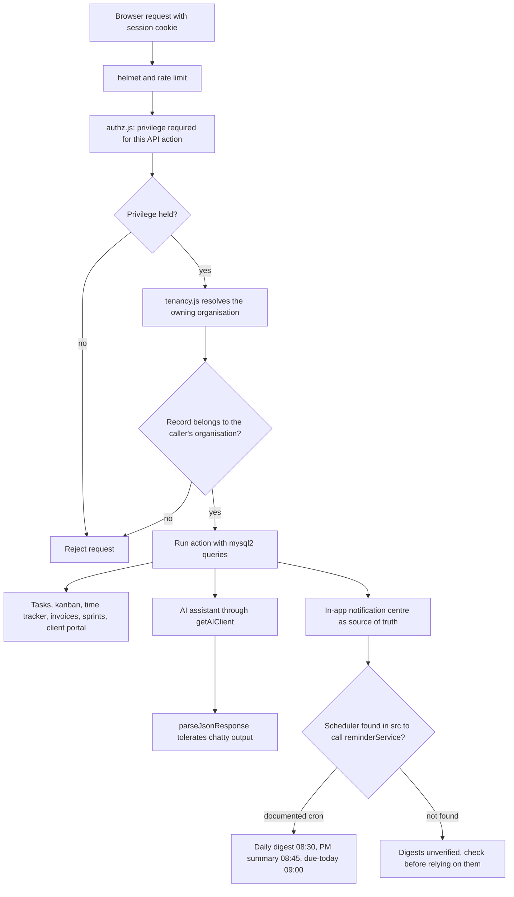
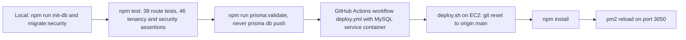

# PMAI Task Manager (multi-tenant SaaS rewrite)

> The StackandCode PMAI Task Manager: the PHP task tool rebuilt in Node as a multi-tenant SaaS with kanban, time tracking, invoices, a client portal, an integrations hub and an AI assistant.

| | |
|---|---|
| **Category** | Apps, calculators, websites and funnels (apps) |
| **Status** | Live, as of 9 Oct 2026 (deployed to AWS EC2) |
| **Type** | Web app (Express 4, EJS views, mysql2) |
| **Runner and schedule** | AWS EC2 under pm2 on port 3050. A cron schedule for emails is documented, but no scheduler calling the senders was found in `src/` |
| **Client / owner** | Stack&Code (StackandCode) |
| **Stack** | Express 4, EJS, mysql2 for every query (Prisma is reference docs only), express-session with file store, helmet, express-rate-limit, bcryptjs, nodemailer, imapflow, mailparser, pdfkit, exceljs, `openai` SDK (works with Groq and xAI), pdf-parse, mammoth |
| **Source** | Main KB Part 6 section 6A (PMAI Task Manager); Portfolio KB section 25 ("Project management tool", name only) |

## 1. Description

### What it does
A workspace-based project management app. Each organisation (workspace) has members, clients, tasks on a kanban board, a stopwatch time tracker, financials with invoice PDFs, a client portal, contractors, sprints and subscriptions. An integrations hub provides API keys, webhooks, Google sign-in and TOTP. An AI assistant parses text and documents, and a notification centre sends in-app and email alerts.

### Inputs and outputs
- **Inputs:** user and client logins, tasks, time entries, uploaded documents, Titan mailbox messages (IMAP), AI prompts.
- **Outputs:** records in MySQL, invoice PDFs (pdfkit), Excel exports (exceljs), emails (nodemailer), in-app notifications.

### Key components
| Component | Role |
|---|---|
| `src/utils/tenancy.js` | Resolves the owning organisation before any ID-addressed action |
| `src/middleware/authz.js` | Declares the privilege each API action needs before dispatch; super-admin actions are platform-only |
| `getAIClient()` | Reads `AI_API_KEY`, `AI_BASE_URL`, `AI_MODEL`; OpenAI by default, Groq `llama-3.3-70b-versatile` or xAI Grok by switching the base URL |
| `parseJsonResponse()` | Tolerates chatty model output |
| `src/services/reminderService.js` | Exports 3 senders only: daily digest, PM summary, due-today |
| `docs/EMAIL_NOTIFICATION_AND_REMINDER_WORKFLOWS.md` | Documented notification design |
| `tests/run_all_tests.js` | 38 route tests, 46 tenancy and security assertions, plus positive-path checks |
| `deploy.sh`, `ecosystem.config.cjs`, `.github/workflows/deploy.yml` | Deployment (git reset, npm install, pm2 reload; CI with a MySQL service container) |

### Where it lives
- Source: `D:\Project\<owner>\Stack&code\pm-tool` (earlier working directory `...\taskmanager\node-app`).
- Production: AWS EC2, pm2 on port 3050. A `Dockerfile` and `docker-compose.yml` also exist.
- Environment variable names: `SESSION_SECRET` and `CRED_ENCRYPT_KEY` (each at least 32 characters; the app refuses `NODE_ENV=production` without them), `APP_URL`, `TRUST_PROXY`, `DB_HOST`, `DB_USER`, `DB_PASS`, `DB_NAME`, `DATABASE_URL`, `AI_API_KEY`, `AI_BASE_URL`, `AI_MODEL`, `OPENAI_KEY`.

## 2. Flow chart

A second chart shows the documented release steps.

**Reading the chart**
1. Every request passes helmet and rate limiting, then `authz.js` checks the privilege declared for the action (the exact middleware order is inferred from the stack list).
2. `tenancy.js` resolves the owning organisation before any action addressed by ID, so one workspace cannot reach another's records.
3. Actions run with mysql2 queries only (Prisma is used for documentation, never at runtime).
4. The AI assistant goes through a provider-neutral client so OpenAI, Groq or xAI can be swapped by changing environment values.
5. The notification centre is designed as the source of truth with three email tiers: instant action, scheduled digests, system and security. The documented schedule is 08:30 Mon-Fri daily work digest, 08:45 PM summary, 09:00 due-today and overdue, 10:00 sprint kickoff and close, Fri 16:00 missing-timesheet alerts, Fri 17:00 weekly project report. Only three senders exist and no caller was found, so scheduled digests are unverified.
6. The second chart lists the documented release guidance in order of use: local database setup and tests, schema validation without `prisma db push`, the CI workflow file (it uses a MySQL service container), and `deploy.sh`, which resets the server checkout to origin/main, installs packages and reloads pm2. What triggers the workflow is not stated in the source.

## 3. Case study

### The challenge
The PHP task manager worked for one agency but not as a product. The rewrite had to support many organisations safely, add project-management features (kanban, sprints, invoices, client portal) and offer AI help, while staying cheap to host.

### The solution
A multi-tenant Express application where `organizations` and `organization_members` define tenancy and admin standing is derived per workspace. Authorisation is declared per API action in one middleware file. AI access is abstracted behind one client that can point at several providers. Tests include tenancy and security assertions. A full application review (28 Sep to 7 Oct 2026, session "Complete application review") informed the tenancy and authorisation design and its test assertions.

### Design decisions and rules learned
- **Never run `prisma db push`.** It would drop columns the app needs. Use `npm run prisma:validate` instead.
- **Re-key the credential vault only with `npm run rotate:cred-key`.** Editing `CRED_ENCRYPT_KEY` in place makes the vault unreadable.
- The app refuses to start in production without strong `SESSION_SECRET` and `CRED_ENCRYPT_KEY`.

### Outcome
Documented facts only: the app has a deploy pipeline to AWS EC2 and a test suite (38 route tests, 46 tenancy and security assertions, plus positive-path checks). A review ran 28 Sep to 7 Oct 2026. No usage or customer figures are recorded.

### Lessons learned
- Resolve the owning organisation before touching any record addressed by ID; declare the required privilege per action.
- A documented cron schedule is not a running schedule; verify that something actually calls the senders.

## 4. Operating notes
- **Run / pause / debug:** local: `cp .env.example .env`, `npm install`, `npm run init-db`, `npm run migrate:security`, then `npm start` or `npm run dev` (port 3000). Test with `npm test`. Production deploy: `deploy.sh` on EC2 (git reset to origin/main, npm install, pm2 reload).
- **Known issues and open items (for the owner):** wire a scheduler for digests (inferred gap, verify first).
- **Risks:** security and credential-hygiene findings for this project are tracked privately and are not published here.

## 5. Related
- [hlgpods-task-manager-php.md](hlgpods-task-manager-php.md) is the PHP original.
- [stackandcode-company-website.md](stackandcode-company-website.md) is the sibling Stack&Code project.
- **Sources:** Main KB Part 6 section 6A "PMAI Task Manager". Portfolio KB section 25 names a "Project management tool"; matching it to this app is inferred from the folder name `pm-tool`.
