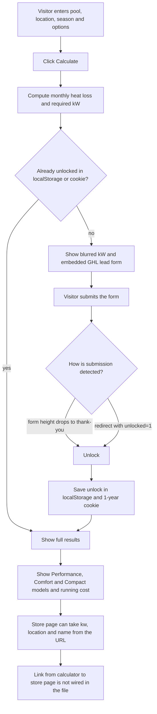

# Pool heat pump sizing calculator and store pages

> A lead-gated calculator for a pool-heating client that turns pool size, location and season into the required kW and recommended heat pump models, plus follow-on store pages that recommend GHL store products.

| | |
|---|---|
| **Category** | Apps, calculators, websites and funnels (calculators) |
| **Status** | On demand, as of 9 Oct 2026 |
| **Type** | Single-file HTML calculator with a GHL form lead gate; static store pages |
| **Runner and schedule** | Manual. Open the file locally (`.claude/launch.json` serves it on port 8000), host it as static HTML, or paste it into a GHL Custom Code/HTML element |
| **Client / owner** | The pool-heating client (themed to bestpoolheating.com.au); store pages sit in the Servigo folder |
| **Stack** | Vanilla HTML, CSS and JS with no dependencies; GHL form iframe; `products.json` and `products_list.json` exported from GHL products |
| **Source** | Main KB Part 6 section 6B (Pool heat pump sizing calculator, plus pool store pages) |

## 1. Description

### What it does
A visitor enters pool size, depth, target temperature, location, blanket, type and season. The page calculates the required kW and recommends heat pump models in three tiers, while an animated pool warms up as results reveal. After Calculate, the kW value is blurred and a GHL lead form ("Calculator Lead magnet") sits over it; once the form is submitted the full results unlock.

### Inputs and outputs
- **Inputs:** city (15 Australian cities with monthly mean air temperature and relative humidity), pool volume and depth (surface area = volume / depth), target water temperature, Indoor/Outdoor, blanket Yes/No, pool type (Regular or Freeform / Spa), electricity price, season start and end months.
- **Outputs:** required kW, tiered model picks, estimated annual running cost, a captured lead in GHL.

### Key components
| Component | Role |
|---|---|
| Physics model | Saturation vapour pressure from air and pool temperatures; monthly evaporative heat loss (wind 0.3 indoor, 2 outdoor) plus 20% extra; minus a radiation term outdoors; x 0.65 with a blanket; x 1.3 for Freeform / Spa; x 1.25 when the coldest season month is 5 C or under; x 1.17^((26 minus minAvgTemp)/5). Required kW = peak in-season monthly demand (zero if the coldest in-season air temperature is above target) |
| Model list | `HP-9/13/17/21/26/32` kW |
| Tier picks | Performance (oversize under 26%), Comfort (under 40%), Compact (smallest single unit covering the load) |
| Running cost | COP = max(2.8, 8.6 minus 4.2 x load), 8 h/day over in-season days |
| Lead gate | GHL form iframe over a blurred kW; unlock remembered in localStorage and a 1-year cookie; `?unlocked=1` redirect also unlocks and restores saved inputs |
| `Servigo\Store pages` | Product recommender reading `?kw=&location=&name=`, loading `products.json` (brand, line, tier, variants with kW and power requirement, last updated 2026-09-15), filtering by tier and power, sorting by match, linking to the GHL Store for checkout |
| `Servigo\best_pool_heating_store` | Static front-end shop with hash routing (`#shop`, `#product/:id`, `#checkout`, `#confirmation`), cart in localStorage `ghl_pool_cart`, products from `products_list.json`; a small Node static server (`server.js`, port 8080) for local viewing only |

### Where it lives
- Calculator: `D:\Project\Client & Agency (Pivot)\HLGP & GoHighLevel\Heat_Pump\heat-pump-calculator.html` (originally `D:\Project\Pivot\Heat_Pump`).
- Store pages: `...\Servigo\Store pages` and `...\Servigo\best_pool_heating_store`. GHL embed experiments: `D:\Project\Personal Tools & Labs (<owner>)\Cloud & Infra\server`.
- Built from a Notion note "Heat Pump Sizing Formulas" and modelled on poolpro.com.au's calculator. Theme: navy, orange, sky-blue, Montserrat/Poppins.

## 2. Flow chart

**Reading the chart**
1. The visitor fills in the pool, location and season details and presses Calculate.
2. The page computes the required kW as the peak in-season monthly demand.
3. If the visitor has not unlocked before, the kW is blurred and a GHL form iframe collects the lead.
4. GHL embedded forms post no "submitted" message, only iframe-height messages. The page detects submission by a large drop in height (the tall form replaced by the short thank-you), with the form's On Submit redirect to `?unlocked=1` as the reliable fallback.
5. Results show three tiers and an annual running cost. The store recommender can take `kw`, `location` and `name` from the URL; the calculator file does not wire a link to it (not found).

## 3. Case study

### The challenge
A lead-magnet calculator for the pool-heating client: pool size, depth, target temperature, location, blanket, type and season give the required kW and the recommended model or models, themed to the client's site and gated behind a GHL form. It was built from a Notion note "Heat Pump Sizing Formulas" and modelled on poolpro.com.au's calculator.

### The solution
A single self-contained HTML file with the physics model from a Notion formula note, three recommendation tiers and a blurred-result lead gate backed by a GHL form. Follow-on store pages pull GHL product exports to recommend products and link to checkout.

### Design decisions and rules learned
- **GHL embedded forms post no "submitted" message**, only iframe-height messages. Detect submission by height drop, with `?unlocked=1` redirect as the reliable fallback (set the form's On Submit to redirect).
- The reCAPTCHA on the form could not be completed in testing, so no test lead was created.
- The "never ask again" memory is per browser, not per person; a server-side GHL contact check would be needed for cross-device unlock.
- The first design needed custom CSS pasted into the GHL form builder, because page CSS cannot reach into the iframe (see the GHL embed patterns in Part 6 section 6D).

### Outcome
No measured outcome recorded. The calculator exists as a finished single file and the store pages exist as separate folders; no lead counts are recorded and no test lead was created.

### Lessons learned
- Do not rely on GHL form events; rely on a redirect.
- Browser-only unlock is a convenience, not a security control.

## 4. Operating notes
- **Run / pause / debug:** open the file or serve it locally on port 8000; paste into GHL Custom Code/HTML when going live. Test the unlock by visiting the page with `?unlocked=1`.
- **Known issues and open items:** link between calculator result and store page not wired (not found); lead gate untested end-to-end because of reCAPTCHA.
- **Risks:** none recorded.

## 5. Related
- GHL form-embed test pages and a standalone pool-heat-calculator lead-form prototype from the Cloud & Infra scratch folder: [../07-personal-tools-media-infra/ghl-embed-test-pages-and-pool-heat-calculator.md](../07-personal-tools-media-infra/ghl-embed-test-pages-and-pool-heat-calculator.md).
- Same client family: [poolsafe-au-website-and-ghl-rebuild.md](poolsafe-au-website-and-ghl-rebuild.md).
- **Sources:** Main KB Part 6 section 6B "Pool heat pump sizing calculator"; embed patterns in section 6D.
