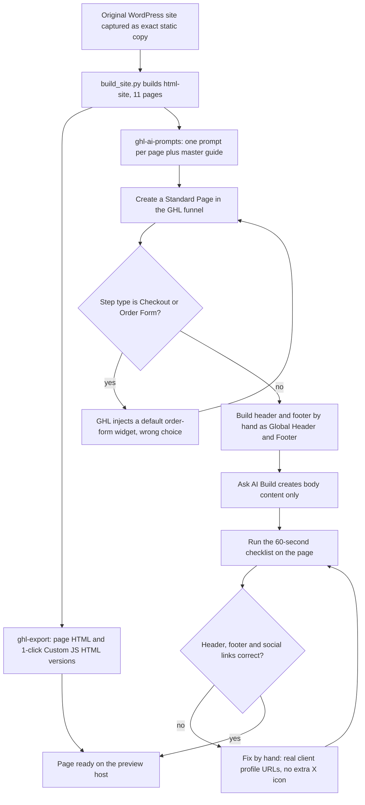

# PoolSafe AU website and GHL rebuild

> An exact static copy of a Queensland pool-safety certification business's WordPress site, then a rebuild inside GoHighLevel using per-page Ask AI Build prompts, with the gotchas learned over three prompt rounds.

| | |
|---|---|
| **Category** | Apps, calculators, websites and funnels (websites) |
| **Status** | On demand, as of 9 Oct 2026 (a live preview host is named in the source) |
| **Type** | Static site capture, GHL export pages and AI build prompts |
| **Runner and schedule** | Manual |
| **Client / owner** | PoolSafe AU (Servigo; South East Queensland) |
| **Stack** | Python `build_site.py`, static HTML, GHL Ask AI Build prompts, GHL Custom JS/HTML pages |
| **Source** | Main KB Part 6 section 6C (PoolSafe AU website and GHL rebuild) |

## 1. Description

### What it does
The original WordPress site was captured as an exact static copy (`html-site/`, built by `build_site.py`): 11 pages (home, about, services, new pools, blogs hub, FAQs, contact and 4 blog posts), with `commercial-inspections.html` at the folder root. It was then rebuilt inside GHL, with a live preview host. A set of per-page prompts lets GHL's Ask AI Build mode recreate the pages.

### Inputs and outputs
- **Inputs:** the original site, per-page prompts, a master prompt guide, an image mapping.
- **Outputs:** static HTML, GHL-ready page HTML in two forms, and pages built in GHL.

### Key components
| Component | Role |
|---|---|
| `html-site/`, `build_site.py` | Exact static copy of the original site |
| `ghl-export/` | Page HTML in two forms (`*.html` and `ghl-*.html` 1-click Custom JS/HTML versions), `GHL_INSTRUCTIONS.md`, `GHL_DRAG_AND_DROP_GUIDE.md` |
| `ghl-ai-prompts/` | One prompt per page (HOME, ABOUT, SERVICES, BLOGS, FAQS, CONTACT) plus `GHL_MASTER_PROMPT_GUIDE.md` |
| `ghl_image_mapping.json` | Maps images |
| `poolsafeau blog\create_post.py`, `post_new.py` | Scrape a source page into blog HTML and post it to the GHL blog via API; one-off scripts that read a hard-coded local path from another tool's folder (inferred) |
| `poolsafeau.au` | A saved copy of the About page and robots.txt |

### Where it lives
- `D:\Project\Client & Agency (Pivot)\Servigo\poolsafeau` (originally `D:\Project\Pivot\poolsafeau\original-exact-site`), plus `poolsafeau.au` and `poolsafeau blog`. Session "Create GHL prompts for HTML pages".
- The blog scripts use the environment names `location` and `pit` (names only).

## 2. Flow chart

**Reading the chart**
1. The original site is captured as an exact static copy by `build_site.py`.
2. GHL-ready exports and one prompt per page are prepared from it.
3. Pages must be built on a Standard Page step; a Checkout/Order Form step makes GHL inject a default order-form widget.
4. GHL's AI sometimes outputs escaped or broken HTML for header and footer (raw `<a>` text) and wrong social URLs, so header and footer are built by hand as the Global Header/Footer, and the AI builds body content only.
5. A 60-second checklist is run after each page; social links must be the client's real profile URLs (no generic root domains, no extra X icon).

## 3. Case study

### The challenge
The original WordPress site of a South East Queensland pool-safety certification business was captured as an exact static copy, and then had to be rebuilt inside GoHighLevel. GHL's Ask AI Build mode was used with per-page prompts.

### The solution
Capture the site as an exact static copy, produce GHL export pages in two forms, and write one Ask AI Build prompt per page with a master guide. Three prompt rounds refined the approach and produced a checklist of recurring AI faults.

### Design decisions and rules learned
- **Use a Standard Page.** If the funnel step type is "Checkout/Order Form", GHL injects a default order-form widget.
- **Build header and footer by hand** and make them the Global Header/Footer; have the AI build body content only. GHL's AI sometimes outputs escaped or broken HTML for header and footer (raw `<a>` text) and wrong social URLs.
- **Run the 60-second checklist** after each page.
- **Social links** must be the client's real profile URLs, with no generic root domains and no extra X icon.
- The blog scripts are one-off helpers with a hard-coded local path.

### Outcome
Documented facts only: 11 static pages captured, GHL export pages in two forms, six per-page prompts (HOME, ABOUT, SERVICES, BLOGS, FAQS, CONTACT), and a named live preview host. The source does not record completion of the GHL build, traffic or leads.

### Lessons learned
- Build header and footer by hand as global sections.
- Keep the per-page prompt plus checklist method; AI output needs a human check.
- Use Standard Pages for custom builds.

## 4. Operating notes
- **Run / pause / debug:** follow `GHL_INSTRUCTIONS.md` and `GHL_MASTER_PROMPT_GUIDE.md`; run the 60-second checklist after each page.
- **Known issues and open items:** completion of the GHL build is not recorded.
- **Risks:** security and credential-hygiene findings for this project are tracked privately and are not published here.

## 5. Related
- [../02-content-seo-newsletters/poolsafe-au-blog-publish-scripts.md](../02-content-seo-newsletters/poolsafe-au-blog-publish-scripts.md) covers the blog publish scripts in detail.
- [../03-ghl-crm-migrations/ghl-ai-prompt-builder-and-search-for-ghl.md](../03-ghl-crm-migrations/ghl-ai-prompt-builder-and-search-for-ghl.md) covers the prompt-building skill.
- [pool-heat-pump-sizing-calculator.md](pool-heat-pump-sizing-calculator.md) is related pool-sector work for another client.
- **Sources:** Main KB Part 6 section 6C "PoolSafe AU (Servigo) website and GHL rebuild".
