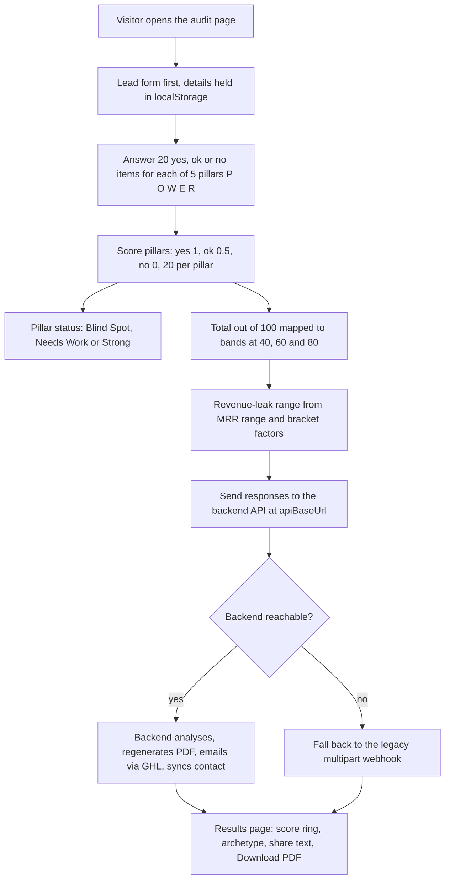

# POWER PIVOT Agency Audit (scored self-assessment front end)

> A single-page lead-magnet quiz for HL Growth Partner in which agency owners answer five pillars of yes/ok/no items and receive a score, blind spots, an estimated revenue leak and an emailed PDF report.

| | |
|---|---|
| **Category** | Apps, calculators, websites and funnels (quizzes and scoring tools) |
| **Status** | On demand, as of 9 Oct 2026 (front end built; live status of the backend not confirmed) |
| **Type** | Self-contained HTML page with inline JS and CSS, GSAP animations, calling a separate backend |
| **Runner and schedule** | Manual. Host as static HTML or paste into GHL; results depend on a server-side API |
| **Client / owner** | HLGP (HL Growth Partner) |
| **Stack** | HTML/CSS/JS (`index.html`, about 178 KB), GSAP; `apply_design.py` for design patches; backend API reached through `apiBaseUrl` |
| **Source** | Main KB Part 6 section 6B (POWER PIVOT Agency Audit); backend described in Part 5 section 9 |

## 1. Description

### What it does
The visitor completes a lead form, then answers 20 items for each of five pillars: P (Product), O (Offer), W (Workflow), E (Engagement) and R (Repeat). Each answer scores yes = 1, ok = 0.5, no = 0, so each pillar is out of 20 and the total is out of 100. The results page shows a score ring, an archetype, share text and a Download PDF button, and a PDF report is emailed.

### Inputs and outputs
- **Inputs:** lead details (including an MRR range), 100 yes/ok/no answers.
- **Outputs:** on-page score, pillar statuses, revenue-leak range, archetype; a PDF report emailed through GHL and a synced contact (done by the backend, not this folder).

### Key components
| Component | Role |
|---|---|
| Pillar scoring | 20 items per pillar. Pillar status: 9.5 or less Blind Spot, up to 15.5 Needs Work, above that Strong |
| Total bands | At 40 / 60 / 80: "Significant Growth Potential", "Recoverable Revenue Detected", "Optimisation Opportunities", "Top 12% Performance" |
| Revenue-leak range | The visitor's MRR range x bracket factors (35-65%, 22-38%, 12-25%, 4-12%). Figures are illustrative; the page says so |
| State | Lead form first, state kept in localStorage |
| `apiBaseUrl` | Points at the backend API, which analyses responses server-side, regenerates the PDF, emails it via GHL and syncs the contact |
| Legacy fallback | A legacy multipart webhook on another host, used if the backend is down |
| `apply_design.py` | Rewrites CSS blocks in `index.html` in place (a design patch script with a hard-coded old path `d:\Project\Pivot\New audit`) |
| `premium-v2/` | Design experiment |

### Where it lives
- `D:\Project\Client & Agency (Pivot)\Compliance & Audits\New audit`.
- The backend code is not in this folder (not found there). Part 5 section 9 of the main KB documents a separate backend in `...\Workflows & Automation\microsaas` (Node/Express, builds the PDF, delivers it by GHL email and syncs the lead); see [the backend file](../05-excel-workflow-tools/power-pivot-audit-backend-and-abcd-checkout.md).

## 2. Flow chart

**Reading the chart**
1. The page collects the lead first, then 100 answers across five pillars.
2. Scores are computed in the browser: yes = 1, ok = 0.5, no = 0.
3. The total maps to four bands at 40 / 60 / 80, and the revenue-leak range multiplies the visitor's MRR range by bracket factors. The page states the figures are illustrative.
4. The page posts to the backend, which re-runs the analysis server-side, regenerates the PDF, emails it through GHL and syncs the contact. If the backend is down, the page falls back to a legacy webhook.

## 3. Case study

### The challenge
HL Growth Partner needed a lead magnet that gave agency owners a credible, shareable score and a concrete estimate of lost revenue, then delivered a PDF by email and created the lead in GHL.

### The solution
A single-file front end with animated scoring and a results page, backed by a server that recomputes scores (so figures cannot be tampered with in the browser, inferred) and builds the PDF. A legacy webhook acts as a break-glass fallback.

### Design decisions and rules learned
- **Honest estimates:** revenue figures are illustrative and the page says so.
- **Break-glass fallback:** if the backend is down, the page falls back to the legacy webhook.
- `apply_design.py` hard-codes an old path; edit the path before running it, because it rewrites files in place.
- **Discrepancy in the main KB:** this section and Part 5 section 9 name different hosts for the backend API (and the backend README names a third). Confirm the target before go-live.

### Outcome
No measured outcome recorded. The source documents the page and its scoring rules; it does not record leads, completions or report sends.

### Lessons learned
- Keep scoring and PDF generation on the server so that the figures shown and emailed agree.
- Label estimated revenue figures clearly.

## 4. Operating notes
- **Run / pause / debug:** serve the HTML statically (or paste into GHL), then test the full path with the backend. For the backend, see Part 5 section 9.
- **Known issues and open items:** the backend host name differs across documents; the legacy webhook host and the backend are not in this folder.
- **Risks:** the page posts contact data to the backend, so HTTPS is needed end to end.

## 5. Related
- Backend, PDF builder and the paid ABCD Audit checkout: [../05-excel-workflow-tools/power-pivot-audit-backend-and-abcd-checkout.md](../05-excel-workflow-tools/power-pivot-audit-backend-and-abcd-checkout.md).
- Other scored quizzes: [ai-agency-readiness-quiz-ghl-custom-code.md](ai-agency-readiness-quiz-ghl-custom-code.md), [bni-franchise-pdf-factory-and-postcode-lock.md](bni-franchise-pdf-factory-and-postcode-lock.md), [ai-launchpad-funnel.md](ai-launchpad-funnel.md).
- **Sources:** Main KB Part 6 section 6B "POWER PIVOT Agency Audit" and Part 5 section 9 (backend and ABCD Audit checkout). No Portfolio KB entry.
