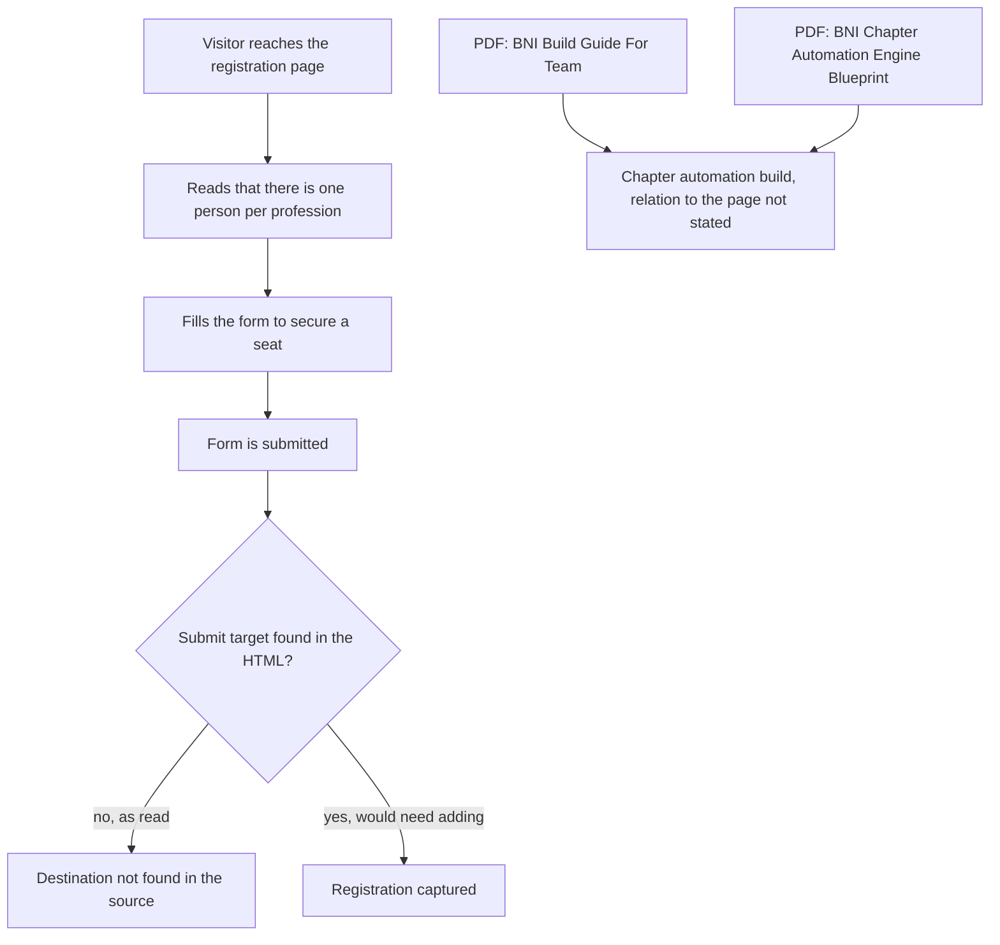

# Servigo BNI visitor funnel

> A static "Visitor Registration - Independent Chapter Communications" page for a BNI chapter (one person per profession), kept with two PDF guides on the chapter automation build.

| | |
|---|---|
| **Category** | Apps, calculators, websites and funnels (funnels) |
| **Status** | On demand, as of 9 Oct 2026 (the form target was not found in the HTML) |
| **Type** | Static HTML page |
| **Runner and schedule** | Manual |
| **Client / owner** | Servigo folder (BNI chapter work) |
| **Stack** | `index.html`, `styles.css`; two PDFs |
| **Source** | Main KB Part 6 section 6B (Servigo BNI visitor funnel) |

## 1. Description

### What it does
A single registration page for chapter visitors. It states that there is one person per profession and offers a form to secure a seat. The HTML posts nowhere that could be found (target not found). Two PDFs sit beside it: "BNI Build Guide For Team" and "BNI Chapter Automation Engine Blueprint", which describe the chapter automation build. The source does not say how the page relates to that automation.

### Inputs and outputs
- **Inputs:** visitor registration details entered into the form.
- **Outputs:** not documented (form target not found).

### Key components
| Component | Role |
|---|---|
| `index.html`, `styles.css` | The visitor-registration page |
| "BNI Build Guide For Team" PDF | Team build guide |
| "BNI Chapter Automation Engine Blueprint" PDF | Describes the chapter automation build |

### Where it lives
- `D:\Project\Client & Agency (Pivot)\Servigo\bni\visitor-funnel`.

## 2. Flow chart

Only the page itself is documented. The chart shows the page and the gap at the form submission.

**Reading the chart**
1. The page positions the chapter as one person per profession and invites registration.
2. The form posts nowhere in the HTML that was read, so what happens to a submission is not documented.
3. The two PDFs describe the chapter automation build; the source does not link them to this page.

## 3. Case study

### The challenge
The source gives only the page's purpose: a visitor-registration page for an independent BNI chapter with an exclusivity message (one person per profession).

### The solution
A static HTML page with CSS and a seat-securing form, kept alongside a team build guide and an automation blueprint in PDF form.

### Design decisions and rules learned
- Do not confuse this tree with the other BNI folders: `BNI & Expos\bni`, `bni2` and `EXPOBNI`.

### Outcome
No measured outcome recorded.

### Lessons learned
- A form with no destination is a dead end; confirm the submit target before use.

## 4. Operating notes
- **Run / pause / debug:** open `index.html`; add or confirm the form target.
- **Known issues and open items:** form target not found.
- **Risks:** none recorded.

## 5. Related
- [bni-landing-page-and-revenue-leak-calculator.md](bni-landing-page-and-revenue-leak-calculator.md) lists all the BNI trees.
- **Sources:** Main KB Part 6 section 6B "Servigo BNI visitor funnel".
