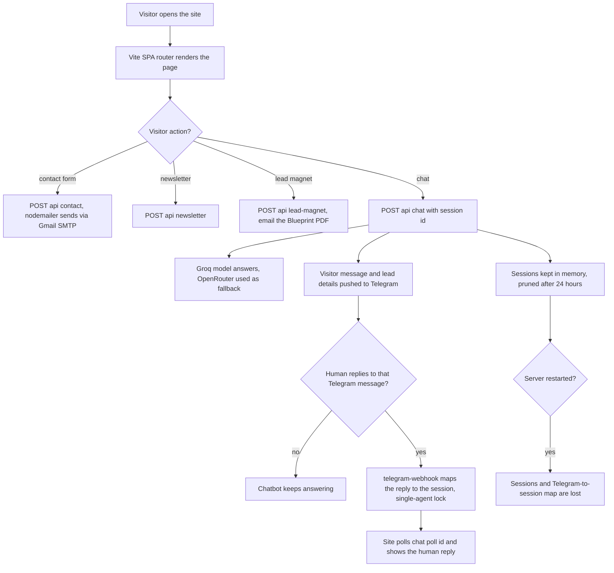

# Stack&Code company website with AI chatbot and Telegram takeover

> The marketing site for StackandCode, a full-stack and AI automation agency, with contact, newsletter and lead-magnet APIs and an AI chatbot whose conversations can be taken over by a human through Telegram.

| | |
|---|---|
| **Category** | Apps, calculators, websites and funnels (apps and websites) |
| **Status** | On demand, as of 9 Oct 2026 (built with deploy tooling; hosting target not verified in the source) |
| **Type** | Web app (Vite single-page site served by Express) |
| **Runner and schedule** | Node process under pm2 (`stackandcode`); chat sessions held in memory and pruned after 24 hours |
| **Client / owner** | Stack&Code (StackandCode, Salem / Chennai, India) |
| **Stack** | Vite (vanilla JS SPA router, GSAP, three.js particles), Express 4 `server.js` serving `dist/`, compression, nodemailer over Gmail SMTP, Groq (OpenRouter fallback), Telegram Bot API, Python for blog art and the PDF generator |
| **Source** | Main KB Part 6 section 6A (Stack&Code company website) |

## 1. Description

### What it does
A marketing site for the agency ("Build. Automate. Integrate. Scale.") with pages for services, AI automation, GHL automation, RAG systems, ServiceM8 integration, white-label development, blogs, about, contact and links. The server exposes API routes for the contact form, newsletter sign-up and a lead magnet that emails the "2026 Business Automation & AI Blueprint" PDF. An AI chatbot answers visitors and pushes each visitor message to Telegram with lead details so a human can step in.

### Inputs and outputs
- **Inputs:** visitor form submissions, newsletter emails, chat messages, human replies in Telegram.
- **Outputs:** emails through Gmail SMTP, the Blueprint PDF, chatbot replies, Telegram notifications, SEO files (`sitemap.xml`, `robots.txt`, `llms.txt`, `llms-full.txt`) and `AI_KNOWLEDGE_FEEDER.md`, a paste-in knowledge document for AI assistants.

### Key components
| Component | Role |
|---|---|
| `POST /api/contact`, `/api/newsletter`, `/api/lead-magnet` | Form handlers; lead magnet emails the Blueprint PDF |
| `scripts/generate_blueprint_pdf.py` | Generates the Blueprint PDF |
| `/api/chat` | Chatbot using Groq (`GROQ_MODEL`, default `openai/gpt-oss-20b`) with an OpenRouter fallback key |
| `/api/telegram-webhook` and `/api/chat/poll/:id` | Maps a Telegram reply to the right session (strict single-agent lock) and lets the site poll for the human reply |
| `scripts/blog-art/` | Python generator for blog hero art |
| `deploy.sh`, `ecosystem.config.cjs`, `nginx.conf.example` | Deployment: git pull, npm install, build, `pm2 reload stackandcode`; 128 MB heap and restart at 200 MB |

### Where it lives
- Source: `D:\Project\<owner>\Stack&code\stack website` (the working directory was earlier `D:\Project\Apps & Fullstack\stack`, which no longer exists).
- Environment variable names: `PORT`, `GMAIL_EMAIL`, `GMAIL_PASSWORD`, `GROQ_API_KEY`, `GROQ_MODEL`, `OPENROUTER_API_KEY`, `TELEGRAM_TOKEN`, `TELEGRAM_CHAT_ID`.
- The stated primary domain is stackandcode.com; whether the site is hosted there was not verified.

## 2. Flow chart

**Reading the chart**
1. The Vite single-page app renders pages client-side; critical JavaScript was reduced after lazy-loading three.js, the chatbot and GSAP.
2. Form handlers send email through Gmail SMTP; the lead magnet emails the 2026 Business Automation & AI Blueprint PDF.
3. Chat messages go to Groq (or OpenRouter as a fallback) and are also pushed to Telegram with lead details.
4. If a person replies to the Telegram message, the webhook maps the reply to the right session (strict single-agent lock) and the website picks it up by polling.
5. Because sessions live in memory, a restart loses them and the Telegram map.

## 3. Case study

### The challenge
The agency needed a credible marketing site that also captured leads, was findable by search engines and AI assistants, and let a person join a chatbot conversation. The first build was slow (large JavaScript and image payload) and was missing a real OG image and logo.

### The solution
A Vite SPA with GSAP and three.js visuals, served by a small Express server that also hosts the lead APIs and the chatbot. Telegram acts as the human inbox: each visitor message is pushed to a chat and a reply in Telegram is relayed back to the visitor. SEO assets include `llms.txt` and `llms-full.txt` for AI crawlers and a feeder document for AI assistants.

### Design decisions and rules learned
- **Optimisation done in session ("Optimize it"):** critical JS cut from 675 KB to 138 KB by lazy-loading three.js, the chatbot and GSAP; images converted to WebP (4.85 MB to 725 KB); a real OG image and logo generated; a mobile nav CTA fix; a smaller chatbot robot on phones.
- **Strict single-agent lock** in the Telegram takeover so two people cannot answer the same visitor.
- **In-memory sessions** are simple but not durable: a restart loses the sessions and the Telegram-to-session map.
- Primary hosting for the site was asked about in the last session ("is this hosted on the web?") and the answer is not in what was read.

### Outcome
Documented facts only: the optimisation figures above; the site has contact, newsletter, lead-magnet, chat and Telegram-webhook endpoints; a logo and a real OG image were generated. Visitor numbers, leads and conversions are not recorded.

### Lessons learned
- Lazy-load heavy visual libraries (three.js, GSAP) and the chatbot to keep the first load light.
- Persisting chat sessions (rather than memory only) would make restarts safe; this is not built.

## 4. Operating notes
- **Run / pause / debug:** `npm run dev`, `npm run build`, `npm start`. Server deploy: `deploy.sh` then `pm2 reload stackandcode`.
- **Known issues and open items:** hosting target not verified; in-memory chat sessions.
- **Risks:** the Gmail SMTP credential, the Groq and OpenRouter keys and the Telegram bot token are environment values and must stay out of git; the chatbot forwards visitor text and lead details to Telegram, so privacy wording matters.

## 5. Related
- [pmai-task-manager-multi-tenant.md](pmai-task-manager-multi-tenant.md) is another Stack&Code product.
- **Sources:** Main KB Part 6 section 6A "Stack&Code company website". Sessions: "Optimize it" and a logo/SEO/blog-images session.
