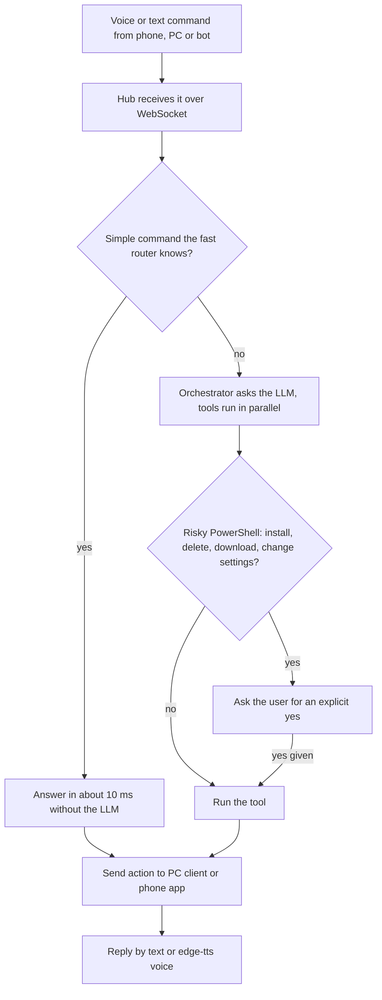
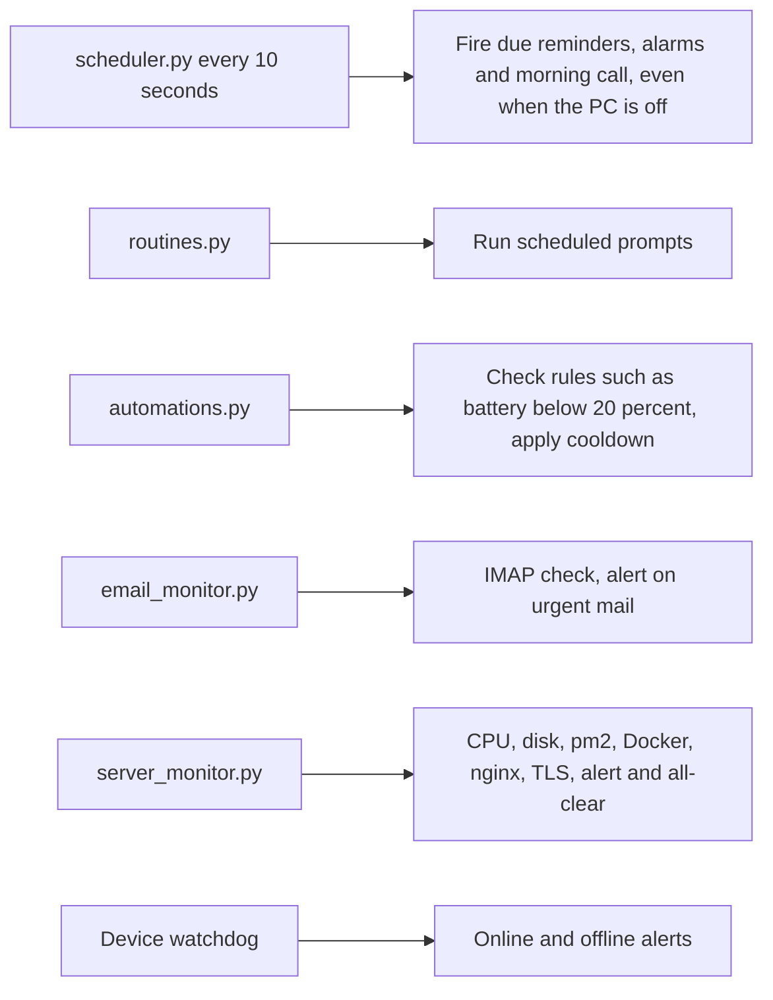

# Willy voice and text assistant for PC and phone

> A "Gemini-style" assistant that controls the owner's Windows PC and Android phone by voice or text, with reminders, routines, if-this-then-that rules, email and server monitoring, and chat-bot front ends.

| | |
|---|---|
| **Category** | Apps, calculators, websites and funnels (apps) |
| **Status** | Personal tool, as of 9 Oct 2026 |
| **Type** | Multi-part app: Python hub, PC client, Flutter phone app, landing site |
| **Runner and schedule** | Hub in Docker (`docker compose up -d`, port 8000) or `python -m server.main`; background loops inside the hub (reminder scheduler every 10 seconds); PC client as tray app or PyInstaller exe with autostart |
| **Client / owner** | Owner (personal project, Stack&Code workspace) |
| **Stack** | FastAPI + uvicorn + WebSockets, SQLAlchemy/PyMySQL (MariaDB `willy` database with Google sign-in and per-account spaces); LLM via Groq, Gemini or OpenAI; Groq Whisper (STT); edge-tts (TTS); Tk/tray PC client with PyInstaller; Flutter phone app; Caddy optional for HTTPS |
| **Source** | Main KB Part 6 section 6A (Willy); Portfolio KB section 25 (name only) |

## 1. Description

### What it does
Willy takes a spoken or typed command ("Hey Willy") and acts on the PC or the phone: lock, volume, open apps, PowerShell, live screen mirror, reminders and alarms, phone skills (call, SMS, WhatsApp, flashlight, find my phone), a morning briefing call, email monitoring and server health. Simple commands are answered in about 10 ms without a language model; anything else goes to an asynchronous brain with parallel tool calls.

### Inputs and outputs
- **Inputs:** voice (Groq Whisper), typed text, schedules, device state, IMAP mailbox checks, server metrics.
- **Outputs:** device actions on the PC and phone, spoken replies (edge-tts), alerts, reminder and alarm triggers, bot messages in Slack, Telegram and Discord.

### Key components
| Component | Role |
|---|---|
| `fast_router.py` | Answers simple commands in about 10 ms without the LLM |
| `orchestrator.py` | Async brain with parallel tool calls |
| `scheduler.py` | Reminders, alarms and the morning call, checked every 10 seconds |
| `features/routines.py` | Scheduled prompts such as "every morning at 8 tell me ..." |
| `features/automations.py` | If-this-then-that rules (for example battery below 20 percent), armed or disarmed with a cooldown |
| `features/jobs.py` | Multi-step background jobs and coding hand-off to Claude Code, Codex or Gemini on the PC |
| `email_monitor.py` | Zero-cost IMAP check for urgent mail |
| `server_monitor.py` | CPU, disk, pm2, Docker, nginx sites and TLS certificates, with alerts and all-clear |
| `features/backups.py`, `slack_bot.py`, `telegram.py`, `discord_bot.py` | Backups and chat front ends |
| `pc_client/`, `mobile_app/`, `server_agent/`, `website/` | PC client (Tk/tray, `WillyPC.exe`), Flutter app (`Willy.apk` built), VPS agent, landing site |

### Where it lives
- Source: `D:\Project\<owner>\Stack&code\Willy` (the older `D:\Project\<owner>\Voive\ asccess` folder now holds only a Flutter `build` folder).
- Environment variable names: `WILLY_REMOTE_TOKEN`, `GROQ_API_KEY`, `LLM_PROVIDER`, `STT_PROVIDER`, `OPENAI_API_KEY`, `OPENAI_MODEL`, `LLM_FALLBACK_MODELS`, `WILLY_DATA_DIR`, `WILLY_DOMAIN`. Settings template: `server/.env.example`.
- Deploy and build scripts: `scripts/deploy_remote.sh`, `update_ec2.sh`, `build_and_deploy.py`, `build_pc_exe.py`, `WillyPC.spec`, `installer.iss`. Tests under `tests/` and `pc_client/test_*.py`.

## 2. Flow chart

A second chart shows the hub's background loops.

**Reading the chart**
1. A command arrives from the PC client, the phone app or a bot.
2. The fast router handles simple commands in about 10 ms; everything else goes to the orchestrator, which calls the LLM and runs tools in parallel.
3. Risky PowerShell (install, delete, download, change settings) always needs the user's explicit "yes".
4. Actions are sent to the PC client or phone app and the reply is returned as text or speech.
5. The second chart shows loops that run on the hub itself. Reminders run on the hub, so they fire while the PC is off; devices and last state are remembered for 7 days.

## 3. Case study

### The challenge
One assistant needed to control both a Windows PC and an Android phone, answer quickly for simple commands, stay safe when running PowerShell, and keep working (reminders, alerts) when the PC is off.

### The solution
A central hub (FastAPI + WebSockets) holds the brain, schedules and monitors; thin clients on the PC and phone execute actions. A fast-path router avoids LLM latency for simple commands. Background loops handle reminders, routines, rules, email checks, server health and device watchdog alerts. Slack, Telegram and Discord bots provide extra front ends.

### Design decisions and rules learned
- **Sign-in once per browser:** dashboards do not embed the access token; the user signs in once per browser.
- **Bugs fixed in the upgrade session ("UI upgrade and feature expansion"):** the PC app never ran phone and dashboard commands (protocol mismatch); reminders were saved but never fired; volume set was wrong; offline PCs showed online for up to 90 seconds; the phone app sent fake data.
- Risky PowerShell is gated by a user confirmation rather than blocked.
- Latest threads (not resolved in the source): Android permissions and ADB-over-Wi-Fi debugging of "Hey Willy" waking continuously, and no downloadable Windows or Android installer on the landing page.

### Outcome
Documented facts only: a built Android package (`Willy.apk`), a PC client build path (PyInstaller to `dist\WillyPC\WillyPC.exe`), a hub deployable by Docker, and the bug fixes listed above from the upgrade session. Usage figures are not recorded.

### Lessons learned
- Keep time-based reminders on the server, not on the client, so they survive device downtime.
- Gate destructive shell actions on explicit confirmation.
- Do not embed access tokens in dashboard pages.

## 4. Operating notes
- **Run / pause / debug:** hub: `docker compose up -d` (volume `willy-data`, optional Caddy HTTPS profile with `WILLY_DOMAIN`) or `python -m server.main`. PC: `python pc_client/main.py` (add `--tray` or `--cli`), or `python build_pc_exe.py --autostart` to build the exe, add a Start-menu entry and autostart. Phone: `flutter run`. Remote update: `scripts/deploy_remote.sh`, `update_ec2.sh`. Tests: `pytest`.
- **Known issues and open items:** wake-word false triggers on Android, missing downloadable installers on the landing page. Willy's `server/features/*` internals beyond the headers were not read.
- **Risks:** security and credential-hygiene findings for this project are tracked privately and are not published here.

## 5. Related
- Hosting: the Willy hub and updates run on the shared Hestia VPS and AWS EC2 (see the hosting map in Part 6 section 6D).
- **Sources:** Main KB Part 6 section 6A "Willy". Portfolio KB section 25 names Willy among applications with automation features (no further detail). Sessions: "UI upgrade and feature expansion" (and fork).
