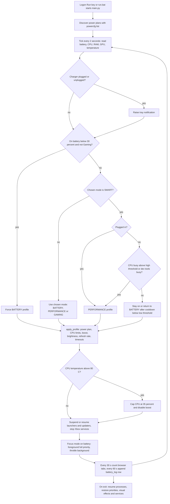

# Adaptive Power Manager

> A PySide6 power daemon and dashboard for the owner's Windows gaming laptop that switches between four power profiles to extend battery life and logs battery health.

| | |
|---|---|
| **Category** | Personal tools, media pipelines and infrastructure |
| **Status** | Personal tool, as of 9 Oct 2026 (built; `settings.json` has `run_on_startup: true`, mode SMART; `battery_history.db` exists at 16 KB) |
| **Type** | Windows desktop app: background `QThread` daemon, dashboard GUI and tray icon |
| **Runner and schedule** | Starts at logon through an `HKCU ...\Run` registry value written by the dashboard's "run on startup" checkbox (command `python main.py --minimized`), or manually via `run.bat`. The loop then runs every 2 seconds. |
| **Client / owner** | Personal tool (Hari). Not a client or business automation. |
| **Stack** | Python 3.12, PySide6 6.11, psutil, pywin32, screen_brightness_control, WMI, SQLite; `powercfg`; optional LibreHardwareMonitor |
| **Source** | Main KB Part 7, "Adaptive Power Manager" section (lines 4069-4099); Portfolio KB section 24 |

## 1. Description

### What it does
It targets an ASUS TUF class laptop with a 144 Hz screen. A daemon discovers the Windows power plans, then every 2 seconds reads battery, CPU, RAM, GPU and temperature data and decides which of four profiles (BATTERY, PERFORMANCE, SMART, GAMING) to apply. Applying a profile changes the power plan, CPU limits, brightness, refresh rate, timeouts and which background launchers or services are suspended. The portfolio KB records it as a "battery optimizer daemon with history database" (portfolio KB).

### Inputs and outputs
- **Inputs:** live system readings (battery, CPU, RAM, GPU engine utilisation, CPU temperature, battery full and design capacity, wear, charge rate, voltage); `settings.json`; the Windows power plans found by `powercfg /list`.
- **Outputs:** power-plan and display changes on the live system; tray notifications; rows in `battery_history.db`; an optional standalone `battery_report.html`.

### Key components
| Component | Role |
|---|---|
| `daemon.py` | `QThread` loop: discovery, metrics, profile decision, `apply_profile`, focus mode, logging, restore on exit. |
| `settings.json` / `config.py` | Current mode, thresholds, focus-mode flags, never-throttle list, and four profile tables (max and min CPU, boost, brightness, refresh rate, suspend apps, stop services, monitor and standby timeouts). `config.py` holds defaults. |
| `database.py` | Creates SQLite table `battery_log` (timestamp, percentage, is_charging, charge_rate, voltage, temperature, full_capacity, design_capacity, wear_percent) and can write the HTML health report. |
| `gui/` | Dashboard with Dashboard, Processes, History and Settings tabs, tray icon, custom widgets. |
| `.venv` | Python 3.12 environment checked into the project folder. |
| `run.bat` | Creates `.venv`, installs requirements, starts `pythonw main.py`; `--minimized` for tray-only. |

### Where it lives
`D:\Project\Personal Tools & Labs (hari)\Desktop & System\battery`. Environment variables: none.

## 2. Flow chart

**Reading the chart**
1. At logon (or by `run.bat`) the app starts, minimised if `--minimized` is passed.
2. Plan discovery: a plan named silent or saver (else balanced) becomes the battery plan; turbo or gaming (else performance) becomes the performance plan.
3. Each tick gathers metrics. CPU temperature comes from LibreHardwareMonitor over WMI if it is running, else the ACPI thermal zone.
4. Charger changes raise tray notifications. Below 30% on battery (outside Gaming mode) the BATTERY profile is forced.
5. SMART mode means PERFORMANCE when plugged in; on battery it watches CPU use and switches up above `smart_cpu_threshold_high`, or when VS Code, Visual Studio, MSBuild, node or git are busy, and back down after `smart_cooldown_seconds` below `smart_cpu_threshold_low`.
6. `apply_profile` changes the plan, CPU max and min percentage, turbo boost, PCIe and USB power saving, brightness, refresh rate (60 versus 144 Hz), and monitor and standby timeouts. In BATTERY mode it also turns off window animations (original values are backed up).
7. A temperature above 80 C caps the CPU at 35% and disables boost.
8. Launcher and updater processes (Steam, Epic, Discord, OneDrive, Adobe sync, GOG, EA) are suspended or resumed; Xbox services are stopped (needs admin).
9. Focus mode keeps the foreground process at full priority and throttles or suspends background processes except the `never_throttle_list` (spotify, discord, msedge, chrome by default).
10. Tab counting notifies above 20 tabs; the 60-second log row feeds the history tab and the HTML report.
11. On exit everything suspended or changed is restored.

## 3. Case study

### The challenge
The source states the purpose as extending battery life on a Windows laptop (ASUS TUF class, 144 Hz screen) and logging battery health history. The design shows the tension it had to handle: a battery profile for unplugged use, full performance when plugged in or when development tools are busy, and changes applied to a live system that must be reversible. No further background is documented in the source.

### The solution
A single Python and PySide6 app. A background thread discovers and switches Windows power plans and layers extra controls on top (CPU limits, refresh rate, brightness, suspended launchers, focus mode). A SMART mode automates the choice between profiles from charger state and CPU load. A SQLite log records battery health over time, and a dashboard shows live data, running processes, history and settings.

### Design decisions and rules learned
- **Four profiles, one of them automatic.** SMART removes the need to switch by hand.
- **Safety floor on battery.** Below 30% the BATTERY profile is forced unless Gaming mode is chosen.
- **Thermal guard.** Above 80 C the CPU is capped and boost disabled.
- **Never suspend Python.** `is_critical` excludes any process name containing "python".
- **Restore on exit.** Original visual-effects values are backed up, and the exit handler resumes processes and restores priorities, visual effects and services.
- **Focus mode with an allow-list.** Spotify, Discord, Edge and Chrome are never throttled by default.

### Outcome
Documented facts only: built; configured to start with Windows in SMART mode; a `battery_history.db` of 16 KB exists, so only a short log was captured. No battery-life improvement or other measured outcome is recorded. No Claude Code session transcript for this tool was found, so the history is inferred from file dates.

### Lessons learned
- Some steps need Administrator rights (stopping Xbox services, some WMI and ACPI temperature reads). Without it they are skipped silently.
- The "+42 minutes" gain shown in the unplug notification is a hard-coded mock value, labelled as such in the code, so it is not a measurement.
- Editing live power plans and registry values (`VisualFXSetting`) is only safe with the exit handler; a crash leaves the battery profile applied.
- `requirements.txt` is saved as UTF-16, so pip may need a re-save or conversion.

## 4. Operating notes
- **Run / pause / debug:** `run.bat` (pass `--minimized` for tray-only). To stop it cleanly, exit from the app so the restore step runs. Launchers of the [Sound Typer](sound-typer-duck-family.md) that run `taskkill /f /im pythonw.exe` will also kill this app, because it runs under `pythonw`.
- **Known issues and open items:** mock "+42 minutes" notification value; silent skips without admin; UTF-16 requirements file.
- **Risks:** it changes live Windows power plans, refresh rate and registry visual-effects settings; an abnormal exit leaves the battery profile applied. It also suspends other applications' processes by design.

## 5. Related
- [BatteryBoost Pro](batteryboost-pro.md) - a separate C# tool with a similar goal (freezing idle background apps).
- [System Dashboard Pro and AutoBoost](system-dashboard-pro-and-autoboost.md) - separate monitoring and RAM-boost tools.
- [Sound Typer](sound-typer-duck-family.md) - its launchers can stop this app.
- **Sources:** Main KB Part 7 lines 4069-4099; Portfolio KB section 24 (lines 777-793).
