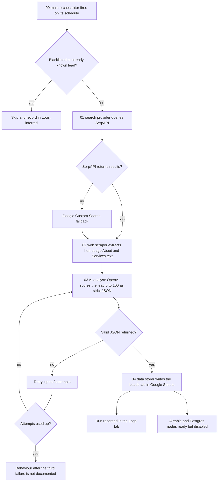
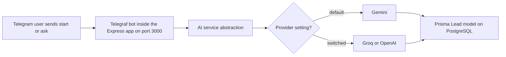

# Portfolio & Clients folder: Agency Growth OS, AI Sales OS and portfolio sites

> Three separate git repos: a modular n8n system that finds and scores development-agency leads, a Telegram AI sales bot foundation, and two Node/Express portfolio sites.

| | |
|---|---|
| **Category** | Personal tools, media pipelines and infrastructure |
| **Status** | Personal tool, as of 9 Oct 2026 (the KB register says "Built (separate git repos)"; run history and live status are not documented) |
| **Type** | n8n workflow set, Node/Express and Telegraf app, two Node/Express websites |
| **Runner and schedule** | Not documented as scheduled. The Agency Growth OS orchestrator carries a schedule inside n8n; whether it is Active is not documented. |
| **Client / owner** | Owner's own lab work; one site was built for a freelance digital marketer |
| **Stack** | n8n, SerpAPI, Google Custom Search, OpenAI, Google Sheets, Airtable and Postgres (ready, disabled), Express, Telegraf, Prisma, PostgreSQL, Gemini, Groq |
| **Source** | Main KB Part 7, "Other Personal Tools & Labs folders" - Portfolio & Clients (lines 4335-4340) and register row (line 3925); Portfolio KB: none specific |

## 1. Description

### What it does
- **`clients` - "Agency Growth OS":** a modular, self-hosted n8n system that discovers, scrapes, qualifies and stores development-agency leads.
- **`method` - "AI Sales OS - Day 1 Foundation":** an Express server (port 3000) with a Telegraf Telegram bot (`/start`, `/ask`) on top of an AI service abstraction (Gemini by default, Groq or OpenAI switchable) and a Prisma `Lead` model on PostgreSQL.
- **`portfolio`:** two Node/Express portfolio sites. One is the owner's full-stack and mobile developer portfolio with a Groq-backed chatbot. The other is a site for a freelance digital marketer; its `package.json` has a deploy script that pushes to git, then pulls, installs and restarts the app on a server under `pm2`.

### Inputs and outputs
- **Inputs:** Agency Growth OS: search queries and the schedule in the orchestrator; blacklists. AI Sales OS: Telegram messages. Sites: content in the repos.
- **Outputs:** Agency Growth OS: scored leads in a Google Sheet ("Leads" and "Logs" tabs). AI Sales OS: bot replies and `Lead` records (the exact message-to-record flow is not documented). Sites: web pages.

### Key components
| Component | Role |
|---|---|
| `00_main_orchestrator` | Schedule, blacklists, dedupe, logs |
| `01_search_provider` | SerpAPI search with a Google Custom Search fallback |
| `02_web_scraper` | Homepage About/Services extraction |
| `03_ai_analyst` | OpenAI scoring 0-100 with strict JSON output and 3 retries |
| `04_data_storer` | Google Sheets "Leads" and "Logs" tabs; Airtable and Postgres nodes ready but disabled |
| `backend`, `frontend`, pnpm-workspace files | Also in `clients`; not described further |
| `query_outreach.js`, `test_pipeline.js` | Outreach query and test scripts in `clients` |
| `method` app | Express + Telegraf bot + AI service abstraction + Prisma `Lead` model |
| `portfolio` sites | Two Node/Express sites, one with a Groq chatbot and a scripted server deploy |

Environment-variable names: Agency Growth OS (in n8n) `GOOGLE_SHEET_ID`, `OPENAI_MODEL`; AI Sales OS `BOT_TOKEN`, `GEMINI_API_KEY`, `DATABASE_URL`.

### Where it lives
`D:\Project\Personal Tools & Labs (hari)\Portfolio & Clients\{clients,method,portfolio}`. Each is its own git repo (`.git` present).

## 2. Flow chart

Agency Growth OS pipeline (the richest of the three):

AI Sales OS Day 1 foundation (stack only; the KB gives the layers, not the message flow):

**Reading the chart**
1. The Agency Growth OS orchestrator runs on its schedule and applies blacklists and de-duplication before spending any search or AI calls.
2. The search provider uses SerpAPI and falls back to Google Custom Search.
3. The scraper pulls About and Services text from each homepage.
4. The AI analyst scores the lead from 0 to 100 and must return strict JSON, with up to 3 retries. What happens after three failures is not documented.
5. The data storer writes leads and logs to Google Sheets. Airtable and Postgres nodes exist but are disabled.
6. The AI Sales OS bot receives `/start` and `/ask`, goes through an AI service that can switch between Gemini (default), Groq and OpenAI, and stores leads through Prisma in PostgreSQL.

## 3. Case study

### The challenge
The source records the builds, not the original brief. What the builds address: finding and qualifying development-agency leads automatically (Agency Growth OS), a chat front end for a sales assistant (AI Sales OS), and web pages presenting a developer and a freelance marketer (portfolio sites).

### The solution
Agency Growth OS splits lead discovery into five n8n workflows (orchestrate, search, scrape, analyse, store) so each can be changed independently, with fallbacks and disabled alternative stores ready. AI Sales OS lays a "Day 1" foundation: server, bot, swappable AI provider and a lead table. The portfolio repo holds two Node/Express sites; one has a `package.json` deploy script that pushes to git and then pulls, installs and restarts the app on a server under pm2.

### Design decisions and rules learned
- Modular workflows: orchestrator, search, scrape, analyse and store are separate n8n workflows.
- Search has a fallback provider (SerpAPI then Google Custom Search).
- The AI step demands strict JSON and retries three times rather than accepting free text.
- Storage is pluggable: Google Sheets is active, Airtable and Postgres nodes are ready but disabled.
- The AI provider is behind an abstraction (Gemini default; Groq and OpenAI switchable).
- Stale path gotcha: `clients\README.md` still references the pre-reorganisation path `d:/Project/<user>/clients`.

### Outcome
No measured outcome recorded. Each repo exists with its structure documented; the source records no lead counts, runs or bot usage.

### Lessons learned
- After a folder reorganisation, READMEs keep old paths; update or note them.
- The source gives structure but no run history. Do not present these as production systems without evidence of runs.

## 4. Operating notes
- **Run / pause / debug:** Not documented beyond the structure. Agency Growth OS runs in n8n (workflows must be Active); AI Sales OS is an Express app on port 3000 with the Telegram bot token and database URL supplied through environment variables.
- **Known issues and open items:** Run history, lead volumes and whether any workflow is Active are not documented. Behaviour after three failed AI retries is not documented.
- **Risks:** The `portfolio` deploy script targets a production server. Security and credential-hygiene findings for these repos are tracked privately and are not published here.

## 5. Related
- [other-personal-tools-and-labs.md](other-personal-tools-and-labs.md) - map of the neighbouring folders.
- Part 4 of the Main KB covers the separate "Client Finder AI" lead platform and the Stack&Code outreach CLI; those are different projects from Agency Growth OS.
- **Sources:** Main KB Part 7 (lines 4335-4340; register row, line 3925). Portfolio KB: no specific entry; no discrepancy found.
