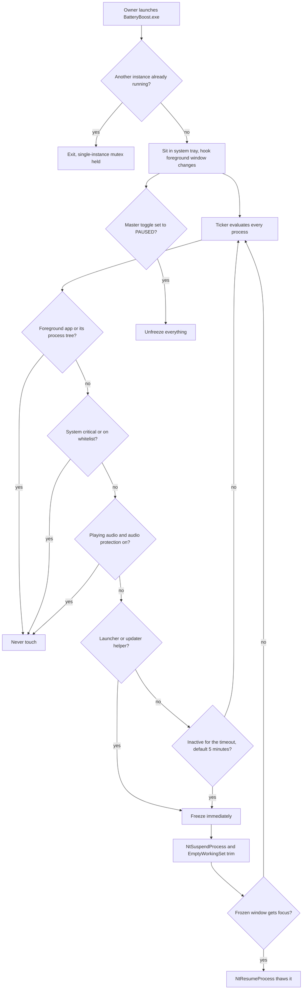

# BatteryBoost Pro

> A C# WinForms tray app that freezes background apps after a period of inactivity so they use no CPU, then thaws them when they get focus, to stretch laptop battery.

| | |
|---|---|
| **Category** | Personal tools, media pipelines and infrastructure |
| **Status** | Personal tool, as of 9 Oct 2026 (built; two compiled executables and the C# source are present) |
| **Type** | Windows desktop tray app (.NET 9 WinForms), single instance |
| **Runner and schedule** | Manual launch of the exe; lives in the system tray. No schedule. |
| **Client / owner** | Personal tool (Hari). Not a client or business automation. |
| **Stack** | .NET 9 WinForms (`net9.0-windows`, `System.Management`), Win32 `NtSuspendProcess`, `NtResumeProcess`, `EmptyWorkingSet`, WASAPI audio detection |
| **Source** | Main KB Part 7, "BatteryBoost Pro (`Battery exe`)" section (lines 4103-4125); Portfolio KB section 24 |

## 1. Description

### What it does
BatteryBoost Pro is described in the source as an "intelligent inactivity app freezer". It watches which window has focus, and any other app that has been idle past a timeout is suspended and has its memory trimmed, so it uses 0% CPU. Focusing the frozen window thaws it immediately. The portfolio KB lists it with AutoBoost as "BatteryBoost and AutoBoost executable builds" (portfolio KB).

### Inputs and outputs
- **Inputs:** the foreground-window event hook; the process list; audio-session state from WASAPI; `whitelist.json` next to the exe; the user's timeout choice (1, 3, 5 or 10 minutes, default 5).
- **Outputs:** frozen and thawed processes, an on-screen event log, and tray status ("BATTERY BOOST: ACTIVE" or "PAUSED").

### Key components
| Component | Role |
|---|---|
| Foreground hook | Tracks the focused window; the foreground app and its process tree are never touched. |
| Ticker | Evaluates every process each cycle against protection rules and the inactivity timeout. |
| `AudioDetector.cs` | Detects apps playing audio through WASAPI so they stay awake, unless the user opts out. |
| `whitelist.json` | Protected process names (chrome.exe, discord.exe, slack.exe at last read; code defaults add spotify.exe). |
| `BatteryBoost.exe` | Self-contained build, about 50 MB. |
| `BatteryBoost_Compact.exe` | About 0.7 MB, needs the .NET 9 desktop runtime. |
| `AutoBoost.exe` | 7 KB headless booster, described in [System Dashboard Pro and AutoBoost](system-dashboard-pro-and-autoboost.md). |

### Where it lives
`D:\Project\Personal Tools & Labs (hari)\Desktop & System\Battery exe`. Source and project file `BatteryBoost.csproj` are in `src`; `obj/` and `bin/` build output also sit inside `src`. Single-instance control uses a named mutex. Environment variables: none.

## 2. Flow chart

**Reading the chart**
1. The exe starts from a manual launch and refuses to run twice.
2. A Windows event hook follows the foreground window; the focused app and its process tree are never touched.
3. The ticker applies protection rules in turn: system-critical and whitelisted names, then apps playing audio (unless the user has opted out of that protection).
4. Launchers and updaters (Steam, Epic, Adobe, EA, GOG helpers) can be frozen immediately; other apps are frozen after the inactivity timeout (choices 1, 3, 5 or 10 minutes, default 5).
5. Freezing uses `NtSuspendProcess` and trims the working set with `EmptyWorkingSet`.
6. Giving a frozen window focus thaws it with `NtResumeProcess`.
7. The master toggle unfreezes everything when switched to PAUSED.

## 3. Case study

### The challenge
The goal stated in the source is to suspend background apps that have been idle so they use 0% CPU, stretching laptop battery without losing application state. That rules out simply closing apps. No further background is documented.

### The solution
A small .NET 9 tray app that treats "not in the foreground for N minutes" as the signal to suspend a process at the OS level. Suspension keeps the process state intact, and a focus event brings it back. Protections (whitelist, audio detection, system-critical names) keep important apps awake. Two builds were compiled: a self-contained one and a compact one that relies on the installed .NET runtime.

### Design decisions and rules learned
- **Suspend rather than kill.** State is preserved and thaw is instant on focus.
- **Audio-playing apps are protected through WASAPI**, so music or calls are not silenced, unless the user opts out.
- **Whitelist on disk.** `whitelist.json` sits next to the exe so protection can be edited without a rebuild.
- **Immediate freeze for launchers and updaters**, which have no reason to wait for the timeout.
- **Chrome is in the whitelist at last read**, so browser tabs are not frozen unless it is removed.
- **Network-holding apps need care.** Freezing apps that hold network connections can drop calls or uploads, so Slack, Discord and Zoom-type apps should stay whitelisted.

### Outcome
Documented facts only: built, with two compiled executables and the source in place. No battery-life measurement or usage record is documented. No Claude Code session transcript for this tool was found, so the history is inferred from file dates.

### Lessons learned
- Check the whitelist before relying on it: its contents at last read defeat freezing for the browser.
- Suspension is safe for state but not for live network sessions.

## 4. Operating notes
- **Run / pause / debug:** run `BatteryBoost.exe`; use the master toggle to pause. Rebuild with `dotnet build` in `src` (project `BatteryBoost.csproj`).
- **Known issues and open items:** none beyond the whitelist and network caveats above.
- **Risks:** freezing the wrong process (for example one holding a network session) can drop calls or uploads; keep real-time apps on the whitelist.

## 5. Related
- [Adaptive Power Manager](adaptive-power-manager.md) - separate Python power-profile daemon with a similar goal.
- [System Dashboard Pro and AutoBoost](system-dashboard-pro-and-autoboost.md) - includes the 7 KB `AutoBoost.exe` also stored in this folder.
- **Sources:** Main KB Part 7 lines 4103-4125; Portfolio KB section 24 (lines 777-793).
