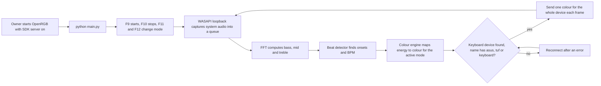

# BeatSync RGB

> A Python app that lights the owner's ASUS TUF laptop keyboard in time with whatever audio the PC is playing, using the OpenRGB SDK server.

| | |
|---|---|
| **Category** | Personal tools, media pipelines and infrastructure |
| **Status** | Personal tool, as of 9 Oct 2026 (built; a `beatsync.log` exists; README still has a screenshot placeholder) |
| **Type** | Windows desktop app (Python, Tkinter control panel) |
| **Runner and schedule** | Manual: `python main.py`, then hotkeys F9 start, F10 stop, F11 next mode, F12 previous mode. |
| **Client / owner** | Personal tool (Hari). Not a client or business automation. |
| **Stack** | Python 3.12, `openrgb-python`, `PyAudioWPatch` (WASAPI loopback), `numpy`, `scipy`, `keyboard`, Tkinter; OpenRGB running locally |
| **Source** | Main KB Part 7, "BeatSync RGB" section (lines 4156-4179); Portfolio KB section 24 |

## 1. Description

### What it does
BeatSync RGB captures the system audio the PC is playing, analyses it for bass, mid and treble energy and for beats, and turns that into keyboard colours in one of five modes. The colours reach the keyboard through a locally running OpenRGB SDK server. The portfolio KB lists it as "BeatSyncRGB keyboard lighting" (portfolio KB).

### Inputs and outputs
- **Inputs:** system audio through WASAPI loopback; `config.json` (brightness, fps 60, fade speed, beat sensitivity, mode, OpenRGB host and port, audio device); hotkeys F9 to F12.
- **Outputs:** keyboard colours and `beatsync.log`.

### Key components
| Component | Role |
|---|---|
| `audio.py` | Captures system audio with WASAPI loopback into a queue. |
| `fft.py` | Computes bass, mid and treble. |
| `beat_detector.py` | Adaptive onset detection and BPM. |
| `color_engine.py` | Maps energy to colours in five modes: Rainbow Beat, Bass Fire, Ocean, Neon Party, Spectrum, with brightness and fade settings. |
| `keyboard.py` | Sends colour to the device through the OpenRGB SDK server (`127.0.0.1:6742`); reconnects after an error. |
| `ui.py` | Small Tkinter control panel. |
| `config.json` | Stored settings. |

### Where it lives
`D:\Project\Personal Tools & Labs (hari)\Desktop & System\keyboard\BeatSyncRGB`. Environment variables: none.

## 2. Flow chart

**Reading the chart**
1. OpenRGB must be started first, with its SDK server enabled.
2. `main.py` opens the control panel and registers global hotkeys. If binding fails the code logs a warning, and admin rights may be needed.
3. Audio is captured as a loopback of whatever the PC plays, then split into frequency bands.
4. The beat detector adapts to the track and also estimates BPM.
5. The colour engine turns band energy and beats into colour using the active mode, brightness and fade settings, at 60 frames per second by default.
6. The keyboard module picks the first device whose name contains "asus", "tuf" or "keyboard" and sets it to one colour per frame. It reconnects after an error.

## 3. Case study

### The challenge
The source records no problem statement. The design suggests (inferred) a visual effect for the laptop's own keyboard lighting driven by live system audio, without vendor software. The technical challenges visible in the code are capturing playback audio, detecting beats in real time, and driving the RGB hardware through a third-party SDK.

### The solution
A Python pipeline: audio capture, FFT, adaptive beat detection, a colour engine with five modes, and an OpenRGB client, controlled by a small Tkinter panel and global hotkeys. Settings persist in `config.json`.

### Design decisions and rules learned
- **Use OpenRGB as the device layer** rather than talking to the keyboard directly; the app connects to `127.0.0.1:6742`.
- **Pick the device by name** ("asus", "tuf" or "keyboard") so no device id is hard-coded.
- **One colour per frame for the whole device.** There are no per-key effects.
- **Global hotkeys F9 to F12** allow control while another window has focus.

### Outcome
Documented facts only: built, with a `beatsync.log` present. The README is unfinished (screenshot placeholder). No performance figures or usage record. No Claude Code session transcript for this tool was found, so the history is inferred from file dates.

### Lessons learned
- Global hotkeys may need admin rights; the code logs a warning if binding fails.
- OpenRGB must be running before the app starts.
- Whole-device colour limits the visual effect to one colour at a time.

## 4. Operating notes
- **Run / pause / debug:** start OpenRGB with the SDK server on, then `pip install -r requirements.txt` and `python main.py`. Check `beatsync.log` for connection and hotkey warnings.
- **Known issues and open items:** README screenshot placeholder; no per-key effects.
- **Risks:** low. It only changes keyboard lighting, but it depends on a third-party SDK server being up.

## 5. Related
- [Sound Typer](sound-typer-duck-family.md) - another audio-driven desktop utility in this folder, unrelated in code.
- **Sources:** Main KB Part 7 lines 4156-4179; Portfolio KB section 24 (lines 777-793).
