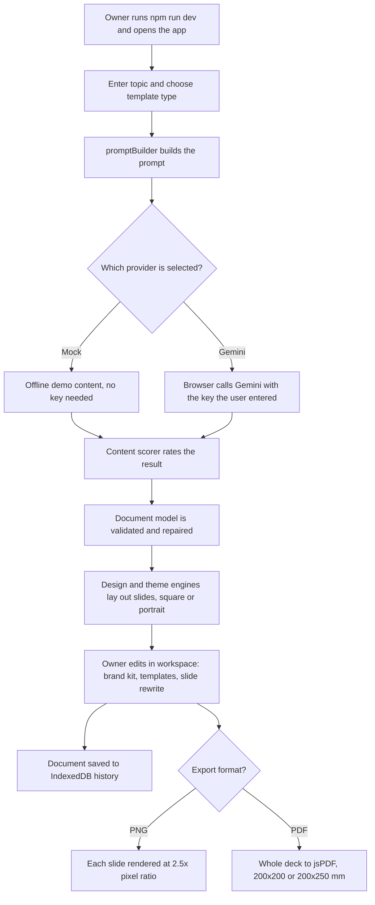

# CanvasFlow (carousel and document designer)

> A React and Vite browser app that turns a topic into a designed multi-slide social carousel or document, with AI copy, themes, a brand kit and PNG or PDF export.

| | |
|---|---|
| **Category** | Personal tools, media pipelines and infrastructure |
| **Status** | Personal tool, as of 9 Oct 2026 (built; production build in `dist\`; Playwright end-to-end test with a last-result screenshot) |
| **Type** | Browser web app (React 19, Vite 8), run locally |
| **Runner and schedule** | Manual dev server (`npm run dev`, port 5173) or serve `dist`. |
| **Client / owner** | Personal tool (Hari). Not a client or business automation. |
| **Stack** | React 19, Vite 8, oxlint, `html-to-image`, `jspdf`, `lucide-react`, `playwright` (dev); IndexedDB; optional Google Gemini API |
| **Source** | Main KB Part 7, "CanvasFlow (`carousel`)" section (lines 4183-4206); Portfolio KB has no entry for this app |

## 1. Description

### What it does
The owner enters a topic and a template type. An AI provider generates slide copy (or an offline mock provider supplies demo content), a content scorer rates it, and a design engine lays out the slides in square or portrait format. Documents are edited in a workspace with a brand kit, themes and templates, saved in the browser, and exported to PNG per slide or a multi-page PDF. The in-app name is "CanvasFlow".

### Inputs and outputs
- **Inputs:** a topic and template type typed in the UI; an optional Gemini API key typed into the UI; brand kit and theme choices.
- **Outputs:** PNG per slide (2.5x pixel ratio), multi-page PDF (200x200 mm square or 200x250 mm portrait), and documents saved in IndexedDB history.

### Key components
| Component | Role |
|---|---|
| `ai/promptBuilder.js`, `ai/aiProvider.js` | Build the prompt and offer providers: offline Mock, Google Gemini (`gemini-1.5-flash`) and Groq (OpenAI-style chat). `App.jsx` only wires Mock and Gemini; the Groq class is defined but unused there (inferred). |
| `contentScorer.js` | Scores generated content; slide rewrite is a separate Gemini call. |
| `core/document` | Validates and repairs the JSON document model. |
| `core/design`, `core/renderer` | DesignEngine, ThemeEngine, ComponentRegistry, LayoutRegistry, SlideRenderer. |
| `templates/marketplace.js` | Starting templates. |
| UI components | Editor workspace, brand kit editor, command palette, content scorer panel, history sidebar, slide canvas. |
| `core/exporter/exportPipeline.js` | PNG export with `html-to-image` and PDF with `jsPDF`. |
| `e2e-test.mjs` | Playwright end-to-end test; last result in `e2e-result.png`. |

### Where it lives
`D:\Project\Personal Tools & Labs (hari)\Desktop & System\carousel`. There are no `.env` variables. Documents persist in the browser's IndexedDB database `CanvasFlowDB`.

## 2. Flow chart

**Reading the chart**
1. The owner starts the Vite dev server (or serves `dist`) and works entirely in the browser.
2. The topic and template type feed the prompt builder.
3. Mock mode needs no key. Gemini mode sends the request from the browser using a key the user supplies in the UI.
4. The content scorer rates the output; `core/document` repairs malformed JSON before rendering.
5. Layout and theming produce the slide canvas; the owner can edit, apply the brand kit and rewrite a slide (a separate Gemini call).
6. Work is saved in IndexedDB; export produces PNG per slide or a single PDF.

## 3. Case study

### The challenge
The source records no problem statement. The app's scope suggests (inferred) a need to produce social carousels and documents quickly from a topic, with consistent branding and no design tool. Technical constraints visible in the code: AI output must be turned into a valid document model, and exports must come out at fixed sizes.

### The solution
A client-side React app with an AI prompt layer, a validated JSON document model, a theme and layout engine, a template marketplace and an export pipeline. An offline Mock provider keeps it usable without any key. A Playwright script exercises the app end to end.

### Design decisions and rules learned
- **Provider abstraction with an offline Mock** so the app works for demos without a key.
- **A JSON document model with validate-and-repair** so imperfect AI output still renders.
- **Everything stays in the browser**: history in IndexedDB, a user-supplied key, exports generated client-side.
- **Fixed export sizes**: 2.5x pixel ratio PNGs; 200x200 mm or 200x250 mm PDFs.

### Outcome
Documented facts only: built; a production build exists in `dist\`; an end-to-end test exists with a recorded result screenshot. No usage record or published output is documented. No Claude Code session transcript for this tool was found, so the history is inferred from file dates.

### Lessons learned
- The Gemini key is handled client-side and sent from the browser. That is fine for personal use but not for a hosted multi-user deployment.
- `README.md` is the unmodified Vite template and says nothing about the app, so the code is the only documentation.
- Deleting history calls `indexedDB.deleteDatabase('CanvasFlowDB')`, which removes all saved documents.

## 4. Operating notes
- **Run / pause / debug:** `cd carousel; npm install; npm run dev`. Build with `npm run build`. Test with `node e2e-test.mjs` while the dev server is up.
- **Known issues and open items:** Groq provider defined but not wired in `App.jsx` (inferred); placeholder README.
- **Risks:** a user-supplied API key is handled in the browser; deleting history is irreversible.

## 5. Related
- No related project file in this folder. The app is standalone.
- **Sources:** Main KB Part 7 lines 4183-4206; Portfolio KB has no CanvasFlow or carousel entry (section 24 lists only file arrangers, battery tools, typing sounds, BeatSyncRGB, S3 and RDS scripts, OpenSSH and a PDF/resume Playwright app).
