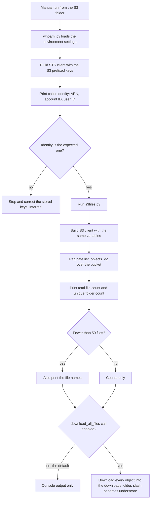

# Cloud & Infra: S3 helper scripts

> Two small Python scripts for the owner's own use: list (and optionally bulk-download) everything in an S3 bucket, and confirm which AWS identity the stored keys belong to.

| | |
|---|---|
| **Category** | Personal tools, media pipelines and infrastructure |
| **Status** | Personal tool, as of 9 Oct 2026 (the KB register labels the whole Cloud & Infra folder "Scratch") |
| **Type** | Python utility scripts (command line) |
| **Runner and schedule** | Manual, run from the S3 folder on the owner's PC. Nothing is scheduled. |
| **Client / owner** | Owner's personal Cloud & Infra scratch folder (Personal Tools & Labs) |
| **Stack** | Python, boto3 (AWS STS and S3 clients), python-dotenv |
| **Source** | Main KB Part 7, "Cloud & Infra - S3 helper scripts" and "Cloud & Infra - RDS and lightsale" (lines 4260-4286) and the Part 7 tool register; Portfolio KB sections 24 and 2 (see Related) |

## 1. Description

### What it does
`whoami.py` loads the environment settings, builds an AWS STS client from the configured keys and prints the caller identity, so the owner can see which AWS identity the keys belong to. `s3files.py` builds an S3 client with the same variables, paginates `list_objects_v2` over the bucket, and prints the total file count and the number of unique folders (plus the file names when there are fewer than 50). A `download_all_files()` function, commented out at the bottom of the script, can download every object into a local `downloads\` folder, flattening `/` in the object key to `_`.

The source does not say which bucket the variables point at, or what it holds.

### Inputs and outputs
- **Inputs:** environment variables `S3_BUCKET_NAME`, `S3_REGION`, `S3_ACCESS_KEY_ID`, `S3_SECRET_ACCESS_KEY` (the non-standard `S3_` prefix means the AWS SDK default credential chain is not used). Values are not recorded here.
- **Outputs:** Console output only. If the download call is enabled, a local `downloads\` folder with every object.

### Key components
| Component | Role |
|---|---|
| `whoami.py` (0.7 KB) | Prints the AWS identity behind the stored keys via STS `get_caller_identity` |
| `s3files.py` (3 KB) | Lists the bucket (paginated), prints file and folder counts, optional bulk download |
| `download_all_files()` | Disabled by default (commented out at the bottom of `s3files.py`); writes to `downloads\` |

### Where it lives
`D:\Project\Personal Tools & Labs (hari)\Cloud & Infra\S3`

Two sibling folders in Cloud & Infra have no content and are folded in here rather than given their own pages:
- `RDS` is an empty folder (no scripts or notes found).
- `lightsale` is a repository skeleton only: a `.git` folder, an empty `.gitignore` and an empty `.geminiignore`. No Lightsail code was found.

## 2. Flow chart

**Reading the chart**
1. The owner runs `python whoami.py` first. It loads the environment settings, builds an STS client with the `S3_`-prefixed keys and prints the caller identity.
2. The owner checks that this is the AWS account and user they expect. What happens if it is not is not documented; correcting the stored keys is the inferred next step.
3. `python s3files.py` builds an S3 client from the same variables and paginates the bucket listing.
4. It prints the total file count and unique folder count, and the file names when there are fewer than 50.
5. Bulk download only happens if the commented-out `download_all_files()` call is switched on. Otherwise the run ends with console output.

## 3. Case study

### The challenge
The owner needed a quick way to see what an S3 bucket contains (file and folder counts, optionally everything downloaded) and to be sure which AWS identity the stored keys belong to before using them. The source states the purpose only; the project or bucket it was used for is not documented.

### The solution
Two single-purpose scripts sharing one set of environment settings. One answers "who am I to AWS", the other answers "what is in the bucket". The download step is deliberately switched off until it is needed.

### Design decisions and rules learned
- Credentials are passed explicitly to the boto3 clients from `S3_`-prefixed variables, not through the SDK default chain.
- The identity check is a separate script, so the account can be confirmed before any listing or download.
- Bulk download is opt-in (commented out) and flattens `/` to `_` so everything lands in one local folder.
- `whoami.py` prints the AWS account number. Do not paste its output into shared documents.

### Outcome
No measured outcome recorded. The source documents that the scripts exist and what they do; it records no run results, bucket contents or counts.

### Lessons learned
- Small utilities like this are best described by what they actually do. The Portfolio KB makes the same point: personal and system tools are to be classified by what they actually do, not automatically described as business automations (portfolio KB section 24).
- The `RDS` and `lightsale` folders hold nothing. Do not present them as delivered work.

## 4. Operating notes
- **Run / pause / debug:** `python whoami.py`, then `python s3files.py`, from the S3 folder. To bulk-download, enable the `download_all_files()` call at the bottom of `s3files.py`. Requires `boto3` and `python-dotenv`.
- **Known issues and open items:** The target bucket and its contents are not documented. No `RDS` or Lightsail code exists to document.
- **Risks:** Printing the AWS account number is a small information leak if the output is shared. Security and credential-hygiene findings for this project are tracked privately and are not published here.

## 5. Related
- [setup-openssh-windows-ssh-server.md](setup-openssh-windows-ssh-server.md) - the other infrastructure utility in the same Cloud & Infra folder.
- [ghl-embed-test-pages-and-pool-heat-calculator.md](ghl-embed-test-pages-and-pool-heat-calculator.md) - the `server` folder in Cloud & Infra.
- **Sources:** Main KB Part 7 (lines 4260-4286; register row "Cloud & Infra", line 3923). Portfolio KB section 24 lists "S3 and RDS scripts" among personal and system tools (portfolio KB). **Discrepancy:** the Portfolio KB reports "S3 and RDS scripts"; the Main KB found only S3 scripts, an empty `RDS` folder and an empty `lightsale` repository. The Main KB (read from real files) is followed.
