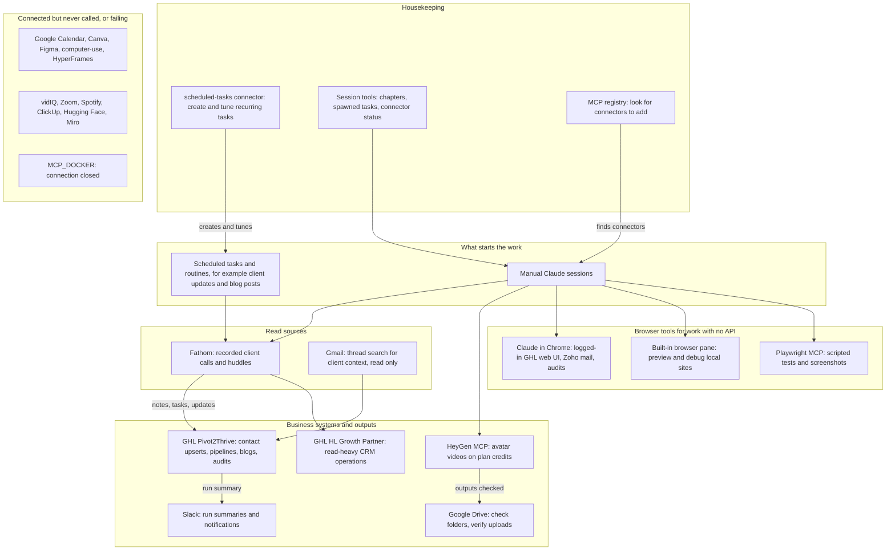

# Connectors and MCP servers in use (usage census)

> A reference inventory of every Claude connector and MCP server seen in the session transcripts, with call counts, so it is clear which ones do the real work in the automations and which are connected but idle.

| | |
|---|---|
| **Category** | Personal tools, media pipelines and infrastructure (reference) |
| **Status** | Reference, as of 9 Oct 2026 |
| **Type** | Inventory and usage census of Claude desktop connectors and MCP servers |
| **Runner and schedule** | Not applicable. It is a snapshot counted from transcripts up to 9 Oct 2026. |
| **Client / owner** | The owner's Claude desktop setup, used across P2T, HLGP, Zaffarology and Stack&Code work |
| **Stack** | Claude desktop connectors, MCP servers (GHL, Fathom, Slack, Gmail, Google Drive, HeyGen, Playwright, Claude in Chrome and others) |
| **Source** | Main KB Part 7, "Connectors / MCP servers in use" (lines 4460-4487); cross-checked with Part 2 section 8 (cloud migration) and the Part 3 conventions (line 1416); Portfolio KB sections 2 and 23 (tool lists only) |

## 1. Description

### What it does
Lists each connector or MCP server with the evidence found in transcripts and what it was used for. Method: `tool_use` entries named `mcp__*` were counted across every transcript under `C:\Users\<user>\.claude\projects\`, including sub-agent files. Claude desktop connectors appear under UUID-style names, so the mapping to products is inferred from the tool sets; Fathom and HyperFrames are confirmed by the servers' own instructions. Counts are calls, not sessions.

### Inputs and outputs
- **Inputs:** Session transcripts (`.jsonl`) and the `claude mcp list` output from 2026-08-13.
- **Outputs:** The table below and the case study ranking. No data is changed by this reference.

### Key components
| Group | Connectors (calls) | Used for |
|---|---|---|
| Data connectors | GHL Pivot2Thrive `ghl-pivot2thrive` (197), GHL HL Growth Partner `ghl-HLGP` (52), Fathom (133, read-only), Slack (41), Gmail (7), Google Drive (49) | CRM reads and writes, recorded calls, run summaries, mail context, Drive checks |
| Browser tools | Claude in Chrome (4,973), built-in browser pane `Claude_Browser` (2,194), Playwright MCP (1,099) | UI work with no API, previews and debugging, scripted tests and screenshots |
| Scheduling | `scheduled-tasks` (40) | Creating and tuning recurring Claude tasks |
| Media | HeyGen remote MCP (15 direct calls), HyperFrames by HeyGen (0) | Avatar video generation; HyperFrames unused |
| Session housekeeping | `ccd_session`, `ccd_session_mgmt`, `ccd_connectors`, `terminal`, `visualize` (72 counted across the named tools), MCP registry (6) | Chapters, spawned side-tasks, connector status, terminal reads, inline charts, connector search |
| Idle or failing | Google Calendar, Canva, Figma, computer-use, vidIQ, Zoom, Spotify, ClickUp, Hugging Face, Miro (0 calls); `MCP_DOCKER` (failed to connect) | Not part of any working flow |

### Where it lives
- Transcripts: `C:\Users\<user>\.claude\projects\<path-with-dashes>\*.jsonl`.
- The two GHL MCP servers (`ghl-HLGP`, `ghl-pivot2thrive`) are custom MCP servers defined in `claude_desktop_config.json`, running as processes on the owner's machine (Part 2 section 8). They point only at the P2T and HLGP agency sub-accounts. Client sub-accounts are reached with a client-specific private integration token held in that project's own environment configuration, never through these servers (Part 3 conventions).
- Connector credentials (HeyGen, Google and others) are held by the Claude app and the individual projects. They never appear in the transcripts' tool results, and none were copied.

## 2. Flow chart

This shows where each connector sits in the automations, using the "Used for" column of the Main KB table. Arrows show the typical direction of data; it is not a documented architecture diagram.

**Reading the chart**
1. Recurring work starts from a scheduled task or routine; the `scheduled-tasks` connector is how those tasks are created and tuned. Manual sessions start the rest.
2. Fathom supplies recorded client calls and huddles, which the Fathom-to-GHL automations turn into client notes, tasks and updates.
3. Gmail is searched read-only for client context (seen in 2 projects).
4. The two GHL servers do the CRM work: Pivot2Thrive carries contact upserts, pipeline and opportunity checks, blog publishing and audits; HL Growth Partner does the same kinds of operations and is read-heavy.
5. Slack receives run summaries (for example the Client Project Updates report) and notifications; most Slack calls are `slack_send_message`.
6. HeyGen generates the avatar videos from plan credits, and the Google Drive connector checks the folder structure and verifies outputs (the pipeline's own uploader uses the Drive REST API with OAuth).
7. Where there is no API, browser tools take over: Claude in Chrome drives the logged-in Chrome profile, the built-in pane previews local dev servers, and Playwright runs scripted tests.
8. Session tools and the MCP registry are housekeeping. A long list of connectors is connected but never called.

## 3. Case study

### The challenge
Many connectors were enabled, and it was unclear which ones the automations actually depend on. The question: by call count in the real transcripts, which connectors do the work, and which are connected but idle?

### The solution
Count every `mcp__*` tool call across all transcripts (including sub-agents), group the counts by connector, and compare against the `claude mcp list` output.

### Which connectors do the real work (by call count)
| Rank | Connector | Calls | Projects | Notes |
|---|---|---|---|---|
| 1 | Claude in Chrome | 4,973 | 9 | 2026-08-03 to 10-09. `computer` 2,930, `browser_batch` 1,069, plus navigate, `get_page_text`, find, `javascript_tool` |
| 2 | Built-in browser pane | 2,194 | 25 | 2026-07-15 to 10-09. `javascript_tool` 577, `computer` 411, `browser_batch` 300, `preview_start` 116 |
| 3 | Playwright MCP | 1,099 | 4 | Aug 28 to Sep 29. `browser_run_code_unsafe` 339, navigate 230, screenshots 193, evaluate 137 |
| 4 | GHL Pivot2Thrive | 197 | 12 | 2026-08-03 to 10-09. `contacts_upsert-contact` 76; a plugin-packaged copy had 20 `locations_get-location` calls in one session |
| 5 | Fathom (read-only) | 133 | 4 | `get_meeting_summary` 78, `list_meetings` 30, `get_recording_by_url` 13, `get_meeting_transcript` 9 |
| 6 | Claude desktop session tools (housekeeping) | 72 across the named tools | n/a | `mark_chapter` 58, `spawn_task` 5, `session_connectors_status` 5, `read_terminal` 2, `show_widget` 2; `list_sessions` and `export_transcript` are also used (counts not given) |
| 7 | GHL HL Growth Partner | 52 | 7 | 2026-08-03 to 10-07. Location, pipelines, opportunities, contacts, conversations, calendar events, blogs, social, email templates |
| 8 | Google Drive | 49 | zaff-vid sessions only | `search_files`, `get_file_metadata`, `create_file` |
| 9 | Slack | 41 | 3 | `slack_send_message` 24, plus channel and user search, thread and channel reads, create conversation |
| 10 | scheduled-tasks | 40 | 6 | 2026-09-11 to 10-09. list 21, create 9, update 7, `list_task_runs` 3 |
| 11 | HeyGen remote MCP | 15 direct | zaff-vid sessions | Asset upload create, complete and get. The Node pipeline calls the same endpoint over HTTP with the cached OAuth token (`create_video_from_avatar`, `get_video`, `list_avatar_looks`, `list_voices`, `delete_video`); those calls are not in the 15 |
| 12 | Gmail | 7 | 2 | `search_threads` only |
| 13 | MCP registry | 6 | n/a | `search_mcp_registry`, `list_connectors` |
| - | Google Calendar, Canva, Figma, computer-use, HyperFrames, vidIQ, Zoom, Spotify, ClickUp, Hugging Face, Miro | 0 | none | Connected or listed but never called in these transcripts. Canva was used manually by the owner (an end-slide MP4 and `SaC Canva.svg` exported by hand) |
| - | `MCP_DOCKER` | failed | none | Docker MCP gateway; "connection closed" on 2026-08-13 and again in the review session, likely Docker Desktop not running |

What the numbers say:
- By raw volume the three browser tools dominate: 4,973 + 2,194 + 1,099 = 8,266 calls (sum of the three rows). Work with no API (the GHL web interface, Zoho mail, funnel and blog work, site previews, audits) is done by driving a browser, and that takes many small calls.
- The data connectors have far fewer calls but sit inside the unattended automations: the two GHL servers (249 calls between them), Fathom (133) and Slack (41) are the backbone of the Fathom-to-GHL client-notes work and its Slack report. The Part 7 connectors section reports Slack posts for a twice-daily Client Project Updates report, Fathom-to-GHL client notes at 7am and 7pm, a cafe order monitor every 2 hours (8am-8pm) and Monday/Wednesday/Friday client blog posts at 9am; the register in Part 1 shows the current Client Project Updates runner as a local task at 10:30 IST on weekdays, so treat the connector section's times as what the transcripts show being created or tuned, not the live schedule.
- Google Drive and HeyGen are single-project connectors: all 49 Drive calls and the 15 direct HeyGen calls are in the Zaffarology video sessions.
- Eleven named connectors recorded no calls at all.

### Design decisions and rules learned
- GHL connectors act on live customer data (contact upserts, blog posts, opportunity updates), so treat their calls as production writes. The Slack and scheduled-task automations run unattended.
- Custom MCP servers (the two GHL ones) run as processes on the owner's machine. Pre-built connectors (Slack, Fathom, Drive) work in cloud tasks, but cloud tasks reach the custom GHL servers only through the open Desktop app (Part 2 section 8). The cloud blog routines therefore use the GHL REST API directly with per-account tokens, with no MCP.
- Remove all connectors from blog routines so they cannot act on Gmail, Slack and similar (Part 2 section 2).
- The two GHL MCP servers only point at the P2T and HLGP sub-accounts; client sub-accounts use client-specific tokens held per project (Part 3 conventions).

### Outcome
- A census, not a business result. Call counts and date ranges are as listed above; the counting covered every transcript under the projects folder, including sub-agent files.
- No measured outcome (time saved, cost, accuracy) is recorded for any connector.

### Lessons learned
- Call counts measure activity, not importance: a connector with 40 calls (scheduled-tasks) or 41 calls (Slack) can be essential to an unattended automation, while thousands of browser calls are interactive work.
- Browser-driving tools are the fallback for anything without an API, which is why they dominate the counts.
- A connector being enabled does not mean it is used. Keep the enabled list short for routines and cloud tasks.
- Names in the Claude desktop UI are UUIDs; the product mapping here is inferred from tool sets, so confirm before relying on it.

## 4. Operating notes
- **Run / pause / debug:** To refresh the census, recount `mcp__*` `tool_use` entries across the transcripts folder. To see current server health, run `claude mcp list` (on 2026-08-13 it showed 15 servers: 11 connected, 3 needing auth, 1 failed).
- **Known issues and open items:** `MCP_DOCKER` fails to connect ("connection closed"); the likely cause named in the KB is Docker Desktop not running. Canva, Figma, Google Calendar, computer-use, vidIQ and HyperFrames show no calls. HyperFrames' own instructions say its compose and render tools are disabled from CLI/IDE agents. Whether the cloud blog routines still have connectors enabled is a UI setting to verify.
- **Risks:** GHL connectors write to live CRM data. Connectors left enabled on a routine can act on mail and chat. Do not paste credentials into chat.

## 5. Related
- [../01-scheduled-tasks-reporting/client-project-updates.md](../01-scheduled-tasks-reporting/client-project-updates.md) - the main Fathom, GHL and Slack automation.
- [../01-scheduled-tasks-reporting/cafe-grato-order-monitor.md](../01-scheduled-tasks-reporting/cafe-grato-order-monitor.md) and [../01-scheduled-tasks-reporting/sales-call-report-dashboard.md](../01-scheduled-tasks-reporting/sales-call-report-dashboard.md) - other scheduled automations.
- [../02-content-seo-newsletters/client-blog-engine-summit-air-solar-flex.md](../02-content-seo-newsletters/client-blog-engine-summit-air-solar-flex.md) - Monday/Wednesday/Friday client blog posts.
- [../02-content-seo-newsletters/cloud-migration-oct-2026.md](../02-content-seo-newsletters/cloud-migration-oct-2026.md) - why custom MCP servers are not used by cloud routines.
- [../03-ghl-crm-migrations/ghl-api-contracts-and-quirks.md](../03-ghl-crm-migrations/ghl-api-contracts-and-quirks.md) - GHL REST conventions used where MCP is not available.
- [zaffarology-video-pipeline-zaff-vid.md](zaffarology-video-pipeline-zaff-vid.md) - the project behind the HeyGen and Google Drive calls.
- **Sources:** Main KB Part 7 (lines 4460-4487; discrepancy note on schedules above), Part 2 sections 2 and 8, Part 3 conventions, Part 7 zaff-vid sessions table (the `claude mcp list` run). Portfolio KB section 2 (portfolio KB) names Playwright, Canva and HeyGen among tools mentioned across the portfolio. **Discrepancy:** the Main KB found no Canva tool call (Canva was used manually), and the Portfolio KB does not distinguish manual from Claude-driven use. The Main KB is followed.
