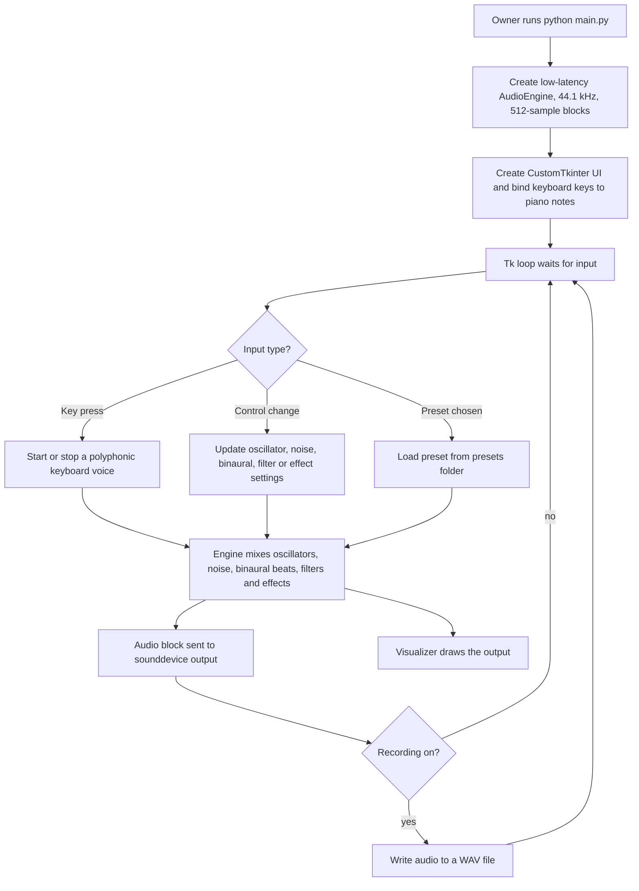

# EmotionSoundLab

> A desktop brainwave and binaural-beat synthesizer with a computer-keyboard piano, oscillators, noise, filters, effects, presets, recording and a visualiser, built for the owner's own use.

| | |
|---|---|
| **Category** | Personal tools, media pipelines and infrastructure |
| **Status** | Personal tool, as of 9 Oct 2026 (built; no README, not found; a `.venv` is checked into the folder) |
| **Type** | Python desktop app (CustomTkinter UI, real-time audio engine) |
| **Runner and schedule** | Manual: `python main.py`. |
| **Client / owner** | Personal tool (Hari). Not a client or business automation. |
| **Stack** | Python, `numpy`, `sounddevice`, `customtkinter` |
| **Source** | Main KB Part 7, "EmotionSoundLab (`Sound`)" section (lines 4210-4228); Portfolio KB has no entry for this app |

## 1. Description

### What it does
`main.py` creates a low-latency `AudioEngine` (44.1 kHz, 512-sample blocks, through `sounddevice`) and a CustomTkinter UI, binds computer-keyboard keys to piano notes, and runs the Tk loop. The engine mixes oscillators, noise, binaural beats, biquad filters, effects and polyphonic keyboard voices; a visualiser draws the output, and sound presets are stored on disk.

### Inputs and outputs
- **Inputs:** UI controls, computer-keyboard key presses (as notes), and preset files.
- **Outputs:** live audio and recordings saved as WAV.

### Key components
| Component | Role |
|---|---|
| `main.py` | Entry point; creates the engine and the UI. |
| `ui.py` | CustomTkinter interface. |
| `AudioEngine` | 44.1 kHz, 512-sample low-latency mixer on `sounddevice`. |
| `oscillator.py`, `noise.py`, `binaural.py` | Tone, noise and binaural-beat sources. |
| `filters.py`, `effects.py` | Biquad filters and effects (delay and reverb, per the source description). |
| `visualizer.py` | Draws the output. |
| `presets.py` and `presets\` | Stored sound presets. |

### Where it lives
`D:\Project\Personal Tools & Labs (hari)\Desktop & System\Sound`. Environment variables: none.

## 2. Flow chart

**Reading the chart**
1. `main.py` builds the audio engine first, then the UI, then enters the Tk loop.
2. Key presses become piano notes (polyphonic voices with ADSR envelopes); other controls change oscillator, noise, binaural, filter, effect and stereo-pan settings.
3. Presets load saved settings.
4. The engine mixes everything into 512-sample blocks for output and drawing.
5. Recordings are saved as WAV.

## 3. Case study

### The challenge
The source records no problem statement. The feature set (binaural beats, noise, brainwave-style tones, a keyboard piano) suggests (inferred) an experiment in producing mood-related sounds on the desktop. The technical constraint visible in the code is real-time audio with low latency.

### The solution
A Python application built around a small mixing engine. Separate modules provide oscillators, noise, binaural beats, filters and effects; a CustomTkinter UI exposes them, with presets, recording and a visualiser.

### Design decisions and rules learned
- **512-sample blocks at 44.1 kHz** keep latency low.
- **Polyphonic keyboard voices with ADSR envelopes** and stereo panning make the computer keyboard playable as a synth.
- **Presets in a folder** let sound settings be saved and reloaded.

### Outcome
Documented facts only: built, with a working folder, presets directory and `.venv`. No README exists (not found), and no usage or output record is documented. No Claude Code session transcript for this tool was found, so the history is inferred from file dates.

### Lessons learned
- A 512-sample block keeps latency low but will glitch on a busy CPU (inferred).
- Headphones are needed to hear binaural beats (inferred).
- The folder has a checked-in `.venv`, which makes it bulky.

## 4. Operating notes
- **Run / pause / debug:** `.venv\Scripts\python main.py`.
- **Known issues and open items:** no README; audio glitches are possible under CPU load (inferred).
- **Risks:** low. It plays audio and writes WAV recordings only.

## 5. Related
- [Sound Typer](sound-typer-duck-family.md) - another sound-focused personal tool in this folder (separate code base).
- **Sources:** Main KB Part 7 lines 4210-4228; Portfolio KB has no entry for EmotionSoundLab.
