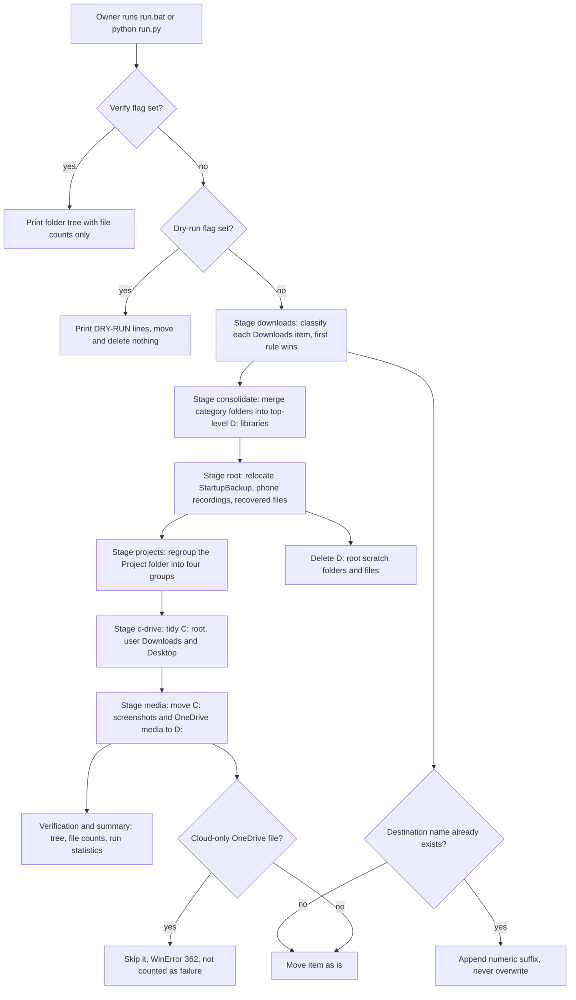
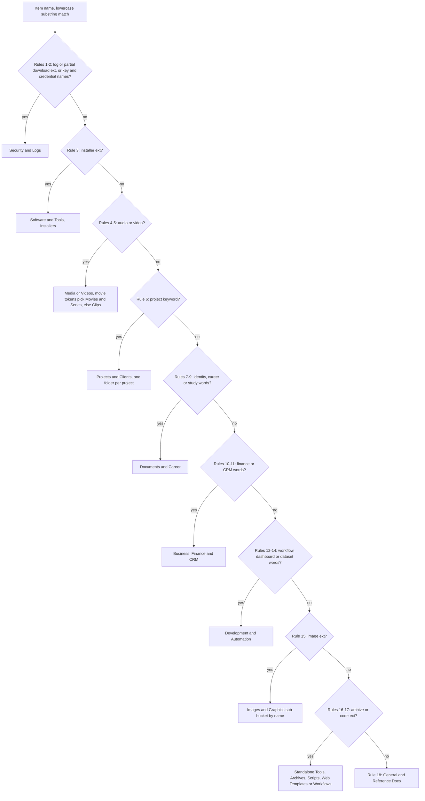

# Files Arranger (drive organiser pipeline)

> A Python pipeline that sorts the Downloads folder with an 18-rule classifier, then consolidates, regroups and tidies the C: and D: drives for the owner's own PC.

| | |
|---|---|
| **Category** | Personal tools, media pipelines and infrastructure |
| **Status** | Personal tool, as of 9 Oct 2026 (built and executed; output files dated 2026-10-07) |
| **Type** | Python CLI orchestrator (`run.py`) plus a family of older standalone scripts and a `.bat` launcher |
| **Runner and schedule** | Manual only, on the owner's Windows PC. Double-click `run.bat` or run `python run.py [flags]`. Nothing is scheduled. |
| **Client / owner** | Personal tool (Hari). Not a client or business automation. |
| **Stack** | Python 3 standard library only (`os, shutil, subprocess, json, pathlib, argparse`); Windows `attrib` and `robocopy` shelled out |
| **Source** | Main KB Part 7, "Files Arranger" and "D: drive and D:\Project taxonomy" sections (lines 3933-4023); Portfolio KB section 24 |

## 1. Description

### What it does
A one-off but re-runnable clean-up of the owner's drives. It sorts `D:\Downloads` into semantic buckets, promotes those buckets into top-level D: libraries, empties the D: root of scratch folders, regroups `D:\Project`, and relocates stray media and documents from the C: user profile to D:. The portfolio KB describes the same work as "file-arranger scripts for C: and D: drives, downloads, and media" and stresses that such items are separate utilities, not business automations (portfolio KB).

### Inputs and outputs
- **Inputs:** the existing folder trees on C: and D:, the hard-coded folder names and keyword rules inside the scripts, and command-line flags (`--dry-run`, `--verify`, `--stage X`). No API calls, no credentials, no environment variables.
- **Outputs:** moved and merged files and folders; `D:\Downloads\organization_manifest.json` (source, destination, category and timestamp per move) and `ORGANIZATION_SUMMARY.md`; a console tree report with file counts and run statistics (moved, merged, cleaned, warnings).

### Key components
| Component | Role |
|---|---|
| `run.py` | Final orchestrator (2026-10-07). Merges the earlier scripts into seven stages: `downloads`, `consolidate`, `root`, `projects`, `c-drive`, `media`, then a verification and summary stage. |
| `run.bat` | Changes to its own folder, runs `python run.py` with any arguments, then pauses. |
| `inventory.py` and `inventory.json` | Snapshot of `D:\Downloads` used to design the rules: 760 items (2 files, 736 sub-files, 22 directories). Not read by `run.py`. |
| Read-only helpers | `analyze_patterns.py`, `list_all_files.py`, `scan_downloads.py`, `inspect_*.py`, `scan_c_media.py`, `check_c_user_media.py`, `deep_search_c_media.py` print clusters and candidates. |
| `test_classifier.py` | Prototype classifier run against `inventory.json`; prints proposed category counts, moves nothing. Its category names differ from the final scheme. |
| `organize_downloads.py`, `finish_summary.py` | First live classifier and mover for Downloads; writes the manifest and summary, removes leftover generic folders. |
| `consolidate_d_drive.py` | Renames and merges Downloads category folders into top-level D: libraries. |
| `organize_d_root.py`, `run_d_organize.py` | Older D: root clean-up (the second is a duplicate using robocopy). |
| `organize_projects.py`, `fast_move_hari.py` | Rebuild `D:\Project` into four top-level groups. |
| `organize_c_drive.py`, `move_c_media_to_d.py` | Clean the C: root, user Downloads and Desktop, and move user media to D:. |
| `verify_arrangement.py`, `verify_unified_d.py`, `verify_project_tree.py` | Read-only tree printers with file counts. |

### Where it lives
`D:\Project\<user>\files arranger` (31 files). It protects its own folder from being moved, which is why `D:\Project\<user>` still exists as a holder folder.

## 2. Flow chart

Main pipeline, as merged into `run.py`:



The classifier inside the `downloads` stage, in the order the rules are tried:



**Reading the chart**
1. The owner starts the run manually. `--verify` only prints the tree; `--dry-run` prints every planned move and changes nothing; otherwise the stages run live. `--stage X` runs a single stage.
2. `downloads` classifies loose files, the old generic folders' contents and other folders. Whole project-style folders (for example `n8n-master-workflows`, `open-webui`, `scrcpy`) move as units.
3. Any destination clash gets a ` (1)`, ` (2)` style suffix, so nothing is overwritten.
4. `consolidate` renames and merges the category folders into top-level libraries (`D:\Media`, `D:\Pictures`, `D:\Documents`, `D:\Software & Tools`, `D:\Archives & Backups`, `D:\Development & Automation`).
5. `root` moves a few known items out of the D: root and deletes listed scratch folders (`d, rcPreview, Voiceover, mnt, Wondershare, tmp, .Trash-1000`) and scratch files (`testfile, test_ok, tmp_test_upload.txt`).
6. `projects` rebuilds `D:\Project`; `c-drive` and `media` pull stray items off C: and out of OneDrive folders. Cloud-only OneDrive files are skipped.
7. The final stage prints a tree with file counts and the run statistics.
8. In the second chart the first matching rule wins. Rule 6 turns the owner's own project names (HLGP, Pivot2Thrive, Zaffarology, and so on) into per-project folders before the generic document and business rules can claim the file.

## 3. Case study

### The challenge
Several drives had accumulated years of unsorted material. The Downloads inventory alone held 760 items: 2 loose files, 736 files inside eight old generic folders (Archives, Audio, Code, Documents, Images, Installers, Others, Videos) and 22 other directories. The D: root held scratch folders and recovered files, `D:\Project` needed regrouping into a readable top level, and the C: user profile held stray screenshots, recordings, downloads and Desktop files. The only signal for sorting was file names and extensions. Cloud-only OneDrive files could not be moved, and the tool had to avoid overwriting anything or moving itself.

### The solution
The pipeline grew in steps. The original standalone scripts date from 2026-08-27. First came read-only inspection helpers and `inventory.py`, which snapshotted Downloads into `inventory.json` so the rules could be designed against real data. A prototype classifier (`test_classifier.py`) printed proposed counts without moving anything. `organize_downloads.py` then became the first live mover, followed by scripts for consolidating D: libraries, tidying the D: root, regrouping `D:\Project`, and cleaning C:. On 2026-10-07 these were merged into `run.py` with seven stages and three safety flags, and `run.bat` was added as the launcher.

The 18-rule classifier is a first-match-wins chain of lowercase substring and extension tests: logs and partial downloads, credentials and keys, installers, audio, video (movie-like tokens separate films from screen recordings), project keywords, personal identity and academic documents, career, study material, finance and invoices, leads and CRM, workflows, web templates, datasets, images (screenshots, WhatsApp media, logos, wallpapers and photos), archives, code, and a general fallback.

The resulting taxonomy (main KB, as found 2026-10-09):
- D: root libraries: `Documents`, `Media`, `Pictures`, `Software & Tools`, `Archives & Backups`, `Development & Automation`, plus `Downloads` (empty of category folders), `Project`, and untouched `Program Files`, `SteamLibrary`, `Grok`, `Modules`, `WillyTest`.
- `D:\Project`: `Apps & Fullstack`, `Client & Agency (Pivot)` (with groups such as `BNI & Expos`, `Compliance & Audits`, `HLGP & GoHighLevel`, `Pivot2Thrive & Content`, `Zaffarology`, `Workflows & Automation`, `Websites & Funnels`), `Personal Tools & Labs (hari)`, `Playbooks & Presentations`, `<owner>`, `Stackandcode`, the leftover `hari` holder folder and `.claude`. Per-client folders added after the arranger ran sit alongside these.

### Design decisions and rules learned
- **First match wins, ordered from most specific to most generic.** Credentials and installers are caught before broad word rules, and the owner's own project names are caught before generic document and finance words.
- **Cohesive folders move as units.** Folders such as `n8n-master-workflows`, `open-webui`, `scrcpy`, `obscura`, `hlgp` (as `hlgp_assets`), `p2t` (as `p2t_assets`), `lovable`, `mail`, `Telegram Desktop` and three OneDrive export folders are moved whole rather than split.
- **Collisions never overwrite.** `get_unique_destination` appends ` (1)`, ` (2)` and so on.
- **The tool protects its own folder** (`CURRENT_SCRIPT_DIR`), which is why `D:\Project\<user>` still exists.
- **Cloud-only OneDrive files (WinError 362) are skipped, not failed.**
- **Safer deletion in the final version.** `run.py` uses `remove_empty_dir_tree`, which deletes a tree only when it holds no files, for most clean-ups.
- **Dry-run is the review step.** `run.py --dry-run` is the only built-in preview; the older standalone scripts have none.
- **Substring matching is broad.** For example `nf` matches any video with "nf" in its name, and `cv`, `tax`, `bill` and `lead` match inside longer words, so edge files can land in the wrong bucket.
- **Standard library only, hard-coded paths.** No dependencies to install, but drive paths are fixed in the code.

### Outcome
Documented facts only:
- `D:\Downloads\organization_manifest.json` and `ORGANIZATION_SUMMARY.md` are dated 2026-10-07 02:35; `run.bat` is dated 02:40 and `run.py` 02:48 the same day.
- `D:\Downloads` now contains no sub-folders.
- The D: root shows the unified libraries (Documents, Media, Pictures, Software & Tools, Archives & Backups, Development & Automation).
- `D:\Project` shows the regrouped top level described above.
- No count of files moved is recorded in the source. No Claude Code session transcript for this tool was found (not found), so the history is inferred from file dates.

### Lessons learned
- Build the inventory and a no-move prototype first; the rules were designed against a real 760-item snapshot.
- Keep an explicit dry-run and a verify mode in the single orchestrator; the earlier scripts acted immediately.
- Treat substring keyword rules as heuristics and review the dry-run output before a live run.
- Record every move in a manifest. Here the manifest is the only rollback aid, and the `downloads` stage in `run.py` builds manifest records but never writes them to disk (inferred from code), so the manifest on disk comes from the older `organize_downloads.py`.

## 4. Operating notes
- **Run / pause / debug:**
  ```
  cd "D:\Project\<user>\files arranger"
  python run.py --dry-run          # preview everything
  python run.py --stage projects   # one stage: downloads | consolidate | root | projects | c-drive | media
  python run.py --verify           # show tree only
  run.bat                          # live run of all stages
  ```
- **Known issues and open items:**
  - No undo script (not found).
  - Several scripts hard-code earlier folder names (`D:\Project\<user>\...`, `D:\Project\Pivot\...`); the mapping lists target names that existed in 2026-08 to 2026-10, not the current tree.
  - `inventory.json` is a design snapshot and is not read by `run.py`.
- **Risks:**
  - Deletion: the old scripts and the `root` stage call `shutil.rmtree(..., ignore_errors=True)` on D: root scratch folders without checking they are empty. `organize_downloads.py` removes a generic folder if anything is left in it after the moves. `organize_projects.py` unlinks orphan files such as `scratch_summary1.txt` and `Project.lnk` and removes `D:\Project\sample`.
  - The older standalone scripts (`organize_*.py`, `consolidate_d_drive.py`, `run_d_organize.py`, `fast_move_hari.py`, `move_c_media_to_d.py`) have no dry-run.
  - Wrong-bucket placement from broad substring rules (see above).

## 5. Related
- [StartupBackup](startupbackup.md) - the folder the `root` stage moved here from `D:\StartupBackup`.
- [System Dashboard Pro and AutoBoost](system-dashboard-pro-and-autoboost.md), [Adaptive Power Manager](adaptive-power-manager.md) and the other `Desktop & System` tools in this folder - relocated into `Personal Tools & Labs (hari)` by the `projects` stage.
- **Sources:** Main KB Part 7, "Files Arranger (drive organiser pipeline)" and the taxonomy subsection (lines 3933-4023), contents table (3909-3932), gaps note (line 4490); Portfolio KB section 24 (lines 777-793). The two KBs agree; the portfolio KB is only a one-line mention and adds no process detail.
