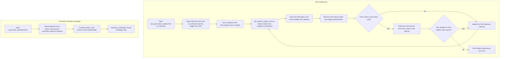

# GHL form embed test pages and pool heat calculator form

> Static front-end experiments for making an embedded GoHighLevel form look like one clean dark "glass" card, plus a standalone pool-heat-calculator lead form prototype.

| | |
|---|---|
| **Category** | Personal tools, media pipelines and infrastructure |
| **Status** | Personal tool, as of 9 Oct 2026 (static test pages and a visual prototype; the KB register labels the Cloud & Infra folder "Scratch") |
| **Type** | Static HTML and CSS test pages (no server code, despite the folder name `server`) |
| **Runner and schedule** | Manual: open the HTML file in a browser. Nothing is scheduled. |
| **Client / owner** | Owner's scratch folder; the pool-heating client work (inferred) |
| **Stack** | HTML, CSS, GHL form embed (iframe plus `form_embed.js`), Google Fonts (DM Sans) |
| **Source** | Main KB Part 7, "Cloud & Infra - server" (lines 4287-4301); Part 6 section 6B (related calculator); Portfolio KB has no entry for these pages |

## 1. Description

### What it does
`test_ghl_iframe_embed.html` loads a real GHL form through an `api.leadconnectorhq.com/widget/form/<formId>` iframe plus `link.msgsndr.com/js/form_embed.js`, styled by `ghl_perfect_single_card.css`. The CSS flattens GHL's nested wrapper elements to transparent and draws exactly one dark glass card, so the embed reads as a single clean card. `pool_heat_calculator.html` is a static "Pool Heat Calculator" glassmorphism form that collects contact details; its form action is only a placeholder, so it is a visual prototype and submits nothing.

### Inputs and outputs
- **Inputs:** A GHL form ID (visible in the HTML; the source says there are no secrets). The CSS and HTML files themselves.
- **Outputs:** A page rendered in the browser for visual checking, and a CSS snippet that is meant to be pasted into the GHL form's custom CSS (inferred).

### Key components
| Component | Role |
|---|---|
| `test_ghl_iframe_embed.html` | Loads the real GHL form in an iframe and `form_embed.js`; styled by the shared CSS file |
| `test_ghl_form.html` | The same idea with the CSS inlined and a long list of GHL class selectors |
| `ghl_perfect_single_card.css` | Makes GHL wrappers (`.hl-app`, `.form-builder`, `#_builder-form`, `.ghl-form-wrap` and similar) transparent, draws ONE dark glass card on `#_builder-form`, and removes the extra space under the orange submit button |
| `pool_heat_calculator.html` and `.css` | Static glassmorphism form: first and last name, email, phone, postcode, optional company, "Continue" button; form action is a placeholder |

Palette: slate-navy background with an orange (`#ff6600`) accent.

### Where it lives
`D:\Project\Personal Tools & Labs (hari)\Cloud & Infra\server`

## 2. Flow chart

**Reading the chart**
1. The owner opens the HTML test page in a browser to see how the GHL form renders inside the page.
2. The page loads the GHL form through an iframe and the GHL embed script.
3. The CSS removes GHL's nested wrapper styling (set to transparent) and draws a single dark glass card with the orange submit button.
4. The owner judges the result. Tweaking the CSS is the inferred loop; the source describes the files, not the iteration.
5. To apply it in GHL the CSS is pasted into the form's custom CSS. The source infers this is required because the cross-origin iframe stops page CSS from styling the form from outside.
6. The calculator form is a separate static prototype that never posts anywhere.

## 3. Case study

### The challenge
GHL forms embedded in a custom-designed page come wrapped in several nested containers, so a dark themed page ends up with a card inside a card and uneven spacing. The goal was a form that looks like a single clean dark card, and a pool-heat-calculator lead form in the same visual style.

### The solution
Two test pages and a CSS file that targets GHL's own container classes: flatten every wrapper to transparent, then draw one card on the form element and trim the space under the submit button. A second, simpler page prototypes the calculator's contact form.

### Design decisions and rules learned
- One card only: every GHL wrapper is made transparent and the card is drawn on a single element.
- The CSS must live inside the GHL form builder to take effect, because the iframe is cross-origin (the source marks this as inferred).
- The CSS leans on `!important` and GHL internal class names, which can change when GHL updates its form builder.
- The calculator form is a prototype with a placeholder action, not a working lead capture.

### Outcome
No measured outcome recorded. The folder holds working test pages and CSS; the source does not record that the CSS was applied to a live GHL form.

### Lessons learned
- Styling a third-party embed depends on class names the owner does not control, so expect to revisit the CSS after GHL form-builder updates.
- Keep prototypes labelled as prototypes. The calculator form here captures nothing; the working lead-gated calculator is a different project (Part 6 section 6B).

## 4. Operating notes
- **Run / pause / debug:** Open the HTML files in a browser. To use the styling for real, paste `ghl_perfect_single_card.css` into the GHL form's custom CSS (inferred).
- **Known issues and open items:** No server code exists, despite the folder name. Whether the styling was ever deployed to a live GHL form is not documented.
- **Risks:** Brittle selectors tied to GHL internals. No secrets are in the pages (the form ID is public in the embed).

## 5. Related
- Part 6 section 6B, "Pool heat pump sizing calculator (lead-gated), plus pool store pages": the working calculator, which uses a GHL form iframe as its lead gate; the Part 6 entry names this `server` folder as the source of its GHL embed experiments.
- [cloud-infra-s3-helper-scripts.md](cloud-infra-s3-helper-scripts.md) and [setup-openssh-windows-ssh-server.md](setup-openssh-windows-ssh-server.md) - the other Cloud & Infra items.
- **Sources:** Main KB Part 7 (lines 4287-4301; register row "Cloud & Infra", line 3923); Main KB Part 6 section 6B (line 3715). Portfolio KB: no entry (portfolio KB section 24 lists only S3, RDS and OpenSSH scripts from this folder).
