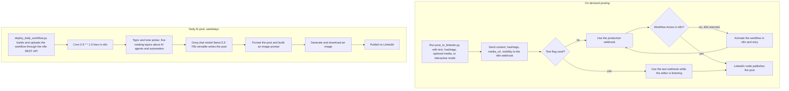

# LinkedIn post via self-hosted n8n (on demand and daily AI schedule)

> A Python command line tool that posts to LinkedIn through a self-hosted n8n webhook, plus a second n8n workflow that writes and publishes an AI-generated LinkedIn post every weekday.

| | |
|---|---|
| **Category** | Personal tools, media pipelines and infrastructure |
| **Status** | Personal tool, as of 9 Oct 2026 (the KB register says "Built"; whether the n8n workflows are currently switched Active is not documented) |
| **Type** | Python CLI scripts plus two n8n workflows |
| **Runner and schedule** | On demand from the CLI. The daily workflow carries cron `0 9 * * 1-5` (weekdays 09:00) inside n8n once it is deployed and Active. |
| **Client / owner** | Owner's personal tools (which LinkedIn account is posted to is not documented) |
| **Stack** | Python, self-hosted n8n (webhook plus REST API), Groq chat model `llama-3.3-70b-versatile`, an image-generation step, LinkedIn OAuth in n8n |
| **Source** | Main KB Part 7, "Other Personal Tools & Labs folders" - "Linkedin post" (lines 4324-4330) and register row (line 3924); Portfolio KB: no LinkedIn entry |

## 1. Description

### What it does
`post_to_linkedin.py` sends `{content, hashtags, media_url, visibility}` to an n8n production webhook, or to the n8n test webhook with `--test`; the n8n workflow's LinkedIn node publishes the post. `deploy_daily_workflow.py` builds a second workflow, "Daily LinkedIn AI Post (Monday-Friday + Image)", and uploads it through the n8n REST API. That workflow runs on cron `0 9 * * 1-5`, picks a topic and tone (five rotating topics about AI agents and automation), has a Groq chat model write the post, formats it and builds an image prompt, generates and downloads an image, then publishes to LinkedIn. `test_connection.py` checks that the n8n API is reachable.

### Inputs and outputs
- **Inputs:** For the CLI: `--text`, `--hashtags`, optional `--media` URL, optional `--test`; or no arguments for interactive mode. For the daily workflow: the n8n cron trigger and the rotating topic list inside the workflow.
- **Outputs:** A published LinkedIn post (text, hashtags, optional media; or text plus a generated image for the daily workflow).

### Key components
| Component | Role |
|---|---|
| `post_to_linkedin.py` | CLI that posts the payload to the n8n webhook (production or test URL) |
| `deploy_daily_workflow.py` | Builds and uploads the daily workflow through the n8n REST API |
| `test_connection.py` | Checks n8n API reachability |
| `linkedin_post_workflow.json`, `daily_linkedin_ai_workflow.json` | Exports of the two workflows |
| n8n workflow "Daily LinkedIn AI Post (Monday-Friday + Image)" | Cron, topic and tone picker (code node), Groq model, format and image prompt, image generate and download, LinkedIn publish |

Environment-variable names: `N8N_BASE_URL`, `N8N_API_KEY`, `N8N_WEBHOOK_URL`, `N8N_TEST_WEBHOOK_URL`. Credentials live inside n8n (a Groq credential and a LinkedIn connection, linked once in the n8n UI), after which the workflow must be toggled Active.

### Where it lives
`D:\Project\Personal Tools & Labs (hari)\Linkedin post`. The n8n instance is self-hosted; its address is not recorded here.

## 2. Flow chart

**Reading the chart**
1. On demand: the owner runs the CLI with text, hashtags and an optional media URL (or in interactive mode).
2. The script posts the payload to the n8n webhook. With `--test` it uses the test webhook, which only works while the n8n editor is listening.
3. A 404 from the production webhook means the workflow is not Active; activating it in n8n fixes that.
4. The workflow's LinkedIn node publishes the post.
5. Daily: `deploy_daily_workflow.py` creates the workflow in n8n via the REST API. Once the LinkedIn connection is linked and the workflow is Active, the cron fires at 09:00 on weekdays.
6. A code node picks one of five rotating topics and a tone, the Groq model writes the post, the post is formatted and an image prompt is built, an image is generated and downloaded, and the post is published.

## 3. Case study

### The challenge
The stated purpose is two paths to LinkedIn through a self-hosted n8n instance: post something specific on demand from the command line, and have an AI-written post about AI agents and automation published on weekdays. The source does not record the original motivation or the target account.

### The solution
n8n does the publishing and the scheduling; Python only triggers and deploys. A thin CLI posts to a webhook, so the same n8n workflow can be called from anywhere. A deploy script builds the daily workflow programmatically through the n8n REST API instead of by hand in the editor. The daily workflow chains a topic picker, a Groq model and an image step before publishing.

### Design decisions and rules learned
- Credentials stay inside n8n (Groq credential, LinkedIn connection); only the n8n API key and webhook settings are held locally, as environment variables.
- The LinkedIn connection has to be linked once in the n8n UI, and the workflow then toggled Active.
- A 404 from the production webhook means the workflow is not Active. Use `--test` while the editor is listening.
- The daily post is a rotation of five topics, so content variety comes from the topic list rather than from live data.

### Outcome
No measured outcome recorded. The folder holds the scripts and two workflow exports; the source records no posts published, run counts or engagement, and does not say whether the daily workflow was ever switched Active.

### Lessons learned
- Keep the publishing credential in the workflow tool, not in the script.
- A webhook in front of the publishing step makes the posting action reusable from any script.

## 4. Operating notes
- **Run / pause / debug:** `python post_to_linkedin.py --text "..." --hashtags "#AI" [--media URL] [--test]`, or run with no arguments for interactive mode. `test_connection.py` checks the n8n API. Pause the daily post by toggling the workflow inactive in n8n.
- **Known issues and open items:** Active state of both workflows is not documented.
- **Risks:** Publishes to a live LinkedIn account. The daily workflow posts AI-written content without a documented human approval step.

## 5. Related
- [other-personal-tools-and-labs.md](other-personal-tools-and-labs.md) - the folder map this tool sits in.
- [connectors-and-mcp-servers-in-use.md](connectors-and-mcp-servers-in-use.md) - Claude-side connectors (this tool does not use them; it talks to n8n directly).
- **Sources:** Main KB Part 7 (lines 4324-4330; register row, line 3924). Portfolio KB: nothing specific; it lists n8n and Groq among tools used but has no LinkedIn-posting entry (portfolio KB section 2).
