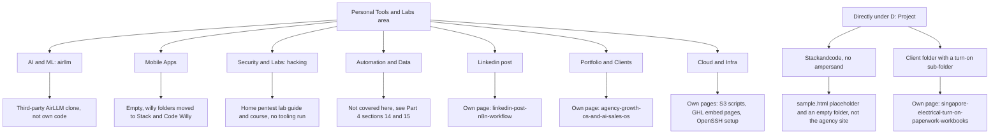

# Other Personal Tools & Labs folders (map and small items)

> A short map of the smaller folders in the owner's Personal Tools & Labs area, saying what each one is, whether it is the owner's own work, and where its fuller page is.

| | |
|---|---|
| **Category** | Personal tools, media pipelines and infrastructure |
| **Status** | Reference, as of 9 Oct 2026 |
| **Type** | Folder inventory (one third-party clone, one empty folder, two small content folders and links to fuller pages) |
| **Runner and schedule** | Not applicable |
| **Client / owner** | Owner's personal tools and labs |
| **Stack** | Not applicable (see the linked pages) |
| **Source** | Main KB Part 7, "Other Personal Tools & Labs folders" (lines 4319-4352); Portfolio KB: none of these folders appear |

## 1. Description

### What it does
This page records the small items that do not justify their own project page. The larger items in the same section have their own pages (linked below). Nothing here is run.

### Inputs and outputs
- **Inputs:** Not applicable.
- **Outputs:** A classification of each folder, so none is mistaken for the owner's own automation when it is not.

### Key components
| Folder | What it is | Page |
|---|---|---|
| `AI & ML\airllm` | A clone of the open-source AirLLM project (run 70B-class LLMs on low-VRAM GPUs). Third-party repository, not the owner's code. | This page |
| `Mobile Apps` | Empty (no content found). The `willy` and `willymob` folders once mapped here now live under `D:\Project\<user>\Stack&code\Willy`. | This page |
| `Security & Labs\hacking` | A home penetration-testing lab learning guide: a root `home-pentest-lab-guide.md`, a numbered self-study course (foundations and ethics through to reporting and defence), cheat sheets and scenarios. Course material for practising on equipment the owner owns. No tooling is run from it. | This page |
| `Automation & Data` | Contains `Data_processing`, `outreach`, `pdf`, `tester`, `Transcript`. Not covered in this slice of the KB. The register points to Part 4 sections 14-15 for the Job Agent (`pdf` folder) and the Transcript recorder. | Part 4 sections 14-15 |
| `D:\Project\Stackandcode` (no ampersand) | A small repo with `sample.html` (a community "summit bonuses" welcome post, apparently sample or placeholder content) and an empty `New folder`. It is not the Stack&Code agency site; that is `D:\Project\<user>\Stack&code\stack website`. | This page |
| `Linkedin post` | n8n + Python LinkedIn posting, on demand and daily | [linkedin-post-n8n-workflow.md](linkedin-post-n8n-workflow.md) |
| `Portfolio & Clients` | Agency Growth OS, AI Sales OS, two portfolio sites | [agency-growth-os-and-ai-sales-os.md](agency-growth-os-and-ai-sales-os.md) |
| Client folder under `D:\Project` | Singapore electrical turn-on workbooks | [singapore-electrical-turn-on-paperwork-workbooks.md](singapore-electrical-turn-on-paperwork-workbooks.md) |
| `Cloud & Infra` | S3 scripts, GHL embed pages, OpenSSH setup | [cloud-infra-s3-helper-scripts.md](cloud-infra-s3-helper-scripts.md), [ghl-embed-test-pages-and-pool-heat-calculator.md](ghl-embed-test-pages-and-pool-heat-calculator.md), [setup-openssh-windows-ssh-server.md](setup-openssh-windows-ssh-server.md) |

### Where it lives
`D:\Project\Personal Tools & Labs (hari)` and, for the last two small items, directly under `D:\Project`. Exact sub-paths are in the table above.

## 2. Flow chart

This is a folder map rather than a process. It shows where each item is documented.

**Reading the chart**
1. The left branch is the Personal Tools & Labs area, the right branch is two items that sit directly under `D:\Project`.
2. Folders that end in a short note (airllm, Mobile Apps, hacking, Automation & Data, Stackandcode) are documented only on this page.
3. Folders ending in "Own page" have a fuller project file.

## 3. Case study

### The challenge
The drive reorganisation (the Files Arranger, Part 7) moved many folders into a new structure. Some of what landed in Personal Tools & Labs is not the owner's own work or is empty, and describing everything as an "automation" would overstate the portfolio.

### The solution
Classify each folder once: third-party, empty, course material, placeholder, or a real build with its own page.

### Design decisions and rules learned
- A folder name alone is not evidence of a project. The Portfolio KB makes the same point: a name does not establish what a folder implements, so files and entry points must be inspected (portfolio KB section 26).
- `airllm` is a third-party clone, not the owner's code.
- `Mobile Apps` is empty; the `willy` content moved under the Stack&Code folder.
- `D:\Project\Stackandcode` (no ampersand) must not be confused with the real Stack&Code agency site.
- `hacking` is study material for practising on the owner's own equipment; no tooling is run from it.

### Outcome
No measured outcome recorded.

### Lessons learned
- Keep third-party clones, empty folders and placeholder files out of project counts.
- Near-identical folder names (`Stackandcode` versus `Stack&code`) need an explicit note.

## 4. Operating notes
- **Run / pause / debug:** Nothing to run.
- **Known issues and open items:** `Automation & Data` is only listed, not described, in this part of the KB.
- **Risks:** The `hacking` material is for use on equipment the owner owns only.

## 5. Related
- [cloud-infra-s3-helper-scripts.md](cloud-infra-s3-helper-scripts.md), [setup-openssh-windows-ssh-server.md](setup-openssh-windows-ssh-server.md), [ghl-embed-test-pages-and-pool-heat-calculator.md](ghl-embed-test-pages-and-pool-heat-calculator.md)
- [linkedin-post-n8n-workflow.md](linkedin-post-n8n-workflow.md), [agency-growth-os-and-ai-sales-os.md](agency-growth-os-and-ai-sales-os.md), [singapore-electrical-turn-on-paperwork-workbooks.md](singapore-electrical-turn-on-paperwork-workbooks.md)
- **Sources:** Main KB Part 7 (lines 4319-4352); register rows (lines 3922-3927). Portfolio KB section 26 (portfolio KB) on folder names as evidence.
