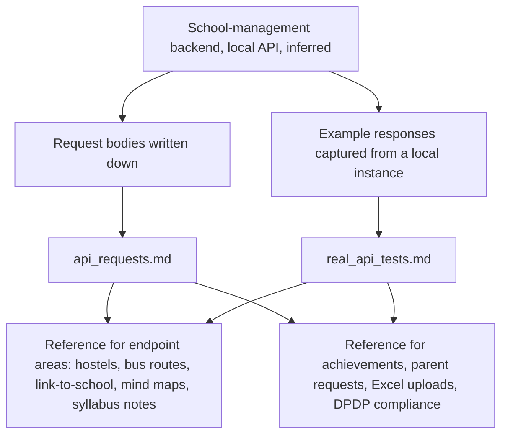

# Scripts (school-management API reference documents)

> Two Markdown API references for a school-management backend, kept in a folder called Scripts although it holds no scripts; documents only.

| | |
|---|---|
| **Category** | Personal tools, media pipelines and infrastructure |
| **Status** | Reference, as of 9 Oct 2026 (documents only; nothing runs) |
| **Type** | Markdown API documentation |
| **Runner and schedule** | None. Documents are read, not run. |
| **Client / owner** | Personal tool folder (Hari). The backend it documents is a school-management system (inferred). |
| **Stack** | Markdown; REST API on a local development server |
| **Source** | Main KB Part 7, "Scripts (`Desktop & System\Scripts`)" section (lines 4232-4242); Portfolio KB has no entry for it |

## 1. Description

### What it does
The folder holds two documents. `api_requests.md` lists request bodies for the backend. `real_api_tests.md` holds example responses captured from a local instance of the API. Together they serve as a reference for calling the backend's endpoints. The main KB infers they belong to a school-management backend.

### Inputs and outputs
- **Inputs:** none (static documents).
- **Outputs:** none. The files are reference material.

### Key components
| Component | Role |
|---|---|
| `api_requests.md` | Request bodies for the endpoints. |
| `real_api_tests.md` | Example responses captured against a local instance of the API. Private; not published. |

Endpoint coverage listed in the source: hostels, bus routes, link-to-school (OTP), mind maps, syllabus notes, achievements, parent requests, Excel uploads, and DPDP compliance (data access, correction, deletion, export, withdraw consent).

### Where it lives
`D:\Project\Personal Tools & Labs (hari)\Desktop & System\Scripts`

## 2. Flow chart

This is not a runtime process. The chart shows how the two documents relate to the backend, as far as the source documents it (the backend link is inferred).

**Reading the chart**
1. The backend exposes the endpoint areas listed in the source.
2. One document records the request bodies; the other records example responses from a local instance.
3. Both serve as a reference for those endpoint areas.
4. The captured-response document stays private.

## 3. Case study

### The challenge
Keeping a reliable record of what the backend accepts and returns. The source does not state a business problem; the folder name suggests scripts were intended, but only documents exist (inferred).

### The solution
Two Markdown references: one for requests and one for example responses captured from a real local instance. No code, tooling or automation is documented.

### Design decisions and rules learned
- The responses were captured from a real local instance, so the examples are actual payloads rather than invented ones.
- The folder name misleads. The folder holds API reference documents rather than scripts.
- Captured responses can carry personal data, so that file was only read at heading level for the knowledge base.

### Outcome
Documented facts only: two documents exist, one for request bodies and one for captured example responses. No other measured outcome is recorded.

### Lessons learned
- Captured API responses are sensitive by nature; do not publish them or paste them into a knowledge base unredacted.
- Name reference folders for what they hold to avoid confusion.

## 4. Operating notes
- **Run / pause / debug:** nothing to run.
- **Known issues and open items:** the folder name does not match its content; the backend repository is not identified in the source.
- **Risks:** Security and credential-hygiene findings for this project are tracked privately and are not published here.

## 5. Related
- No related project file in this folder.
- **Sources:** Main KB Part 7 lines 4232-4242 and gaps line 4494 (the captured-response file was deliberately not read in full); Portfolio KB has no entry.
