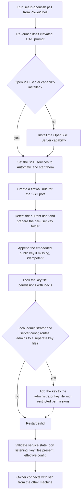

# setup-openssh.ps1: Windows SSH server with key login

> A PowerShell script that turns the owner's Windows PC into an SSH server reachable with a key (passwordless login), for remote control from another machine.

| | |
|---|---|
| **Category** | Personal tools, media pipelines and infrastructure |
| **Status** | Personal tool, as of 9 Oct 2026 (not run during the KB review) |
| **Type** | PowerShell script (needs elevation) |
| **Runner and schedule** | Manual, one-off setup on the PC being exposed. Nothing is scheduled. |
| **Client / owner** | Owner's personal Cloud & Infra folder |
| **Stack** | PowerShell, Windows OpenSSH Server capability, `sshd` and `ssh-agent` services, Windows Firewall, `icacls` |
| **Source** | Main KB Part 7, "Cloud & Infra - setup-openssh.ps1" (lines 4303-4315); Portfolio KB section 24 |

## 1. Description

### What it does
The script installs the OpenSSH Server Windows capability if it is missing, sets the SSH services to start automatically, opens the SSH port in the Windows firewall, and installs one embedded public key so the owner can log in without a password. It then validates the result. It re-launches itself elevated first, so a UAC prompt appears.

### Inputs and outputs
- **Inputs:** The script itself, which embeds one public key (a public key is not a secret, and it is not reproduced here). Run by the logged-in Windows account.
- **Outputs:** A running SSH server, the key registered for key-only login, a firewall rule, and a validation report (service state, port listening, key files present, effective-config check).

### Key components
| Component | Role |
|---|---|
| `setup-openssh.ps1` | The only file; numbered steps from elevation to validation |
| Windows firewall rule | Opens the inbound SSH port |
| Per-user key file | Receives the embedded public key (appended only if missing, so safe to re-run) |
| Administrator key file | Also receives the key when the account is a local administrator and the server config routes admins to that file |
| `icacls` | Locks down permissions on the key files |

### Where it lives
`D:\Project\Personal Tools & Labs (hari)\Cloud & Infra\setup-openssh.ps1`. It was moved here from `D:\Project` by the Files Arranger (see the Part 7 Files Arranger section).

## 2. Flow chart

**Reading the chart**
1. The owner runs the script; the first step relaunches it elevated, which shows a UAC prompt.
2. The OpenSSH Server capability is installed only if it is missing.
3. The SSH services are set to Automatic and started.
4. A firewall rule opens the inbound SSH port.
5. The script detects the current user and prepares the per-user key folder.
6. The embedded public key is appended only if it is not already there, then the file's permissions are locked with `icacls`.
7. For a local administrator whose server config routes admins to a separate key file, the key is added there too with SYSTEM/Administrators-only permissions.
8. `sshd` is restarted, then validated: service running, port listening, key files present, effective config check.
9. The owner then connects from the other machine with `ssh` using the PC's address.

## 3. Case study

### The challenge
The owner wanted to control this Windows PC remotely from another machine using a key (passwordless login). Setting that up by hand means several separate steps: installing the capability, starting services, opening the firewall, placing the key with the right permissions, and handling the extra key file that administrator accounts can use. The source states the purpose; it does not record the original situation beyond that.

### The solution
A single re-runnable PowerShell script that does the whole job end to end, from installing the capability and starting services to locking down the key files and validating the result, so a clean machine can be set up with one command.

### Design decisions and rules learned
- Idempotent key install: the key is appended only if missing, so the script can be run again safely.
- Both key files are handled: the user's file and, for administrators, the separate administrator file when the server config routes admins there.
- File permissions are locked with `icacls`; the administrator key file is restricted to SYSTEM and Administrators.
- It ends with a validation step rather than assuming success.
- Only the public half of a key pair is embedded in the file.

### Outcome
No measured outcome recorded. The script was not run during the KB review, so a successful remote login is not documented.

### Lessons learned
- Opening an inbound SSH port is only safe with key-only login and a trusted network. The KB advises considering disabling password authentication.
- The Portfolio KB lists the OpenSSH setup script among personal and system tools that are to be classified by what they actually do rather than counted as business automations. That is the right framing.

## 4. Operating notes
- **Run / pause / debug:** `powershell -ExecutionPolicy Bypass -File .\setup-openssh.ps1` (it prompts for UAC), then `ssh <user>@<host>` from the other machine. If login fails, the validation step shows the service state, port status, key files and the effective config.
- **Known issues and open items:** Whether password authentication is disabled is not documented and is left to the owner. The script does not state how to remove the firewall rule or the key later.
- **Risks:** Exposes an SSH service through the Windows firewall. Safe only with key-only login on a trusted network. Anyone holding the matching private key gets access to the account.

## 5. Related
- [cloud-infra-s3-helper-scripts.md](cloud-infra-s3-helper-scripts.md) - the other infrastructure utility in the Cloud & Infra folder.
- [ghl-embed-test-pages-and-pool-heat-calculator.md](ghl-embed-test-pages-and-pool-heat-calculator.md) - the `server` folder in Cloud & Infra.
- **Sources:** Main KB Part 7 (lines 4303-4315; register row "Cloud & Infra", line 3923). Portfolio KB section 24 mentions the OpenSSH setup script by name only (portfolio KB); it adds no process detail.
