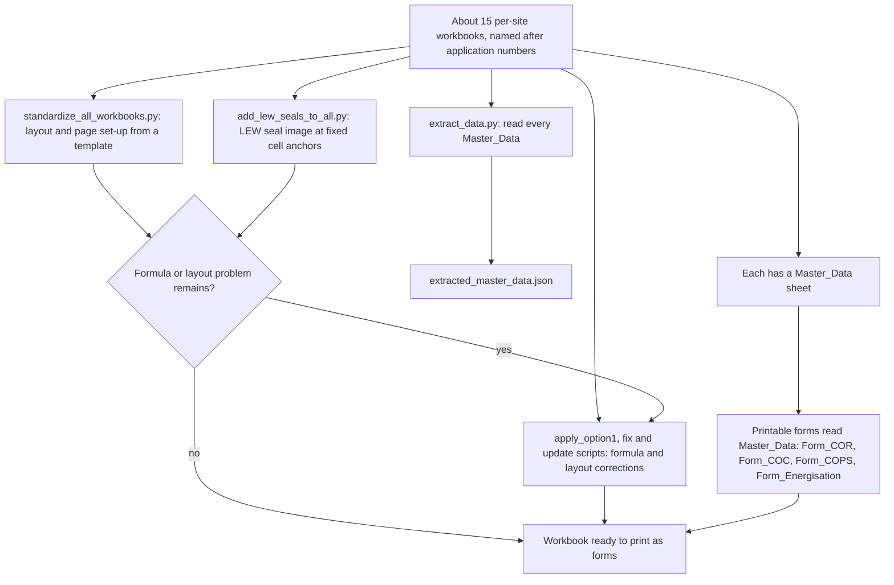

# Singapore electrical turn-on paperwork workbooks (client folder)

> Python/openpyxl scripts that keep about 15 per-site Excel workbooks consistent, so one data sheet feeds the printable compliance forms for Singapore electrical turn-on paperwork.

| | |
|---|---|
| **Category** | Personal tools, media pipelines and infrastructure (client work, found in the personal folders) |
| **Status** | On demand, as of 9 Oct 2026 (manual Python scripts; run history not documented; the client attribution is inferred from the folder name) |
| **Type** | Excel workbooks plus Python/openpyxl maintenance scripts |
| **Runner and schedule** | Manual. Nothing is scheduled. |
| **Client / owner** | Client work (inferred from the folder name). Client-confidential; the KB reproduces nothing from the workbooks. |
| **Stack** | Excel (formulas, printable forms), Python, openpyxl, a seal image placed on sheets, reference PDFs |
| **Source** | Main KB Part 7, "Other Personal Tools & Labs folders" - the client folder under `D:\Project` (line 4349); Portfolio KB section 22 (Singapore Power form conversion) |

The client folder's own name is withheld in this file.

## 1. Description

### What it does
About 15 per-site Excel workbooks, named after application numbers, share a `Master_Data` sheet that feeds printable forms (`Form_COR`, `Form_COC`, `Form_COPS`, `Form_Energisation`). A set of scripts then maintains that set of workbooks: reading every workbook's data out, standardising layout and page set-up from a template, placing the licensed electrical worker (LEW) seal image at fixed cell anchors, and applying formula and layout corrections (for example the Solar PV capacity line).

### Inputs and outputs
- **Inputs:** The per-site workbooks (site addresses and consumer names inside them are client-confidential), a template workbook, the LEW seal image, reference PDFs.
- **Outputs:** Updated, standardised workbooks ready to print as forms; `extracted_master_data.json` holding every workbook's `Master_Data`.

### Key components
| Component | Role |
|---|---|
| Per-site workbooks (about 15) | One `Master_Data` sheet drives the printable form sheets |
| `Form_COR`, `Form_COC`, `Form_COPS`, `Form_Energisation` | Printable forms fed from `Master_Data` |
| `extract_data.py` | Reads every workbook's `Master_Data` into `extracted_master_data.json` |
| `standardize_all_workbooks.py` | Layout and page set-up from a template |
| `add_lew_seals_to_all.py` | Places the LEW seal image at fixed cell anchors |
| `apply_option1_*`, `fix_*`, `update_*` | Formula and layout corrections |
| Reference PDFs | Source forms and guidance |

### Where it lives
A client folder directly under `D:\Project` (`<client-folder>`), in a turn-on sub-folder. It has its own `.git` with no commits.

## 2. Flow chart

The KB lists the scripts but not the order they are run in, so the chart shows them as independent tools acting on the same set of workbooks.

**Reading the chart**
1. The set of workbooks is the starting point; each has a `Master_Data` sheet that the form sheets read.
2. `extract_data.py` collects every workbook's `Master_Data` into one JSON file.
3. `standardize_all_workbooks.py` applies a common layout and page set-up from a template.
4. `add_lew_seals_to_all.py` places the seal image at fixed cell anchors.
5. The `apply_option1_*`, `fix_*` and `update_*` scripts correct formulas and layout, such as the Solar PV capacity line. The check-and-correct loop shown is inferred from their names.
6. The result is a set of workbooks that print as the official-style forms.

## 3. Case study

### The challenge
Each turn-on application needs its own set of paperwork (certificate and energisation forms). With about 15 workbooks, keeping layout, seals and formulas consistent by hand is error-prone, and a correction (for example to a capacity line) has to be applied to every workbook.

### The solution
One data sheet per workbook drives the printable forms, so details are entered once. Scripts then apply layout, seal and formula changes across all workbooks in one pass, and another script extracts all the data to JSON.

### Design decisions and rules learned
- Single source of truth per site: `Master_Data` feeds every form sheet.
- Standardise from a template rather than editing workbooks one by one.
- Fixed cell anchors for the seal image so it lands in the same place on every form.
- Treat it as client-confidential: site addresses and consumer names are in the workbooks, and nothing is reproduced here.

### Outcome
No measured outcome recorded. The folder holds about 15 workbooks and the scripts; the source records no run counts, submissions or turnaround times. Its own git repo has no commits.

### Lessons learned
- The Portfolio KB cautions that Singapore Power form conversion should be treated as document/data conversion unless the actual workflow shows additional automation (portfolio KB section 22; the Main KB maps that item to a separate folder, Part 5 section 11). The same caution fits here: these scripts standardise and correct workbooks. No filing with any authority is documented.
- The client attribution is inferred from the folder name; confirm it before using this as a client case study.

## 4. Operating notes
- **Run / pause / debug:** Run the Python scripts manually against the workbook folder; the order is not documented. Back up the workbooks first, since the scripts rewrite layout and formulas (general caution, not stated in the source).
- **Known issues and open items:** Run history, script order and the identity of the client are not documented. No commits in the repo.
- **Risks:** The workbooks contain site addresses and consumer names. Do not share the folder or paste its contents.

## 5. Related
- Main KB Part 5 section 11, "Singapore Power forms to Excel": a separate folder that rebuilds energisation and certificate-of-compliance PDF forms as one workbook (generator script `Sample.py`, five tabs including `Master_Data`, `Form_Energisation`, `Form_COC`, `Form_COPS`). Same paperwork domain; different folder.
- [other-personal-tools-and-labs.md](other-personal-tools-and-labs.md) - map of the neighbouring folders.
- **Sources:** Main KB Part 7 (line 4349). Portfolio KB section 22 (portfolio KB) reports an Excel conversion of energisation and certificate-of-compliance forms and says to treat it as document/data conversion; it does not mention the per-site workbook scripts, so there is no discrepancy but also no extra detail.
