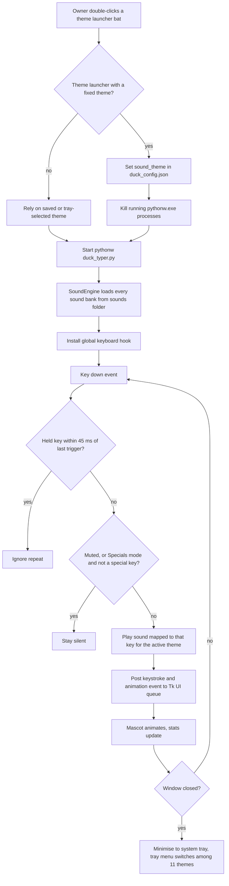
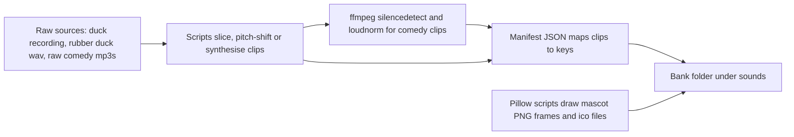

# Sound Typer (the "duck" family of typing-sound apps)

> A system-wide Windows typing companion that plays a themed sound on every key press, built as one program with many sound themes, for the owner's personal use.

| | |
|---|---|
| **Category** | Personal tools, media pipelines and infrastructure |
| **Status** | Personal tool, as of 9 Oct 2026 (built and used; `duck_config.json` last written 2026-10-04, code and README last edited 2026-10-03) |
| **Type** | Windows desktop app (Python, Tkinter window plus system tray) with per-theme `.bat` launchers |
| **Runner and schedule** | Manual: one `.bat` launcher per theme. No auto-start registration for the typer is in the code (not found). |
| **Client / owner** | Personal tool (Hari). Not a client or business automation. |
| **Stack** | Python with `pygame`, `keyboard`, `pystray`, `Pillow`, `tkinter`; `numpy` and `scipy` for bank building; `ffmpeg` on PATH for the comedy bank |
| **Source** | Main KB Part 7, "Sound Typer" section (lines 4027-4065) and the Part 6 "Duck Typer (personal tool)" entry (lines 3705-3708); Portfolio KB section 24 |

## 1. Description

### What it does
Every key press anywhere in Windows plays a sound from the chosen theme. One program serves many themes: duck quacks, a bird aviary, 88 individual animals, nature, water, violin, grand piano (a melodic mode and a full 88-key mode), a spooky ghost theme, and Tamil comedy dialogues (88 distinct clips, plus a "Vadivelu Specials" mode where only Delete, Win, Enter and Space speak and every other key is silent). The portfolio KB lists the same family as "typing-sound apps: duck, bird, piano, ghost, nature, and comedy" and a separate "system-tray launcher" (portfolio KB); the tray launcher most likely corresponds to `Start in System Tray.bat` (inferred).

### Inputs and outputs
- **Inputs:** global keystrokes from the keyboard hook; the theme, volume and mute settings in `duck_config.json`; sound banks under `sounds\`.
- **Outputs:** audible feedback only, `duck_config.json`, and optional in-window keystroke statistics. Nothing is logged to disk and nothing is sent over a network.

### Key components
| Component | Role |
|---|---|
| `duck_typer.py` | Main app: `SoundEngine` (pygame mixer, 44.1 kHz stereo, 32 channels, 512-sample buffer) and `SoundTyperApp` (global hook, Tk window, tray). |
| `sounds\` (~163 MB) | Banks: `animals_88`, `birds`, `nature`, `water`, `tamil_comedy`, `violin`, `piano`, `quacks`, `ghost`, with a manifest JSON per bank where one exists. |
| Launcher `.bat` files (13 launcher and stop files) | Set `sound_theme`, stop any running instance, and start `pythonw duck_typer.py`; plus `Start in System Tray.bat` and `Stop Duck Typer.bat`. |
| Bank-building scripts | `extract_quacks.py`, `prepare_sound_bank.py`, `build_nature_and_water_banks.py`, `process_tamil_comedy_bank.py`, `build_comedy_manifest.py`, `build_pure_vadivelu_88.py`, `build_vadivelu_88_manifest.py`. |
| Mascot and icon scripts | `generate_animation_frames.py`, `generate_comedy_mascots.py`, `generate_water_nature_mascots.py`, `make_icon.py` (Pillow). |
| Exploration scripts | `find_sounds.py` and `test_dialogue_fetch.py`; `temp_*.wav` and `test_tamil.mp3` are leftovers. |

### Where it lives
`D:\Project\<user>\duck`. Config is read from and written to `duck_config.json` in the working directory (keys: `volume`, `muted`, `sound_theme`, `special_keys`, `minimize_to_tray_on_close`).

## 2. Flow chart

Runtime behaviour:

Offline sound-bank building, run once per bank:

**Reading the chart**
1. A launcher `.bat` optionally sets the theme in `duck_config.json`. The Duck, Ghost, Piano, Violin and Animals launchers only start the app and rely on the saved or tray-selected theme.
2. The Birds, Nature, Water, Tamil Comedy and Vadivelu launchers, and `Stop Duck Typer.bat`, run `taskkill /f /im pythonw.exe` before starting.
3. `duck_typer.py` builds the sound engine and loads all banks, then installs the global hook.
4. Each key-down is throttled to one trigger per 45 ms, which stops held keys from machine-gunning sounds.
5. Mute and the Specials mode decide whether the key is audible; otherwise the sound mapped to that key for the active theme plays.
6. An event goes to the Tk queue so the mascot (duck, bird, ghost, piano, violin, leaf, water drop, comedy character) animates and stats update.
7. Closing the window minimises to the tray; the tray menu switches themes and has "Exit Completely". `--tray` and `--minimized` start hidden; `--headless` runs with no UI.
8. The second chart is the offline path that produced the banks (for example the 88 pure-clip comedy bank mapped to a-z, 0-9, shifted numbers, symbols and control keys).

## 3. Case study

### The challenge
The source records no problem statement; the tool is a personal typing companion. The design implies (inferred) audible feedback while typing, with a different character per theme, running everywhere on Windows rather than inside one editor. That needs a global keyboard hook, low-latency playback that can overlap many sounds, and a large library of short clips that suits each key.

### The solution
One Python program with a theme-keyed sound engine and a Tkinter and tray front end, plus a set of one-time scripts that build the sound banks. Examples from the source: the 8 loudest 150-650 ms segments in a duck recording become quack sounds; a rubber duck sample is pitch-shifted into six variants; water and nature sounds are synthesised with numpy and scipy; Tamil comedy MP3s are sliced with ffmpeg and normalised, and an 88-clip pure-Vadivelu bank was built last (an older mixed-actor manifest, `build_comedy_manifest.py`, covered clips from Vadivelu, Goundamani and Santhanam). Mascot frames are drawn with Pillow.

### Design decisions and rules learned
- **One engine, many banks and manifests.** A manifest JSON per bank maps keys to clips, so new themes are mostly data.
- **Throttle held keys to one trigger per 45 ms** to keep the audio usable.
- **Minimise to tray on close** so the app can stay running in the background.
- **Launchers kill all `pythonw.exe` processes.** This was convenient for switching themes but it stops every windowless Python tool on the PC, including the Adaptive Power Manager started by its `run.bat`.
- **Specials mode** makes only Delete, Win, Enter and Space speak, leaving other keys silent.

### Outcome
Documented facts only: built and in personal use (inferred); `duck_config.json` currently selects `piano_full`; the `sounds\` folder is about 163 MB. No usage statistics or other measured outcome recorded. No Claude Code session transcript for this tool was found, so the history is inferred from file dates.

### Lessons learned
- `Start Vadivelu Specials Typer.bat` has no `cd /d "%~dp0"` and edits `duck_config.json` with a PowerShell regex replace, so it only works when launched from inside the folder, and it does not stop an already-running instance.
- The README lists a different mute shortcut per theme (Ctrl+Shift+T/N/W/A/B/V/P/Q), but in the code all eight call the same `toggle_mute_from_hotkey` (inferred).
- The README only documents the Vadivelu theme in detail; the other themes are documented by the code.

## 4. Operating notes
- **Run / pause / debug:** double-click `Start Duck Typer.bat` or a theme-specific launcher; `Start in System Tray.bat` for a hidden start; `Stop Duck Typer.bat` to stop. Manually: `pythonw duck_typer.py [--tray|--headless]`.
- **Known issues and open items:** the mute-shortcut and README mismatches above; leftover test audio files; no auto-start registration found.
- **Risks:**
  - The global hook sees every keystroke system-wide, including passwords. It does not record or transmit them, but antivirus tools may flag the `keyboard` library.
  - `taskkill /f /im pythonw.exe` ends all windowless Python processes, not only this app.
  - The Tamil comedy clips were cut from third-party dialogue and ringtone downloads (copyrighted film audio): fine for private use, not for redistribution (inferred from the scripts).

## 5. Related
- [Adaptive Power Manager](adaptive-power-manager.md) - also runs under `pythonw` and can be stopped by the launchers' `taskkill`.
- [Files Arranger](files-arranger.md) - the `duck` folder sits in the `D:\Project\<user>` holder folder that the arranger leaves in place.
- **Sources:** Main KB Part 7 lines 4027-4065, Part 6 lines 3705-3708, gaps line 4490; Portfolio KB section 24 (lines 777-793).
